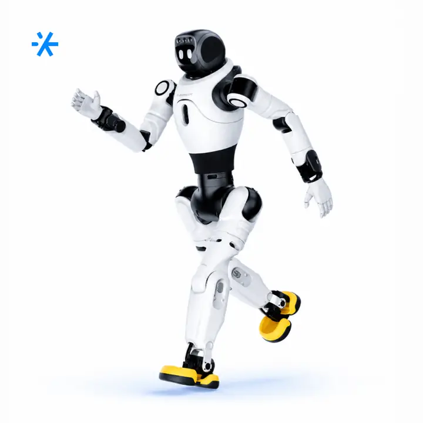
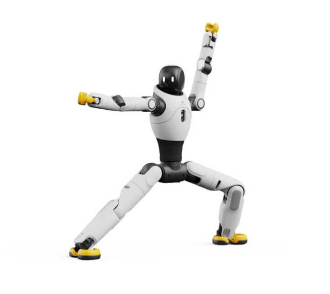
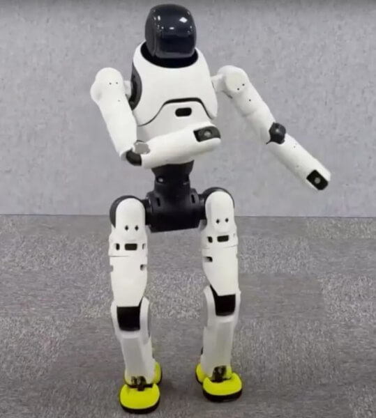
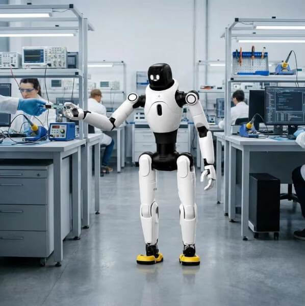

# робота-гуманоида Agibot X2

Route: `/robots/arenda-agibot-x2/`

Source-of-truth meaningful images: `10`
Upper gallery block near hero: `5`
Lower gallery block near photo section: `5`

Status: `needs_rights_review`; production use is **not approved** until a human confirms rights.

Approval:

- [ ] approve for production
- [ ] replace before production
- [ ] block for production
- [ ] rights/source holder confirmed

## Why earlier visual cards showed too few gallery images

The earlier visual card used the rebuilt short gallery subset. The original live page has two gallery blocks, so this card now separates the upper gallery block near the hero area and the lower gallery block near the photo section.

## Legacy horizontal hero

- role: `legacy_horizontal_hero`
- src: `/images/tild3635-6464-4337-a138-666439373335__photo.jpg`
- projectPath: `site-export/images/tild3635-6464-4337-a138-666439373335__photo.jpg`
- actualDescription: Горизонтальный hero-кадр: робот-гуманоид Agibot X2 с живой мимикой на презентации.
- seoAlt: Аренда робота-гуманоида Agibot X2: робот-гуманоид Agibot X2 с живой мимикой на презентации.
- caption: Горизонтальный hero-кадр: робот-гуманоид Agibot X2 с живой мимикой на презентации.
- sourceGalleryBlock: `n/a`
- rightsStatus: `needs_rights_review`
- textSource: legacy-hero-generated from extracted live hero evidence; needs human text/right review

## Current generated hero

- role: `current_generated_hero`
- src: `/images/kiber-45/arenda-agibot-x2.webp`
- projectPath: `public/images/kiber-45/arenda-agibot-x2.webp`
- actualDescription: Agibot X2 стоит на белом фоне, вид спереди; держит руки над головой и демонстрирует танцевальное движение.
- seoAlt: Робот-гуманоид Agibot X2: на белом фоне, вид спереди; держит руки над головой и демонстрирует танцевальное движение.
- caption: Agibot X2 демонстрирует танцевальное движение.
- sourceGalleryBlock: `n/a`
- rightsStatus: `needs_rights_review`
- textSource: data/models/robots.source-of-truth.json (previous human+agent media review, mapped from role=hero to optimized generated hero)

## Catalog card

- role: `catalog_card`
- src: `/images/tild3734-3539-4934-b636-633061353532__03.jpg`
- projectPath: `site-export/images/tild3734-3539-4934-b636-633061353532__03.jpg`
- actualDescription: Agibot X2 присел на корточки на белом фоне; перед ним пирамида из деревянных кубиков, словно он собирает конструкцию. Вид спереди.
- seoAlt: Аренда человекоподобного робота Agibot X2 для презентации: присел на корточки на белом фоне; перед ним пирамида из деревянных кубиков, как будто он.
- caption: Agibot X2 присел перед пирамидой из деревянных кубиков.
- sourceGalleryBlock: `upper_near_hero`
- rightsStatus: `needs_rights_review`
- textSource: data/models/robots.source-of-truth.json (previous human+agent media review)

## Upper gallery block

### arenda-agibot-x2__04

- role: `source_gallery_hero_candidate`
- src: `/images/tild3338-3732-4064-a466-626562306133__010.jpg`
- projectPath: `site-export/images/tild3338-3732-4064-a466-626562306133__010.jpg`
- actualDescription: Agibot X2 стоит на белом фоне, вид спереди; держит руки над головой и демонстрирует танцевальное движение.
- seoAlt: Робот-гуманоид Agibot X2: на белом фоне, вид спереди; держит руки над головой и демонстрирует танцевальное движение.
- caption: Agibot X2 демонстрирует танцевальное движение.
- sourceGalleryBlock: `upper_near_hero`
- rightsStatus: `needs_rights_review`
- textSource: data/models/robots.source-of-truth.json (previous human+agent media review)

### arenda-agibot-x2__06

- role: `gallery`
- src: `/images/tild6265-3335-4233-a339-333166366661__08.jpg`
- projectPath: `site-export/images/tild6265-3335-4233-a339-333166366661__08.jpg`
- actualDescription: Agibot X2 на белом фоне демонстрирует движение из ушу или боевого единоборства. Вид спереди.
- seoAlt: Робот-человек Agibot X2, андроид Agibot X2: на белом фоне демонстрирует движение из ушу или боевого единоборства. Вид спереди.
- caption: Agibot X2 показывает движение в стиле ушу.
- sourceGalleryBlock: `upper_near_hero`
- rightsStatus: `needs_rights_review`
- textSource: data/models/robots.source-of-truth.json (previous human+agent media review)

### arenda-agibot-x2__07

- role: `gallery`
- src: `/images/tild6665-6366-4537-a464-653439383238__09.jpg`
- projectPath: `site-export/images/tild6665-6366-4537-a464-653439383238__09.jpg`
- actualDescription: Agibot X2 стоит вертикально на белом фоне, руки слегка согнуты перед корпусом. Демонстрационный кадр.
- seoAlt: Прокат андроида Agibot X2 для мероприятия: стоит вертикально на белом фоне, руки немного согнуты, как будто он разговаривает с человеком.
- caption: Agibot X2 демонстрирует жесты общения.
- sourceGalleryBlock: `upper_near_hero`
- rightsStatus: `needs_rights_review`
- textSource: data/models/robots.source-of-truth.json (previous human+agent media review)

### arenda-agibot-x2__08

- role: `gallery`
- src: `/images/tild6437-3735-4235-a161-656439643739__02.jpg`
- projectPath: `site-export/images/tild6437-3735-4235-a161-656439643739__02.jpg`
- actualDescription: Agibot X2 бежит на сером фоне и демонстрирует передвижение бегом.
- seoAlt: Робот в виде человека Agibot X2, интерактивный гуманоид Agibot X2: на сером фоне бежит и демонстрирует передвижение бегом.
- caption: Agibot X2 демонстрирует бег.
- sourceGalleryBlock: `upper_near_hero`
- rightsStatus: `needs_rights_review`
- textSource: data/models/robots.source-of-truth.json (previous human+agent media review)

## Lower gallery block

### arenda-agibot-x2__10

- role: `gallery`
- src: `/images/tild3063-6333-4161-b064-343764636537__011.jpg`
- projectPath: `site-export/images/tild3063-6333-4161-b064-343764636537__011.jpg`
- actualDescription: Реальная фотография: робот-гуманоид Agibot X2 танцует на сером фоне, вид спереди.
- seoAlt: Заказать человекоподобного робота Agibot X2 на презентации: Реальная фотография: робот-гуманоид Agibot X2 танцует на сером фоне, вид спереди.
- caption: Agibot X2 танцует на сером фоне.
- sourceGalleryBlock: `lower_near_photo_section`
- rightsStatus: `needs_rights_review`
- textSource: data/models/robots.source-of-truth.json (previous human+agent media review)

### arenda-agibot-x2__11

- role: `gallery`
- src: `/images/tild6238-6339-4439-b061-313961333062__04.jpg`
- projectPath: `site-export/images/tild6238-6339-4439-b061-313961333062__04.jpg`
- actualDescription: Agibot X2 рядом с робособакой на выставке демонстрации технологий. Вид немного спереди.
- seoAlt: Человекообразный робот Agibot X2: рядом с робособакой на выставке демонстрации технологий. Вид немного спереди.
- caption: Agibot X2 и робособака на демонстрации технологий.
- sourceGalleryBlock: `lower_near_photo_section`
- rightsStatus: `needs_rights_review`
- textSource: data/models/robots.source-of-truth.json (previous human+agent media review)

### arenda-agibot-x2__12

- role: `gallery`
- src: `/images/tild3730-3866-4365-b461-336133633866__01.jpg`
- projectPath: `site-export/images/tild3730-3866-4365-b461-336133633866__01.jpg`
- actualDescription: Крупный план робота Agibot X2 с человеком: человек приобнимает робота, у робота одна рука поднята вверх. Серый фон, вид спереди, человек довольный, изображение обрезано примерно по колено.
- seoAlt: Арендовать андроида Agibot X2 для мероприятия: Крупный план робота Agibot X2 с человеком: человек приобнимает робота, у робота одна рука.
- caption: Agibot X2 в кадре с человеком, робот поднимает руку.
- sourceGalleryBlock: `lower_near_photo_section`
- rightsStatus: `needs_rights_review`
- textSource: data/models/robots.source-of-truth.json (previous human+agent media review)

### arenda-agibot-x2__13

- role: `gallery`
- src: `/images/tild6561-6236-4831-a663-663263643764__07.jpg`
- projectPath: `site-export/images/tild6561-6236-4831-a663-663263643764__07.jpg`
- actualDescription: Робот Agibot X2 на производстве рассматривает объект перед собой. Вид спереди.
- seoAlt: Человекоподобный робот Agibot X2, робот-человек Agibot X2: на производстве что-то рассматривает. Вид спереди.
- caption: Agibot X2 на производстве.
- sourceGalleryBlock: `lower_near_photo_section`
- rightsStatus: `needs_rights_review`
- textSource: data/models/robots.source-of-truth.json (previous human+agent media review)

### arenda-agibot-x2__14

- role: `gallery`
- src: `/images/tild6664-3537-4635-a266-633164383463__05.jpg`
- projectPath: `site-export/images/tild6664-3537-4635-a266-633164383463__05.jpg`
- actualDescription: Робот Agibot X2 на выставке общается с людьми; вокруг него много мужчин, которые смотрят на робота или разговаривают с ним.
- seoAlt: Взять в прокат человекоподобного робота Agibot X2 для выставочного стенда: на выставке общается с людьми; вокруг него много мужчин, которые смотрят на робота или.
- caption: Agibot X2 общается с посетителями выставки.
- sourceGalleryBlock: `lower_near_photo_section`
- rightsStatus: `needs_rights_review`
- textSource: data/models/robots.source-of-truth.json (previous human+agent media review)
