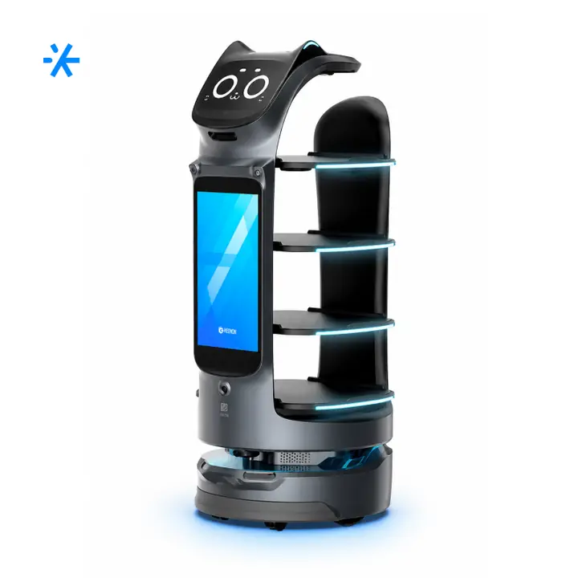
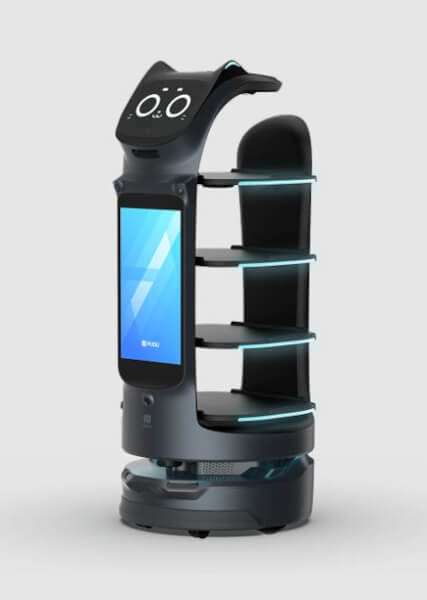
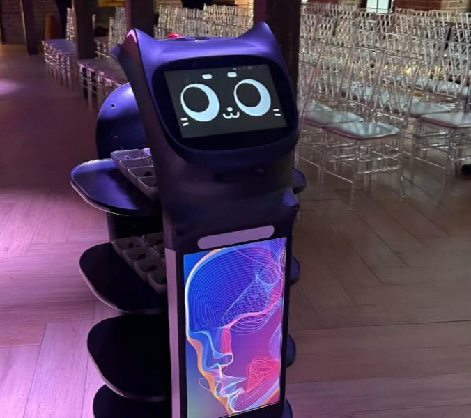
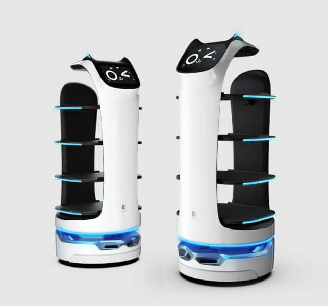
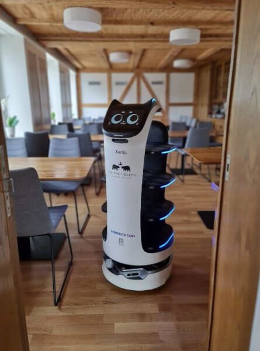
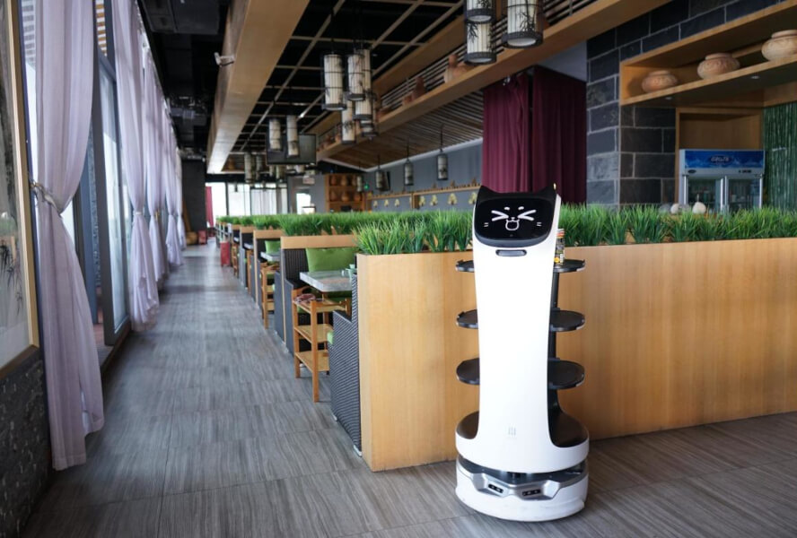
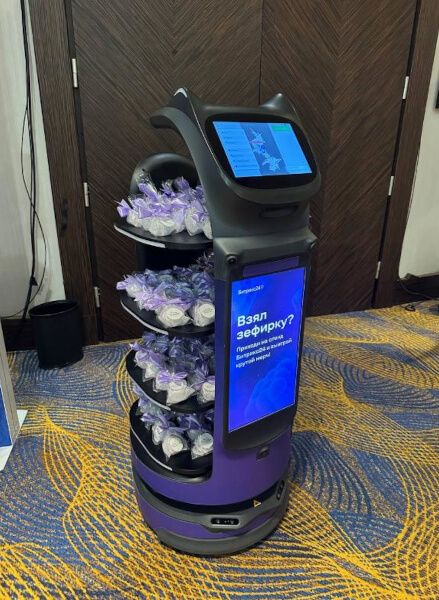
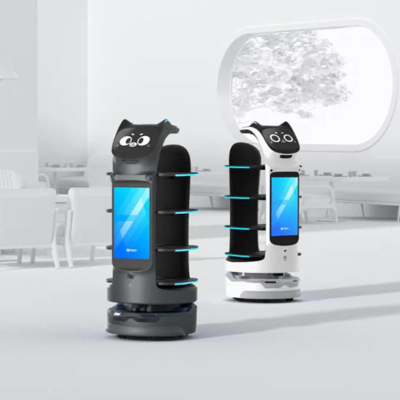

# робота-официанта BellaBot

Route: `/robots/arenda-bellabot/`

Source-of-truth meaningful images: `11`
Upper gallery block near hero: `5`
Lower gallery block near photo section: `6`

Status: `needs_rights_review`; production use is **not approved** until a human confirms rights.

Approval:

- [ ] approve for production
- [ ] replace before production
- [ ] block for production
- [ ] rights/source holder confirmed

## Why earlier visual cards showed too few gallery images

The earlier visual card used the rebuilt short gallery subset. The original live page has two gallery blocks, so this card now separates the upper gallery block near the hero area and the lower gallery block near the photo section.

## Legacy horizontal hero

- role: `legacy_horizontal_hero`
- src: `/images/tild6237-3138-4535-b563-336532646462__photo.jpg`
- projectPath: `site-export/images/tild6237-3138-4535-b563-336532646462__photo.jpg`
- actualDescription: Горизонтальный hero-кадр: робот-официант BellaBot в виде кота разносит блюда и напитки гостям.
- seoAlt: Аренда сервисного робота робота-официанта BellaBot: робот-официант BellaBot в виде кота разносит блюда и напитки гостям.
- caption: Горизонтальный hero-кадр: робот-официант BellaBot в виде кота разносит блюда и напитки гостям.
- sourceGalleryBlock: `n/a`
- rightsStatus: `needs_rights_review`
- textSource: legacy-hero-generated from extracted live hero evidence; needs human text/right review

## Current generated hero

- role: `current_generated_hero`
- src: `/images/kiber-45/arenda-bellabot.webp`
- projectPath: `public/images/kiber-45/arenda-bellabot.webp`
- actualDescription: BellaBot крупным планом на сером фоне, вид спереди немного наискось.
- seoAlt: Робот-официант BellaBot: крупным планом на сером фоне, вид спереди немного наискось.
- caption: Крупный план робота-официанта BellaBot.
- sourceGalleryBlock: `n/a`
- rightsStatus: `needs_rights_review`
- textSource: data/models/robots.source-of-truth.json (previous human+agent media review, mapped from role=hero to optimized generated hero)

## Catalog card

- role: `catalog_card`
- src: `/images/tild3065-3239-4635-a634-306235326337__04.jpg`
- projectPath: `site-export/images/tild3065-3239-4635-a634-306235326337__04.jpg`
- actualDescription: Два робота-официанта BellaBot разного цвета, чёрный и белый, находятся вместе в помещении.
- seoAlt: Аренда сервисного робота BellaBot для презентации: Два робота-официанта BellaBot разного цвета, чёрный и белый, находятся вместе в помещении.
- caption: Два BellaBot разного цвета в помещении.
- sourceGalleryBlock: `upper_near_hero`
- rightsStatus: `needs_rights_review`
- textSource: data/models/robots.source-of-truth.json (previous human+agent media review)

## Upper gallery block

### arenda-bellabot__04

- role: `source_gallery_hero_candidate`
- src: `/images/tild6137-3561-4532-b062-646264396639__02.jpg`
- projectPath: `site-export/images/tild6137-3561-4532-b062-646264396639__02.jpg`
- actualDescription: BellaBot крупным планом на сером фоне, вид спереди немного наискось.
- seoAlt: Робот-официант BellaBot: крупным планом на сером фоне, вид спереди немного наискось.
- caption: Крупный план робота-официанта BellaBot.
- sourceGalleryBlock: `upper_near_hero`
- rightsStatus: `needs_rights_review`
- textSource: data/models/robots.source-of-truth.json (previous human+agent media review)

### arenda-bellabot__06

- role: `gallery`
- src: `/images/tild3730-3164-4238-a530-353561376234__noroot.png`
- projectPath: `site-export/images/tild3730-3164-4238-a530-353561376234__noroot.png`
- actualDescription: BellaBot крупным планом; видна кошачья мордочка и стилизованное человеческое лицо на экране. Робот находится на мероприятии.
- seoAlt: Робот-доставщик BellaBot, робот для ресторана BellaBot: крупным планом; видна кошачья мордочка и стилизованное человеческое лицо на экране. Робот явно.
- caption: BellaBot с кошачьим экраном в рабочей обстановке.
- sourceGalleryBlock: `upper_near_hero`
- rightsStatus: `needs_rights_review`
- textSource: data/models/robots.source-of-truth.json (previous human+agent media review)

### arenda-bellabot__07

- role: `gallery`
- src: `/images/tild3161-3431-4835-a134-373533613032__03.jpg`
- projectPath: `site-export/images/tild3161-3431-4835-a134-373533613032__03.jpg`
- actualDescription: Два белых робота-официанта BellaBot крупным планом на сером фоне.
- seoAlt: Прокат робота для ресторана BellaBot для мероприятия: Два белых робота-официанта BellaBot крупным планом на сером фоне.
- caption: Два белых BellaBot на сером фоне.
- sourceGalleryBlock: `upper_near_hero`
- rightsStatus: `needs_rights_review`
- textSource: data/models/robots.source-of-truth.json (previous human+agent media review)

### arenda-bellabot__08

- role: `gallery`
- src: `/images/tild6430-3838-4730-a532-343435366463__09.jpg`
- projectPath: `site-export/images/tild6430-3838-4730-a532-343435366463__09.jpg`
- actualDescription: BellaBot крупным планом; видна верхняя часть кошачьей мордочки, на заднем фоне помещение ресторана.
- seoAlt: Робот-кот официант BellaBot, интерактивный официант BellaBot: крупным планом; видна только верхняя часть кошачьей мордочки, на заднем фоне помещение ресторана.
- caption: Крупный план BellaBot с кошачьей мордочкой.
- sourceGalleryBlock: `upper_near_hero`
- rightsStatus: `needs_rights_review`
- textSource: data/models/robots.source-of-truth.json (previous human+agent media review)

## Lower gallery block

### arenda-bellabot__10

- role: `gallery`
- src: `/images/tild3461-3562-4063-b032-656137346433__05.jpg`
- projectPath: `site-export/images/tild3461-3562-4063-b032-656137346433__05.jpg`
- actualDescription: BellaBot во весь рост движется по помещению кафе или ресторана.
- seoAlt: Заказать сервисного робота BellaBot на HoReCa-зоны и события с гостями: во весь рост движется по помещению кафе или ресторана.
- caption: BellaBot движется по залу кафе или ресторана.
- sourceGalleryBlock: `lower_near_photo_section`
- rightsStatus: `needs_rights_review`
- textSource: data/models/robots.source-of-truth.json (previous human+agent media review)

### arenda-bellabot__11

- role: `gallery`
- src: `/images/tild6239-6132-4661-a438-316164333461__01.jpg`
- projectPath: `site-export/images/tild6239-6132-4661-a438-316164333461__01.jpg`
- actualDescription: Белый робот-официант BellaBot находится в помещении ресторана; широкое изображение, видно почти всё помещение ресторана.
- seoAlt: Робот-официант BellaBot: Белый робот-официант BellaBot находится в помещении ресторана; широкое изображение, видно почти.
- caption: BellaBot в просторном интерьерном зале.
- sourceGalleryBlock: `lower_near_photo_section`
- rightsStatus: `needs_rights_review`
- textSource: data/models/robots.source-of-truth.json (previous human+agent media review)

### arenda-bellabot__12

- role: `gallery`
- src: `/images/tild6533-3031-4766-b662-303762393638__010.jpg`
- projectPath: `site-export/images/tild6533-3031-4766-b662-303762393638__010.jpg`
- actualDescription: BellaBot движется по залу мероприятия и перевозит блюда. На заднем фоне несколько человек стоят и разговаривают, похоже на нетворкинг или конференцию.
- seoAlt: Арендовать робота для ресторана BellaBot для демонстрации возможностей: движется по залу мероприятия и перевозит блюда. На заднем фоне несколько человек стоят и.
- caption: BellaBot перевозит блюда в зале мероприятия.
- sourceGalleryBlock: `lower_near_photo_section`
- rightsStatus: `needs_rights_review`
- textSource: data/models/robots.source-of-truth.json (previous human+agent media review)

### arenda-bellabot__13

- role: `gallery`
- src: `/images/tild6338-3063-4335-b931-623732346635__noroot.png`
- projectPath: `site-export/images/tild6338-3063-4335-b931-623732346635__noroot.png`
- actualDescription: BellaBot на выставке; на заднем фоне люди сидят и слушают лекцию, робот движется по направлению от людей, виден целиком.
- seoAlt: Робот-доставщик BellaBot, робот для ресторана BellaBot: на выставке; на заднем фоне люди сидят и слушают лекцию, робот движется по направлению от.
- caption: BellaBot на выставке рядом с аудиторией лекции.
- sourceGalleryBlock: `lower_near_photo_section`
- rightsStatus: `needs_rights_review`
- textSource: data/models/robots.source-of-truth.json (previous human+agent media review)

### arenda-bellabot__14

- role: `gallery`
- src: `/images/tild3966-6630-4761-a135-306232623062__08.jpg`
- projectPath: `site-export/images/tild3966-6630-4761-a135-306232623062__08.jpg`
- actualDescription: Чёрный робот-официант BellaBot крупным планом, на его подносах лежат сладости.
- seoAlt: Взять в прокат сервисного робота BellaBot для презентации: Чёрный робот-официант BellaBot крупным планом, на его подносах лежат сладости.
- caption: BellaBot с подносами со сладостями.
- sourceGalleryBlock: `lower_near_photo_section`
- rightsStatus: `needs_rights_review`
- textSource: data/models/robots.source-of-truth.json (previous human+agent media review)

### arenda-bellabot__15

- role: `gallery`
- src: `/images/tild3532-3264-4261-a634-643438656237__noroot.png`
- projectPath: `site-export/images/tild3532-3264-4261-a634-643438656237__noroot.png`
- actualDescription: Два робота-официанта BellaBot чёрного и белого цвета на светлом фоне помещения; стилизованное фирменное футуристичное изображение.
- seoAlt: Робот-кот официант BellaBot, интерактивный официант BellaBot: Два робота-официанта BellaBot чёрного и белого цвета на светлом фоне помещения; стилизованное.
- caption: Два BellaBot в футуристичном фирменном изображении.
- sourceGalleryBlock: `lower_near_photo_section`
- rightsStatus: `needs_rights_review`
- textSource: data/models/robots.source-of-truth.json (previous human+agent media review)
