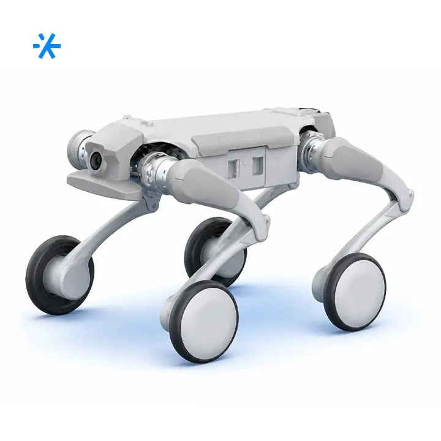
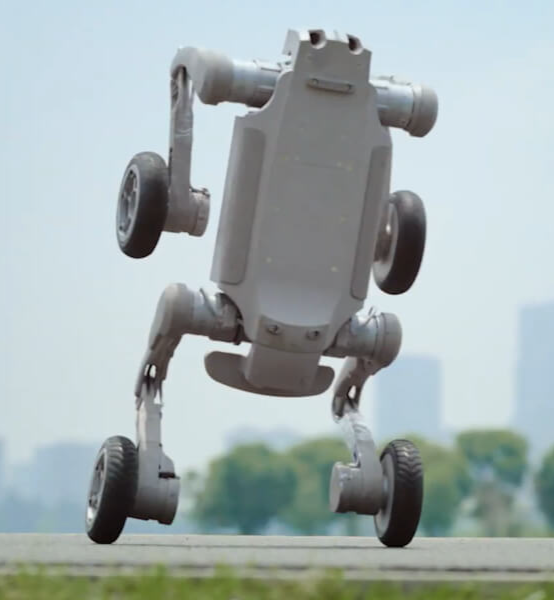
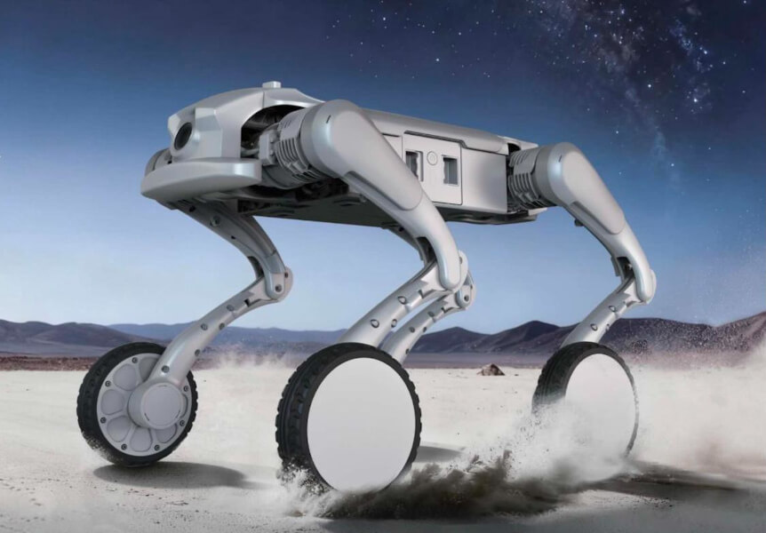
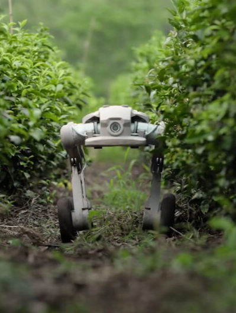
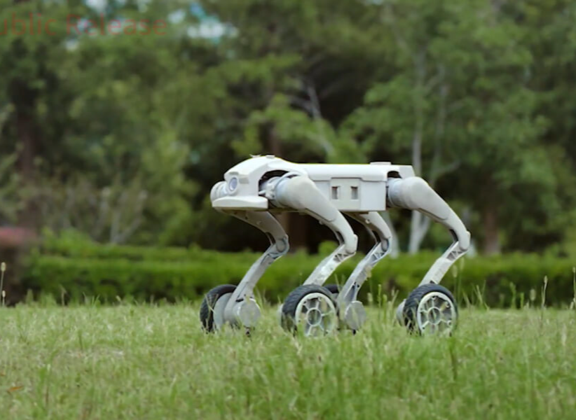

# робота-собаки Inchbot L1-W EDU

Route: `/robots/arenda-inchbot-l1-w-edu/`

Source-of-truth meaningful images: `11`
Upper gallery block near hero: `5`
Lower gallery block near photo section: `6`

Status: `needs_rights_review`; production use is **not approved** until a human confirms rights.

Approval:

- [ ] approve for production
- [ ] replace before production
- [ ] block for production
- [ ] rights/source holder confirmed

## Why earlier visual cards showed too few gallery images

The earlier visual card used the rebuilt short gallery subset. The original live page has two gallery blocks, so this card now separates the upper gallery block near the hero area and the lower gallery block near the photo section.

## Legacy horizontal hero

- role: `legacy_horizontal_hero`
- src: `/images/tild3339-3661-4139-b463-643561616565__-__resize__504x__photo.jpg`
- projectPath: `site-export/images/tild3339-3661-4139-b463-643561616565__-__resize__504x__photo.jpg`
- actualDescription: Горизонтальный hero-кадр: робот-собака Inchbot L1-W показывает STEM-программу на детском мероприятии.
- seoAlt: Прокат робота-собаки Inchbot L1-W EDU: робот-собака Inchbot L1-W показывает STEM-программу на детском мероприятии.
- caption: Горизонтальный hero-кадр: робот-собака Inchbot L1-W показывает STEM-программу на детском меропр.
- sourceGalleryBlock: `n/a`
- rightsStatus: `needs_rights_review`
- textSource: legacy-hero-generated from extracted live hero evidence; needs human text/right review

## Current generated hero

- role: `current_generated_hero`
- src: `/images/kiber-45/arenda-inchbot-l1-w-edu.webp`
- projectPath: `public/images/kiber-45/arenda-inchbot-l1-w-edu.webp`
- actualDescription: Inchbot L1-W EDU движется по пересечённой местности на колёсах. Крупный план спереди.
- seoAlt: Робот-собака Inchbot L1-W EDU: движется по пересечённой местности на колёсах. Крупный план спереди.
- caption: Inchbot L1-W EDU движется по пересечённой местности на колёсах.
- sourceGalleryBlock: `n/a`
- rightsStatus: `needs_rights_review`
- textSource: data/models/robots.source-of-truth.json (previous human+agent media review, mapped from role=hero to optimized generated hero)

## Catalog card

- role: `catalog_card`
- src: `/images/tild6661-3332-4231-b435-326639316534__04.jpg`
- projectPath: `site-export/images/tild6661-3332-4231-b435-326639316534__04.jpg`
- actualDescription: Робот-собака Inchbot L1-W EDU, вид сбоку, залезает на большой камень. Кадр показывает технологические возможности робота.
- seoAlt: Аренда робособаки Inchbot L1-W EDU для демонстрации возможностей: вид сбоку, залезает на большой камень. Кадр красиво демонстрирует технологические возможности.
- caption: Inchbot L1-W EDU залезает на большой камень.
- sourceGalleryBlock: `upper_near_hero`
- rightsStatus: `needs_rights_review`
- textSource: data/models/robots.source-of-truth.json (previous human+agent media review)

## Upper gallery block

### arenda-inchbot-l1-w-edu__04

- role: `source_gallery_hero_candidate`
- src: `/images/tild3034-3838-4233-a563-373266333161__noroot.png`
- projectPath: `site-export/images/tild3034-3838-4233-a563-373266333161__noroot.png`
- actualDescription: Inchbot L1-W EDU движется по пересечённой местности на колёсах. Крупный план спереди.
- seoAlt: Робот-собака Inchbot L1-W EDU: движется по пересечённой местности на колёсах. Крупный план спереди.
- caption: Inchbot L1-W EDU движется по пересечённой местности на колёсах.
- sourceGalleryBlock: `upper_near_hero`
- rightsStatus: `needs_rights_review`
- textSource: data/models/robots.source-of-truth.json (previous human+agent media review)

### arenda-inchbot-l1-w-edu__06

- role: `gallery`
- src: `/images/tild3039-6438-4864-a336-613831663462__noroot.png`
- projectPath: `site-export/images/tild3039-6438-4864-a336-613831663462__noroot.png`
- actualDescription: Inchbot L1-W EDU оторвалась от земли и делает сальто в воздухе. Фотография спереди крупным планом.
- seoAlt: Робот-пёс Inchbot L1-W EDU, механический пёс Inchbot L1-W EDU: оторвалась от земли и делает сальто в воздухе. Фотография спереди крупным планом.
- caption: Inchbot L1-W EDU выполняет сальто в воздухе.
- sourceGalleryBlock: `upper_near_hero`
- rightsStatus: `needs_rights_review`
- textSource: data/models/robots.source-of-truth.json (previous human+agent media review)

### arenda-inchbot-l1-w-edu__07

- role: `gallery`
- src: `/images/tild6263-3565-4132-b736-663530333864__08.jpg`
- projectPath: `site-export/images/tild6263-3565-4132-b736-663530333864__08.jpg`
- actualDescription: Inchbot L1-W EDU движется на колёсах по пустыне, вид сбоку; за ней поднимается пыль.
- seoAlt: Прокат четвероногого робота Inchbot L1-W EDU для демонстрации возможностей: движется на колёсах по пустыне, вид сбоку; за ней поднимается пыль.
- caption: Inchbot L1-W EDU движется по пустыне, поднимая пыль.
- sourceGalleryBlock: `upper_near_hero`
- rightsStatus: `needs_rights_review`
- textSource: data/models/robots.source-of-truth.json (previous human+agent media review)

### arenda-inchbot-l1-w-edu__08

- role: `gallery`
- src: `/images/tild6637-6536-4064-a663-353132643466__07.jpg`
- projectPath: `site-export/images/tild6637-6536-4064-a663-353132643466__07.jpg`
- actualDescription: Inchbot L1-W EDU видна издалека, спускается с небольшого каменистого пригорка и показывает технологические возможности.
- seoAlt: Четвероногий робот Inchbot L1-W EDU, робот на четырёх лапах Inchbot L1-W EDU: видна издалека, спускается с небольшого каменистого пригорка и показывает технологические.
- caption: Inchbot L1-W EDU спускается с каменистого пригорка.
- sourceGalleryBlock: `upper_near_hero`
- rightsStatus: `needs_rights_review`
- textSource: data/models/robots.source-of-truth.json (previous human+agent media review)

## Lower gallery block

### arenda-inchbot-l1-w-edu__10

- role: `gallery`
- src: `/images/tild6164-3661-4835-b039-303964323837__noroot.png`
- projectPath: `site-export/images/tild6164-3661-4835-b039-303964323837__noroot.png`
- actualDescription: Inchbot L1-W EDU едет между кустарниками по земле, вид спереди, демонстрация проходимости.
- seoAlt: Заказать робособаки Inchbot L1-W EDU на демонстрации возможностей: едет между кустарниками по земле, вид спереди, демонстрация проходимости.
- caption: Inchbot L1-W EDU демонстрирует проходимость между кустарниками.
- sourceGalleryBlock: `lower_near_photo_section`
- rightsStatus: `needs_rights_review`
- textSource: data/models/robots.source-of-truth.json (previous human+agent media review)

### arenda-inchbot-l1-w-edu__11

- role: `gallery`
- src: `/images/tild3165-6138-4635-b538-623931653530__noroot.png`
- projectPath: `site-export/images/tild3165-6138-4635-b538-623931653530__noroot.png`
- actualDescription: Inchbot L1-W EDU на мероприятии на колёсной базе едет между столов, вид сбоку.
- seoAlt: Образовательная робособака Inchbot L1-W EDU: на мероприятии на колёсной базе едет между столов, вид сбоку.
- caption: Inchbot L1-W EDU едет между столов на мероприятии.
- sourceGalleryBlock: `lower_near_photo_section`
- rightsStatus: `needs_rights_review`
- textSource: data/models/robots.source-of-truth.json (previous human+agent media review)

### arenda-inchbot-l1-w-edu__12

- role: `gallery`
- src: `/images/tild3237-3030-4131-b965-346163333661__noroot.png`
- projectPath: `site-export/images/tild3237-3030-4131-b965-346163333661__noroot.png`
- actualDescription: Inchbot L1-W EDU на колёсной базе поднимается вверх по широкой каменной лестнице, вид сзади.
- seoAlt: Арендовать четвероногого робота Inchbot L1-W EDU для демонстрации возможностей: на колёсной базе поднимается вверх по широкой каменной лестнице, вид сзади.
- caption: Inchbot L1-W EDU поднимается по широкой каменной лестнице.
- sourceGalleryBlock: `lower_near_photo_section`
- rightsStatus: `needs_rights_review`
- textSource: data/models/robots.source-of-truth.json (previous human+agent media review)

### arenda-inchbot-l1-w-edu__13

- role: `gallery`
- src: `/images/tild3136-3230-4164-b132-313762636265__noroot.png`
- projectPath: `site-export/images/tild3136-3230-4164-b132-313762636265__noroot.png`
- actualDescription: Inchbot L1-W EDU едет по поляне по траве, вид сбоку; на заднем фоне деревья.
- seoAlt: Робособака Inchbot L1-W EDU, робот-пёс Inchbot L1-W EDU: едет по поляне по траве, вид сбоку; на заднем фоне деревья.
- caption: Inchbot L1-W EDU едет по траве на фоне деревьев.
- sourceGalleryBlock: `lower_near_photo_section`
- rightsStatus: `needs_rights_review`
- textSource: data/models/robots.source-of-truth.json (previous human+agent media review)

### arenda-inchbot-l1-w-edu__14

- role: `gallery`
- src: `/images/tild3037-3533-4161-b537-353864356265__noroot.png`
- projectPath: `site-export/images/tild3037-3533-4161-b537-353864356265__noroot.png`
- actualDescription: Inchbot L1-W EDU передвигается по снегу в промышленной зоне, вид спереди.
- seoAlt: Взять в прокат робособаки Inchbot L1-W EDU для презентации: передвигается по снегу в промышленной зоне, вид спереди.
- caption: Inchbot L1-W EDU передвигается по снегу в промышленной зоне.
- sourceGalleryBlock: `lower_near_photo_section`
- rightsStatus: `needs_rights_review`
- textSource: data/models/robots.source-of-truth.json (previous human+agent media review)

### arenda-inchbot-l1-w-edu__15

- role: `gallery`
- src: `/images/tild6363-3930-4134-a539-393439366462__013.jpg`
- projectPath: `site-export/images/tild6363-3930-4134-a539-393439366462__013.jpg`
- actualDescription: Inchbot L1-W EDU поднимается по металлической лестнице зимой, вид сзади; выглядит технологично.
- seoAlt: Механический пёс Inchbot L1-W EDU, четвероногий робот Inchbot L1-W EDU: поднимается по металлической лестнице зимой, вид сзади; выглядит технологично.
- caption: Inchbot L1-W EDU поднимается по металлической лестнице зимой.
- sourceGalleryBlock: `lower_near_photo_section`
- rightsStatus: `needs_rights_review`
- textSource: data/models/robots.source-of-truth.json (previous human+agent media review)
