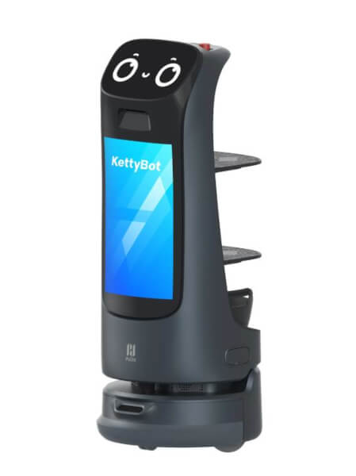
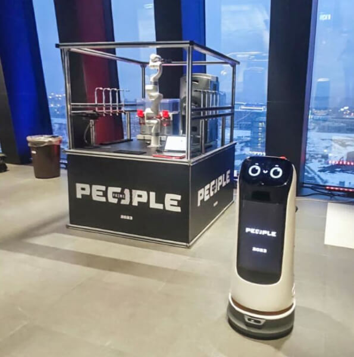
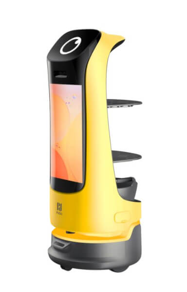

# робота-официанта KettyBot

Route: `/robots/arenda-kettybot/`

Source-of-truth meaningful images: `11`
Upper gallery block near hero: `5`
Lower gallery block near photo section: `6`

Status: `approved_by_owner_for_production_media_use`; production media use for this card is approved by the owner review evidence below.

Approval:

- Approved by: Александр Маркин
- Approved at: `2026-08-29T00:55:09Z`
- Evidence: first five full cards reviewed directly; all remaining cards approved because they follow the same validated schema/principle.

- [x] approve for production
- [ ] replace before production
- [ ] block for production
- [x] rights/source holder confirmed

## Why earlier visual cards showed too few gallery images

The earlier visual card used the rebuilt short gallery subset. The original live page has two gallery blocks, so this card now separates the upper gallery block near the hero area and the lower gallery block near the photo section.

## Legacy horizontal hero

- role: `legacy_horizontal_hero`
- src: `/images/tild3265-3261-4533-b965-383239633331__photo.jpg`
- projectPath: `site-export/images/tild3265-3261-4533-b965-383239633331__photo.jpg`
- actualDescription: Горизонтальный hero-кадр: робот-доставщик KettyBot везёт заказы гостям с рекламным экраном.
- seoAlt: Аренда сервисного робота робота-официанта KettyBot: робот-доставщик KettyBot везёт заказы гостям с рекламным экраном.
- caption: Горизонтальный hero-кадр: робот-доставщик KettyBot везёт заказы гостям с рекламным экраном.
- sourceGalleryBlock: `n/a`
- rightsStatus: `approved_for_production`
- textSource: legacy-hero-generated from extracted live hero evidence; needs human text/right review

## Current generated hero

- role: `current_generated_hero`
- src: `/images/kiber-45/arenda-kettybot.webp`
- projectPath: `public/images/kiber-45/arenda-kettybot.webp`
- actualDescription: KettyBot крупным планом везёт поднос на корпоративном мероприятии.
- seoAlt: Робот-официант KettyBot: крупным планом везёт поднос на корпоративном мероприятии.
- caption: KettyBot везёт поднос на корпоративном событии.
- sourceGalleryBlock: `n/a`
- rightsStatus: `approved_for_production`
- textSource: data/models/robots.source-of-truth.json (previous human+agent media review, mapped from role=hero to optimized generated hero)

## Catalog card

- role: `catalog_card`
- src: `/images/tild3864-3165-4464-b639-613562333764__010.jpg`
- projectPath: `site-export/images/tild3864-3165-4464-b639-613562333764__010.jpg`
- actualDescription: KettyBot крупным планом на белом фоне, вид спереди немного наискось.
- seoAlt: Аренда сервисного робота KettyBot для презентации: крупным планом на белом фоне, вид спереди немного наискось.
- caption: Крупный план KettyBot на белом фоне.
- sourceGalleryBlock: `upper_near_hero`
- rightsStatus: `approved_for_production`
- textSource: data/models/robots.source-of-truth.json (previous human+agent media review)

## Upper gallery block

### arenda-kettybot__04

- role: `source_gallery_hero_candidate`
- src: `/images/tild6236-3131-4466-a632-623038373139__07.jpg`
- projectPath: `site-export/images/tild6236-3131-4466-a632-623038373139__07.jpg`
- actualDescription: KettyBot крупным планом везёт поднос на корпоративном мероприятии.
- seoAlt: Робот-официант KettyBot: крупным планом везёт поднос на корпоративном мероприятии.
- caption: KettyBot везёт поднос на корпоративном событии.
- sourceGalleryBlock: `upper_near_hero`
- rightsStatus: `approved_for_production`
- textSource: data/models/robots.source-of-truth.json (previous human+agent media review)

### arenda-kettybot__06

- role: `gallery`
- src: `/images/tild6139-3335-4138-a539-383539326630__01.jpg`
- projectPath: `site-export/images/tild6139-3335-4138-a539-383539326630__01.jpg`
- actualDescription: KettyBot едет вдоль столиков в кафе; на рекламном экране показаны изображения блюд. Горизонтальное фото.
- seoAlt: Робот-доставщик KettyBot, робот для ресторана KettyBot: едет вдоль столиков в кафе; на рекламном экране показаны изображения блюд. Горизонтальное фото.
- caption: KettyBot едет вдоль столиков с рекламным экраном блюд.
- sourceGalleryBlock: `upper_near_hero`
- rightsStatus: `approved_for_production`
- textSource: data/models/robots.source-of-truth.json (previous human+agent media review)

### arenda-kettybot__07

- role: `gallery`
- src: `/images/tild3663-6530-4536-b734-643935626664__08.jpg`
- projectPath: `site-export/images/tild3663-6530-4536-b734-643935626664__08.jpg`
- actualDescription: Два робота KettyBot, один жёлтый и один белый, крупным планом на белом фоне.
- seoAlt: Прокат робота-промоутера KettyBot для мероприятия: Два робота KettyBot, один жёлтый и один белый, крупным планом на белом фоне.
- caption: Жёлтый и белый KettyBot на белом фоне.
- sourceGalleryBlock: `upper_near_hero`
- rightsStatus: `approved_for_production`
- textSource: data/models/robots.source-of-truth.json (previous human+agent media review)

### arenda-kettybot__08

- role: `gallery`
- src: `/images/tild6330-6138-4764-a335-376636333838__04.jpg`
- projectPath: `site-export/images/tild6330-6138-4764-a335-376636333838__04.jpg`
- actualDescription: KettyBot везёт два блюда гостям конференции, вид сзади.
- seoAlt: Робот-промоутер с экраном KettyBot, интерактивный робот-официант KettyBot: везёт два блюда гостям конференции, вид сзади.
- caption: KettyBot везёт блюда людям в деловой обстановке.
- sourceGalleryBlock: `upper_near_hero`
- rightsStatus: `approved_for_production`
- textSource: data/models/robots.source-of-truth.json (previous human+agent media review)

## Lower gallery block

### arenda-kettybot__10

- role: `gallery`
- src: `/images/tild3762-3232-4237-b965-323533333164__09.jpg`
- projectPath: `site-export/images/tild3762-3232-4237-b965-323533333164__09.jpg`
- actualDescription: KettyBot крупным планом едет по кафе; на заднем фоне столики и стулья.
- seoAlt: Заказать сервисного робота KettyBot на HoReCa-зоны и события с гостями: крупным планом едет по кафе; на заднем фоне столики и стулья.
- caption: KettyBot движется по кафе на фоне столиков и стульев.
- sourceGalleryBlock: `lower_near_photo_section`
- rightsStatus: `approved_for_production`
- textSource: data/models/robots.source-of-truth.json (previous human+agent media review)

### arenda-kettybot__11

- role: `gallery`
- src: `/images/tild3864-3062-4563-b431-666566303761__02.jpg`
- projectPath: `site-export/images/tild3864-3062-4563-b431-666566303761__02.jpg`
- actualDescription: KettyBot стоит у фотозоны на выставке рядом с женщиной, которая смотрит на него и фотографируется с ним.
- seoAlt: Робот-официант KettyBot: стоит у фотозоны на выставке рядом с женщиной, которая смотрит на него и фотографируется с ним.
- caption: KettyBot у фотозоны рядом с женщиной.
- sourceGalleryBlock: `lower_near_photo_section`
- rightsStatus: `approved_for_production`
- textSource: data/models/robots.source-of-truth.json (previous human+agent media review)

### arenda-kettybot__12

- role: `gallery`
- src: `/images/tild3736-3534-4030-b338-333366663735__06.jpg`
- projectPath: `site-export/images/tild3736-3534-4030-b338-333366663735__06.jpg`
- actualDescription: KettyBot едет по ресторану; на экране отображаются изображения блюд.
- seoAlt: Арендовать робота-промоутера KettyBot для HoReCa-зоны и события с гостями: едет по ресторану; на экране отображаются изображения блюд.
- caption: KettyBot едет по ресторану с изображениями блюд на экране.
- sourceGalleryBlock: `lower_near_photo_section`
- rightsStatus: `approved_for_production`
- textSource: data/models/robots.source-of-truth.json (previous human+agent media review)

### arenda-kettybot__13

- role: `gallery`
- src: `/images/tild6365-3064-4761-a334-303561393261__03.jpg`
- projectPath: `site-export/images/tild6365-3064-4761-a334-303561393261__03.jpg`
- actualDescription: KettyBot крупным планом в помещении кафе.
- seoAlt: Робот-доставщик KettyBot, робот для ресторана KettyBot: крупным планом в помещении кафе.
- caption: Крупный план KettyBot в интерьерном помещении.
- sourceGalleryBlock: `lower_near_photo_section`
- rightsStatus: `approved_for_production`
- textSource: data/models/robots.source-of-truth.json (previous human+agent media review)

### arenda-kettybot__14

- role: `gallery`
- src: `/images/tild3938-3662-4534-b030-623936613139__05.jpg`
- projectPath: `site-export/images/tild3938-3662-4534-b030-623936613139__05.jpg`
- actualDescription: Сервисный робот-официант KettyBot на корпоративном мероприятии позирует рядом с робобаром.
- seoAlt: Взять в прокат сервисного робота KettyBot для HoReCa-зоны и события с гостями: Сервисный робот-официант KettyBot на корпоративном мероприятии позирует рядом с робобаром.
- caption: KettyBot на корпоративном событии рядом с робобаром.
- sourceGalleryBlock: `lower_near_photo_section`
- rightsStatus: `approved_for_production`
- textSource: data/models/robots.source-of-truth.json (previous human+agent media review)

### arenda-kettybot__15

- role: `gallery`
- src: `/images/tild6362-3235-4561-a436-623839356139__011.jpg`
- projectPath: `site-export/images/tild6362-3235-4561-a436-623839356139__011.jpg`
- actualDescription: Жёлтый робот-официант KettyBot крупным планом на белом фоне.
- seoAlt: Робот-промоутер с экраном KettyBot, интерактивный робот-официант KettyBot: Жёлтый робот-официант KettyBot крупным планом на белом фоне.
- caption: Жёлтый KettyBot крупным планом на белом фоне.
- sourceGalleryBlock: `lower_near_photo_section`
- rightsStatus: `approved_for_production`
- textSource: data/models/robots.source-of-truth.json (previous human+agent media review)
