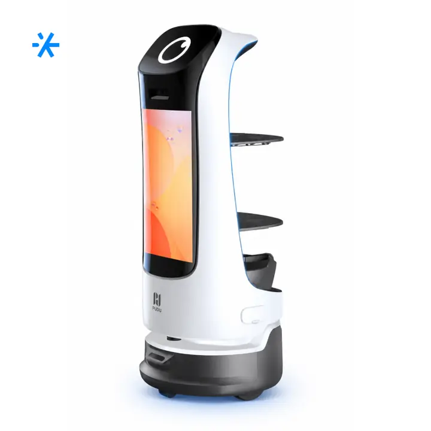
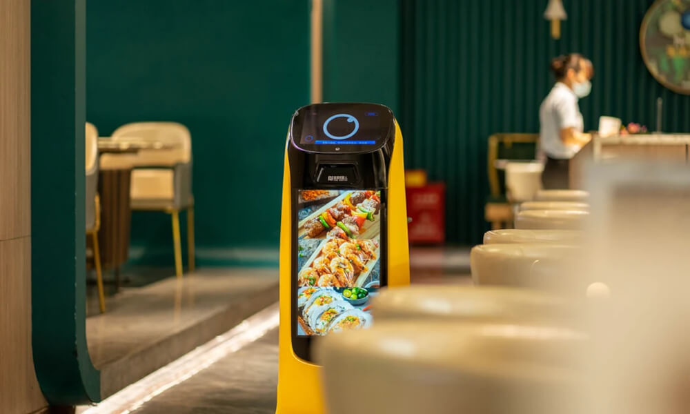
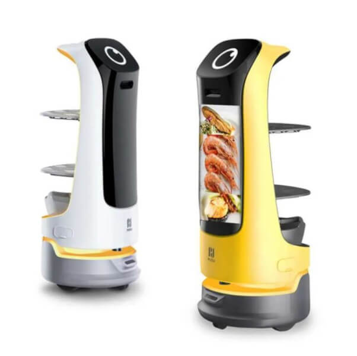
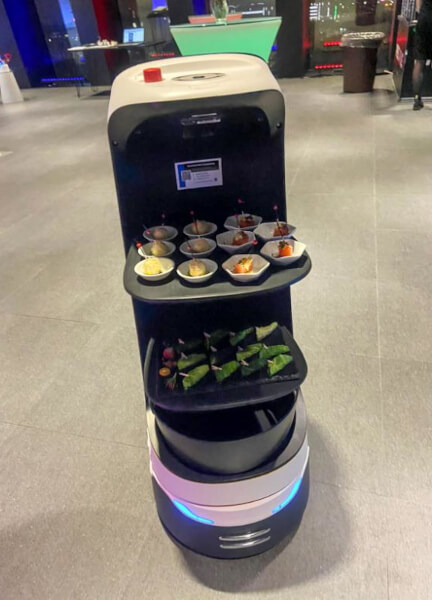
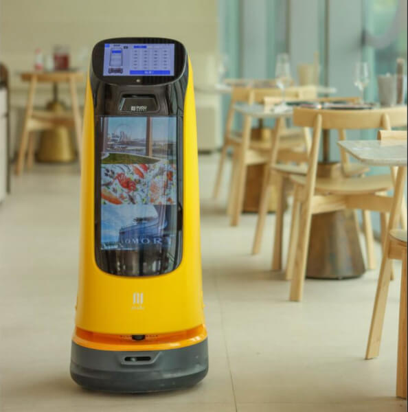
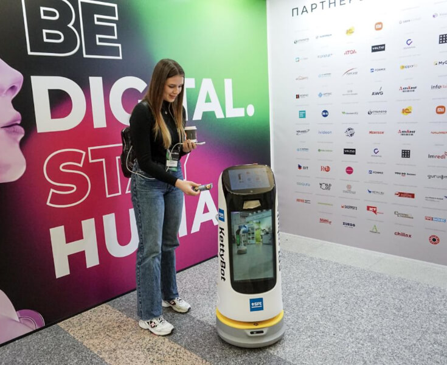

# робота-официанта KettyBot

Route: `/robots/arenda-kettybot/`

Status: `needs_rights_review`; production use is **not approved** until a human confirms rights.

Approval:

- [ ] approve for production
- [ ] replace before production
- [ ] block for production
- [ ] rights/source holder confirmed

## Legacy horizontal hero

- role: `legacy_horizontal_hero`
- src: `/images/tild3265-3261-4533-b965-383239633331__photo.jpg`
- projectPath: `site-export/images/tild3265-3261-4533-b965-383239633331__photo.jpg`
- actualDescription: Горизонтальный hero-кадр: робот-доставщик KettyBot везёт заказы гостям с рекламным экраном.
- seoAlt: Аренда сервисного робота робота-официанта KettyBot: робот-доставщик KettyBot везёт заказы гостям с рекламным экраном.
- caption: Горизонтальный hero-кадр: робот-доставщик KettyBot везёт заказы гостям с рекламным экраном.
- rightsStatus: `needs_rights_review`
- textSource: legacy-hero-generated from extracted live hero evidence; needs human text/right review

## Current generated hero

- role: `current_generated_hero`
- src: `/images/kiber-45/arenda-kettybot.webp`
- projectPath: `public/images/kiber-45/arenda-kettybot.webp`
- actualDescription: KettyBot крупным планом везёт поднос на корпоративном мероприятии.
- seoAlt: Робот-официант KettyBot: крупным планом везёт поднос на корпоративном мероприятии.
- caption: KettyBot везёт поднос на корпоративном событии.
- rightsStatus: `needs_rights_review`
- textSource: data/models/robots.source-of-truth.json (previous human+agent media review, mapped from role=hero to optimized generated hero)

## Gallery

### Gallery 0

- role: `gallery`
- src: `/images/tild6139-3335-4138-a539-383539326630__01.jpg`
- projectPath: `site-export/images/tild6139-3335-4138-a539-383539326630__01.jpg`
- actualDescription: KettyBot едет вдоль столиков в кафе; на рекламном экране показаны изображения блюд. Горизонтальное фото.
- seoAlt: Робот-доставщик KettyBot, робот для ресторана KettyBot: едет вдоль столиков в кафе; на рекламном экране показаны изображения блюд. Горизонтальное фото.
- caption: KettyBot едет вдоль столиков с рекламным экраном блюд.
- rightsStatus: `needs_rights_review`
- textSource: data/models/robots.source-of-truth.json (previous human+agent media review)

### Gallery 1

- role: `gallery`
- src: `/images/tild3663-6530-4536-b734-643935626664__08.jpg`
- projectPath: `site-export/images/tild3663-6530-4536-b734-643935626664__08.jpg`
- actualDescription: Два робота KettyBot, один жёлтый и один белый, крупным планом на белом фоне.
- seoAlt: Прокат робота-промоутера KettyBot для мероприятия: Два робота KettyBot, один жёлтый и один белый, крупным планом на белом фоне.
- caption: Жёлтый и белый KettyBot на белом фоне.
- rightsStatus: `needs_rights_review`
- textSource: data/models/robots.source-of-truth.json (previous human+agent media review)

### Gallery 2

- role: `gallery`
- src: `/images/tild6330-6138-4764-a335-376636333838__04.jpg`
- projectPath: `site-export/images/tild6330-6138-4764-a335-376636333838__04.jpg`
- actualDescription: KettyBot везёт два блюда гостям конференции, вид сзади.
- seoAlt: Робот-промоутер с экраном KettyBot, интерактивный робот-официант KettyBot: везёт два блюда гостям конференции, вид сзади.
- caption: KettyBot везёт блюда людям в деловой обстановке.
- rightsStatus: `needs_rights_review`
- textSource: data/models/robots.source-of-truth.json (previous human+agent media review)

### Gallery 3

- role: `gallery`
- src: `/images/tild3762-3232-4237-b965-323533333164__09.jpg`
- projectPath: `site-export/images/tild3762-3232-4237-b965-323533333164__09.jpg`
- actualDescription: KettyBot крупным планом едет по кафе; на заднем фоне столики и стулья.
- seoAlt: Заказать сервисного робота KettyBot на HoReCa-зоны и события с гостями: крупным планом едет по кафе; на заднем фоне столики и стулья.
- caption: KettyBot движется по кафе на фоне столиков и стульев.
- rightsStatus: `needs_rights_review`
- textSource: data/models/robots.source-of-truth.json (previous human+agent media review)

### Gallery 4

- role: `gallery`
- src: `/images/tild3864-3062-4563-b431-666566303761__02.jpg`
- projectPath: `site-export/images/tild3864-3062-4563-b431-666566303761__02.jpg`
- actualDescription: KettyBot стоит у фотозоны на выставке рядом с женщиной, которая смотрит на него и фотографируется с ним.
- seoAlt: Робот-официант KettyBot: стоит у фотозоны на выставке рядом с женщиной, которая смотрит на него и фотографируется с ним.
- caption: KettyBot у фотозоны рядом с женщиной.
- rightsStatus: `needs_rights_review`
- textSource: data/models/robots.source-of-truth.json (previous human+agent media review)

### Gallery 5

- role: `gallery`
- src: `/images/tild3736-3534-4030-b338-333366663735__06.jpg`
- projectPath: `site-export/images/tild3736-3534-4030-b338-333366663735__06.jpg`
- actualDescription: KettyBot едет по ресторану; на экране отображаются изображения блюд.
- seoAlt: Арендовать робота-промоутера KettyBot для HoReCa-зоны и события с гостями: едет по ресторану; на экране отображаются изображения блюд.
- caption: KettyBot едет по ресторану с изображениями блюд на экране.
- rightsStatus: `needs_rights_review`
- textSource: data/models/robots.source-of-truth.json (previous human+agent media review)
