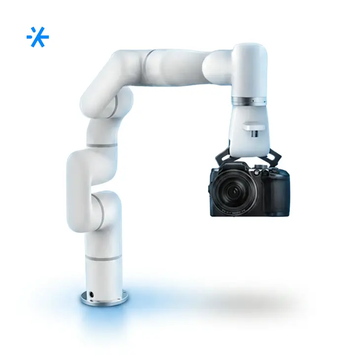
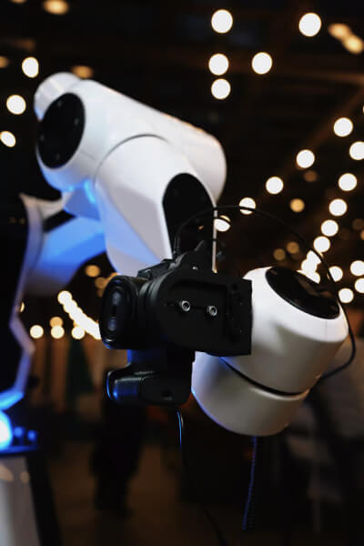
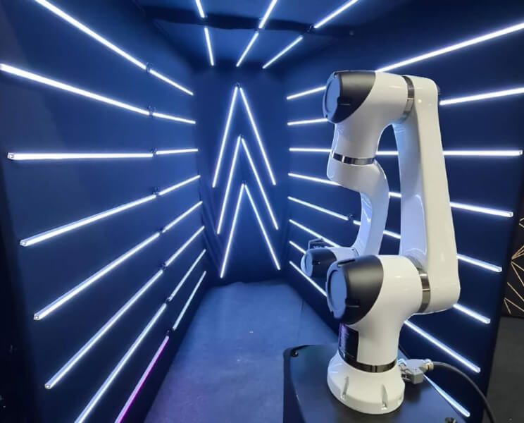
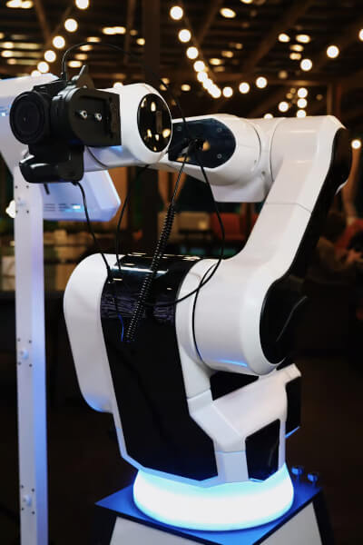
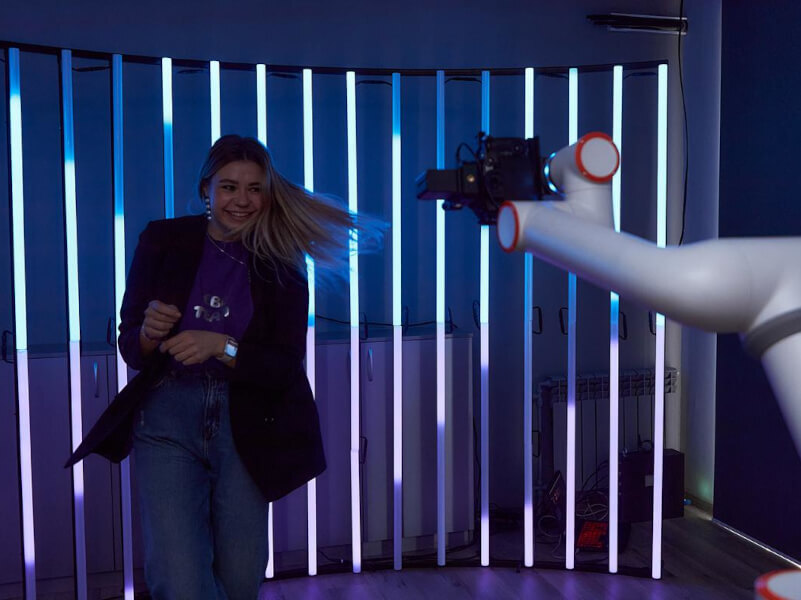

# робота Клипмейкер

Route: `/robots/arenda-klipmeiker/`

Source-of-truth meaningful images: `7`
Upper gallery block near hero: `3`
Lower gallery block near photo section: `4`

Status: `needs_rights_review`; production use is **not approved** until a human confirms rights.

Approval:

- [ ] approve for production
- [ ] replace before production
- [ ] block for production
- [ ] rights/source holder confirmed

## Why earlier visual cards showed too few gallery images

The earlier visual card used the rebuilt short gallery subset. The original live page has two gallery blocks, so this card now separates the upper gallery block near the hero area and the lower gallery block near the photo section.

## Legacy horizontal hero

- role: `legacy_horizontal_hero`
- src: `/images/tild6666-6661-4038-b966-616430346630__photo.jpg`
- projectPath: `site-export/images/tild6666-6661-4038-b966-616430346630__photo.jpg`
- actualDescription: Горизонтальный hero-кадр: роборука с камерой Клипмейкер снимает динамичное моушн-видео гостей.
- seoAlt: Заказать роботизированную съёмку робота Клипмейкер: роборука с камерой Клипмейкер снимает динамичное моушн-видео гостей.
- caption: Горизонтальный hero-кадр: роборука с камерой Клипмейкер снимает динамичное моушн-видео гостей.
- sourceGalleryBlock: `n/a`
- rightsStatus: `needs_rights_review`
- textSource: legacy-hero-generated from extracted live hero evidence; needs human text/right review

## Current generated hero

- role: `current_generated_hero`
- src: `/images/kiber-45/arenda-klipmeiker.webp`
- projectPath: `public/images/kiber-45/arenda-klipmeiker.webp`
- actualDescription: Робот Klipmeiker крупным планом; на заднем фоне видны мерцающие огни гирлянд.
- seoAlt: Робот-Klipmeiker: крупным планом; на заднем фоне видны мерцающие огни гирлянд.
- caption: Крупный план Klipmeiker на фоне мерцающих огней.
- sourceGalleryBlock: `n/a`
- rightsStatus: `needs_rights_review`
- textSource: data/models/robots.source-of-truth.json (previous human+agent media review, mapped from role=hero to optimized generated hero)

## Catalog card

- role: `catalog_card`
- src: `/images/tild3962-6238-4437-b135-656231613161__01.jpg`
- projectPath: `site-export/images/tild3962-6238-4437-b135-656231613161__01.jpg`
- actualDescription: Роботизированная рука с камерой снимает мужчину с гитарой, который позирует на неоновом фоне праздничного мероприятия.
- seoAlt: Аренда роботизированной камеры Klipmeiker для фотозоны и фотоактивации: Роботизированная рука с камерой снимает мужчину с гитарой, который позирует на неоновом фоне.
- caption: Klipmeiker снимает мужчину с гитарой на праздничном событии.
- sourceGalleryBlock: `upper_near_hero`
- rightsStatus: `needs_rights_review`
- textSource: data/models/robots.source-of-truth.json (previous human+agent media review)

## Upper gallery block

### arenda-klipmeiker__04

- role: `source_gallery_hero_candidate`
- src: `/images/tild6661-3737-4761-b032-643935616666__02.jpg`
- projectPath: `site-export/images/tild6661-3737-4761-b032-643935616666__02.jpg`
- actualDescription: Робот Klipmeiker крупным планом; на заднем фоне видны мерцающие огни гирлянд.
- seoAlt: Робот-Klipmeiker: крупным планом; на заднем фоне видны мерцающие огни гирлянд.
- caption: Крупный план Klipmeiker на фоне мерцающих огней.
- sourceGalleryBlock: `upper_near_hero`
- rightsStatus: `needs_rights_review`
- textSource: data/models/robots.source-of-truth.json (previous human+agent media review)

### arenda-klipmeiker__06

- role: `gallery`
- src: `/images/tild3039-3538-4564-b237-626230636636__06.jpg`
- projectPath: `site-export/images/tild3039-3538-4564-b237-626230636636__06.jpg`
- actualDescription: Робот для создания клипов Klipmeiker крупным планом на фоне неоновой подсветки в помещении на выставке.
- seoAlt: Камера-робот Klipmeiker, робот для видеороликов Klipmeiker: Робот для создания клипов Klipmeiker крупным планом на фоне красивой неоновой подсветки в.
- caption: Klipmeiker крупным планом в неоновой подсветке.
- sourceGalleryBlock: `upper_near_hero`
- rightsStatus: `needs_rights_review`
- textSource: data/models/robots.source-of-truth.json (previous human+agent media review)

## Lower gallery block

### arenda-klipmeiker__09

- role: `gallery`
- src: `/images/tild6165-6134-4737-b861-653139383366__04.jpg`
- projectPath: `site-export/images/tild6165-6134-4737-b861-653139383366__04.jpg`
- actualDescription: Роботизированная рука с камерой, вид спереди крупным планом, стоит на подставке на мероприятии в ресторане.
- seoAlt: Прокат медиа-робота Klipmeiker для HoReCa-зоны и события с гостями: Роботизированная рука с камерой, вид спереди крупным планом, стоит на подставке на мероприятии.
- caption: Роботизированная камера Klipmeiker на подставке в ресторане.
- sourceGalleryBlock: `lower_near_photo_section`
- rightsStatus: `needs_rights_review`
- textSource: data/models/robots.source-of-truth.json (previous human+agent media review)

### arenda-klipmeiker__10

- role: `gallery`
- src: `/images/tild3330-3561-4639-b639-343130353130__08.jpg`
- projectPath: `site-export/images/tild3330-3561-4639-b639-343130353130__08.jpg`
- actualDescription: Робот Klipmeiker на подставке стоит на сцене в небольшой дымке и снимает выступающего человека.
- seoAlt: Робот для контента Klipmeiker, медиа-робот Klipmeiker: на подставке стоит на сцене в небольшой дымке и снимает выступающего человека.
- caption: Klipmeiker снимает выступление на сцене.
- sourceGalleryBlock: `lower_near_photo_section`
- rightsStatus: `needs_rights_review`
- textSource: data/models/robots.source-of-truth.json (previous human+agent media review)

### arenda-klipmeiker__11

- role: `gallery`
- src: `/images/tild3936-6361-4463-a536-336239326466__07.jpg`
- projectPath: `site-export/images/tild3936-6361-4463-a536-336239326466__07.jpg`
- actualDescription: Девушка позирует для роботизированной руки с камерой Klipmeiker; у неё развеваются волосы, она радостная, съёмка происходит в фотозоне.
- seoAlt: Заказать роботизированной камеры Klipmeiker на фотозоны и фотоактивации: Девушка позирует для роботизированной руки с камерой Klipmeiker; у неё развеваются волосы, она.
- caption: Девушка позирует для Klipmeiker в фотозоне.
- sourceGalleryBlock: `lower_near_photo_section`
- rightsStatus: `needs_rights_review`
- textSource: data/models/robots.source-of-truth.json (previous human+agent media review)

### arenda-klipmeiker__12

- role: `gallery`
- src: `/images/tild3331-3030-4833-a364-383039306561__09.jpg`
- projectPath: `site-export/images/tild3331-3030-4833-a364-383039306561__09.jpg`
- actualDescription: Робот Klipmeiker установлен на подставке на сцене; вокруг мужчины монтируют его. На заднем фоне много экранов с разными изображениями.
- seoAlt: Робот-Klipmeiker: установлен на подставке на сцене; вокруг мужчины монтируют его. На заднем фоне много экранов с.
- caption: Монтаж Klipmeiker на сцене перед съёмкой.
- sourceGalleryBlock: `lower_near_photo_section`
- rightsStatus: `needs_rights_review`
- textSource: data/models/robots.source-of-truth.json (previous human+agent media review)
