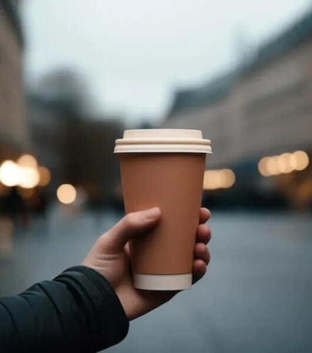

# мини робо-кофейни

Route: `/robots/arenda-mini-robo-kofeyni/`

Source-of-truth meaningful images: `8`
Upper gallery block near hero: `4`
Lower gallery block near photo section: `4`

Status: `approved_by_owner_for_production_media_use`; production media use for this card is approved by the owner review evidence below.

Approval:

- Approved by: Александр Маркин
- Approved at: `2026-08-29T00:55:09Z`
- Evidence: first five full cards reviewed directly; all remaining cards approved because they follow the same validated schema/principle.

- [x] approve for production
- [ ] replace before production
- [ ] block for production
- [x] rights/source holder confirmed

## Why earlier visual cards showed too few gallery images

The earlier visual card used the rebuilt short gallery subset. The original live page has two gallery blocks, so this card now separates the upper gallery block near the hero area and the lower gallery block near the photo section.

## Legacy horizontal hero

- role: `legacy_horizontal_hero`
- src: `/images/tild3339-3933-4137-b235-613431633164__photo.jpg`
- projectPath: `site-export/images/tild3339-3933-4137-b235-613431633164__photo.jpg`
- actualDescription: Горизонтальный hero-кадр: робот мини-кофейня в аренду — готовит кофе и мороженое гостям мероприятия.
- seoAlt: Аренда робо-кофейни мини робо-кофейни: робот мини-кофейня в аренду — готовит кофе и мороженое гостям мероприятия.
- caption: Горизонтальный hero-кадр: робот мини-кофейня в аренду — готовит кофе и мороженое гостям меропри.
- sourceGalleryBlock: `n/a`
- rightsStatus: `approved_for_production`
- textSource: legacy-hero-generated from extracted live hero evidence; needs human text/right review

## Current generated hero

- role: `current_generated_hero`
- src: `/images/kiber-45/arenda-mini-robo-kofeyni.webp`
- projectPath: `public/images/kiber-45/arenda-mini-robo-kofeyni.webp`
- actualDescription: Человек держит в руке стакан кофе, приготовленный мини-робокофейней. Видна только рука человека, на заднем фоне размытое здание, фото сделано на улице.
- seoAlt: Мини-робо-кофейня: Человек держит в руке стакан кофе, приготовленный мини-робокофейней. Видна только рука.
- caption: Стакан кофе, приготовленный мини-робокофейней.
- sourceGalleryBlock: `n/a`
- rightsStatus: `approved_for_production`
- textSource: data/models/robots.source-of-truth.json (previous human+agent media review, mapped from role=hero to optimized generated hero)

## Catalog card

- role: `catalog_card`
- src: `/images/tild3430-3038-4438-a532-323836613937__04.jpg`
- projectPath: `site-export/images/tild3430-3038-4438-a532-323836613937__04.jpg`
- actualDescription: Процесс приготовления кофе мини-робокофейней: видно стакан, в который льётся кофе, стакан держит роботизированная рука.
- seoAlt: Аренда мини робота-бариста для HoReCa-зоны и события с гостями: Процесс приготовления кофе мини-робокофейней: видно стакан, в который льётся кофе, стакан.
- caption: Мини-робокофейня наливает кофе в стакан.
- sourceGalleryBlock: `upper_near_hero`
- rightsStatus: `approved_for_production`
- textSource: data/models/robots.source-of-truth.json (previous human+agent media review)

## Upper gallery block

### arenda-mini-robo-kofeyni__04

- role: `source_gallery_hero_candidate`
- src: `/images/tild3439-3161-4166-a662-336436386532__08.jpg`
- projectPath: `site-export/images/tild3439-3161-4166-a662-336436386532__08.jpg`
- actualDescription: Человек держит в руке стакан кофе, приготовленный мини-робокофейней. Видна только рука человека, на заднем фоне размытое здание, фото сделано на улице.
- seoAlt: Мини-робо-кофейня: Человек держит в руке стакан кофе, приготовленный мини-робокофейней. Видна только рука.
- caption: Стакан кофе, приготовленный мини-робокофейней.
- sourceGalleryBlock: `upper_near_hero`
- rightsStatus: `approved_for_production`
- textSource: data/models/robots.source-of-truth.json (previous human+agent media review)

### arenda-mini-robo-kofeyni__06

- role: `gallery`
- src: `/images/tild3364-3236-4736-b430-303065663465__02.jpg`
- projectPath: `site-export/images/tild3364-3236-4736-b430-303065663465__02.jpg`
- actualDescription: Мини-робокофейня крупным планом во весь рост, видна целиком и установлена в зале конференции.
- seoAlt: Компактная роботизированная кофейня мини-робо-кофейня, автоматическая мини-кофейня мини-робо-кофейня: Мини-робокофейня крупным планом во весь рост, видна целиком и установлена в зале конференции.
- caption: Мини-робокофейня в просторном зале.
- sourceGalleryBlock: `upper_near_hero`
- rightsStatus: `approved_for_production`
- textSource: data/models/robots.source-of-truth.json (previous human+agent media review)

### arenda-mini-robo-kofeyni__07

- role: `gallery`
- src: `/images/tild6231-3835-4131-b966-373139663534__07.jpg`
- projectPath: `site-export/images/tild6231-3835-4131-b966-373139663534__07.jpg`
- actualDescription: Человек только что взял стакан кофе у робокофейни: видны только руки человека, манипулятор робота и стол.
- seoAlt: Прокат автоматической мини-кофейни для HoReCa-зоны и события с гостями: Человек только что взял стакан кофе у робокофейни: видны только руки человека, манипулятор.
- caption: Гость забирает кофе у робокофейни.
- sourceGalleryBlock: `upper_near_hero`
- rightsStatus: `approved_for_production`
- textSource: data/models/robots.source-of-truth.json (previous human+agent media review)

## Lower gallery block

### arenda-mini-robo-kofeyni__09

- role: `gallery`
- src: `/images/tild6634-3530-4637-a534-653639323435__05.jpg`
- projectPath: `site-export/images/tild6634-3530-4637-a534-653639323435__05.jpg`
- actualDescription: Человек подошёл к робокофейне и забирает свой стакан кофе, крупный план.
- seoAlt: Кофейный робот мини-робо-кофейня, мини-робо-кофейня: Человек подошёл к робокофейне и забирает свой стакан кофе, крупный план.
- caption: Крупный план выдачи кофе мини-робокофейней.
- sourceGalleryBlock: `lower_near_photo_section`
- rightsStatus: `approved_for_production`
- textSource: data/models/robots.source-of-truth.json (previous human+agent media review)

### arenda-mini-robo-kofeyni__10

- role: `gallery`
- src: `/images/tild3035-3038-4565-b133-646631646662__03.jpg`
- projectPath: `site-export/images/tild3035-3038-4565-b133-646631646662__03.jpg`
- actualDescription: Мини-робокофейня делает мороженое: роботизированная рука держит стакан, в который из аппарата подаётся мороженое.
- seoAlt: Заказать мини робота-бариста на HoReCa-зоны и события с гостями: Мини-робокофейня делает мороженое: роботизированная рука держит стакан, в который из аппарата.
- caption: Мини-робокофейня готовит мороженое.
- sourceGalleryBlock: `lower_near_photo_section`
- rightsStatus: `approved_for_production`
- textSource: data/models/robots.source-of-truth.json (previous human+agent media review)

### arenda-mini-robo-kofeyni__11

- role: `gallery`
- src: `/images/tild6265-3763-4265-b135-653138386261__06.jpg`
- projectPath: `site-export/images/tild6265-3763-4265-b135-653138386261__06.jpg`
- actualDescription: Несколько женщин стоят и ждут своей очереди у мини-робокофейни на мероприятии.
- seoAlt: Мини робот-бариста мини-робо-кофейня: Несколько женщин стоят и ждут своей очереди у мини-робокофейни на мероприятии.
- caption: Женщины ждут очередь у мини-робокофейни.
- sourceGalleryBlock: `lower_near_photo_section`
- rightsStatus: `approved_for_production`
- textSource: data/models/robots.source-of-truth.json (previous human+agent media review)

### arenda-mini-robo-kofeyni__12

- role: `gallery`
- src: `/images/tild3462-6461-4733-b237-356464643830__01.jpg`
- projectPath: `site-export/images/tild3462-6461-4733-b237-356464643830__01.jpg`
- actualDescription: Робокофейня крупным планом на выставке; рядом две женщины ждут, пока приготовится кофе.
- seoAlt: Арендовать автоматической мини-кофейни для выставочного стенда: Робокофейня крупным планом на выставке; рядом две женщины ждут, пока приготовится кофе.
- caption: Робокофейня на выставке рядом с посетительницами.
- sourceGalleryBlock: `lower_near_photo_section`
- rightsStatus: `approved_for_production`
- textSource: data/models/robots.source-of-truth.json (previous human+agent media review)
