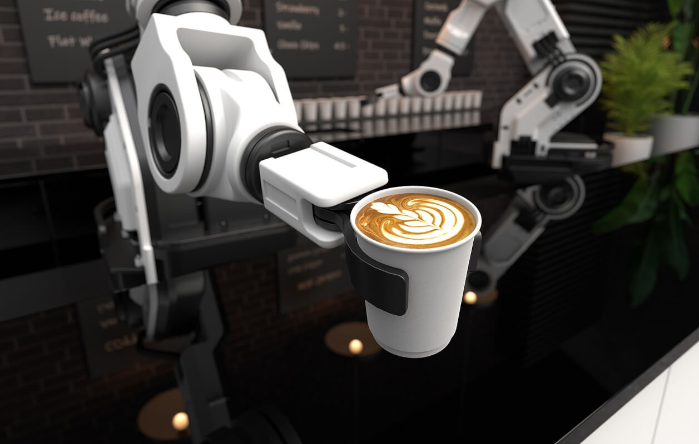
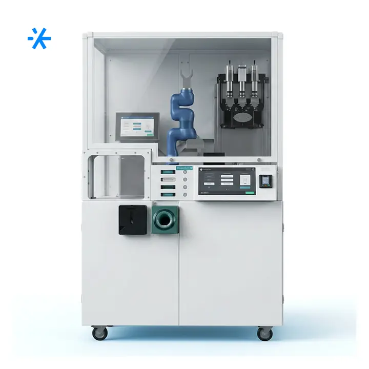
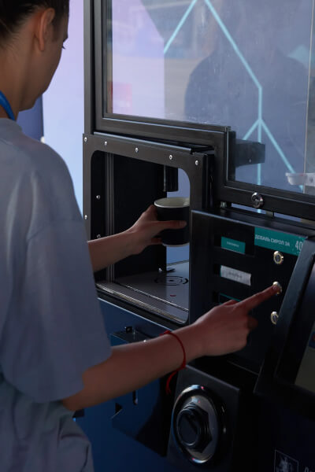
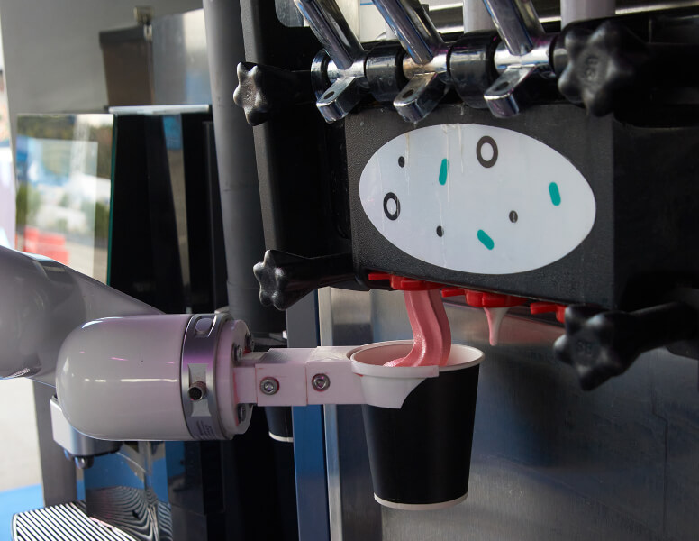
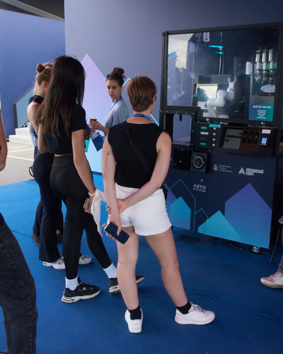

# мини робо-кофейни

Route: `/robots/arenda-mini-robo-kofeyni/`

Status: `needs_rights_review`; production use is **not approved** until a human confirms rights.

Approval:

- [ ] approve for production
- [ ] replace before production
- [ ] block for production
- [ ] rights/source holder confirmed

## Legacy horizontal hero

- role: `legacy_horizontal_hero`
- src: `/images/tild3339-3933-4137-b235-613431633164__photo.jpg`
- projectPath: `site-export/images/tild3339-3933-4137-b235-613431633164__photo.jpg`
- actualDescription: Горизонтальный hero-кадр: робот мини-кофейня в аренду — готовит кофе и мороженое гостям мероприятия.
- seoAlt: Аренда робо-кофейни мини робо-кофейни: робот мини-кофейня в аренду — готовит кофе и мороженое гостям мероприятия.
- caption: Горизонтальный hero-кадр: робот мини-кофейня в аренду — готовит кофе и мороженое гостям меропри.
- rightsStatus: `needs_rights_review`
- textSource: legacy-hero-generated from extracted live hero evidence; needs human text/right review

## Current generated hero

- role: `current_generated_hero`
- src: `/images/kiber-45/arenda-mini-robo-kofeyni.webp`
- projectPath: `public/images/kiber-45/arenda-mini-robo-kofeyni.webp`
- actualDescription: Человек держит в руке стакан кофе, приготовленный мини-робокофейней. Видна только рука человека, на заднем фоне размытое здание, фото сделано на улице.
- seoAlt: Мини-робо-кофейня: Человек держит в руке стакан кофе, приготовленный мини-робокофейней. Видна только рука.
- caption: Стакан кофе, приготовленный мини-робокофейней.
- rightsStatus: `needs_rights_review`
- textSource: data/models/robots.source-of-truth.json (previous human+agent media review, mapped from role=hero to optimized generated hero)

## Gallery

### Gallery 0

- role: `gallery`
- src: `/images/tild3364-3236-4736-b430-303065663465__02.jpg`
- projectPath: `site-export/images/tild3364-3236-4736-b430-303065663465__02.jpg`
- actualDescription: Мини-робокофейня крупным планом во весь рост, видна целиком и установлена в зале конференции.
- seoAlt: Компактная роботизированная кофейня мини-робо-кофейня, автоматическая мини-кофейня мини-робо-кофейня: Мини-робокофейня крупным планом во весь рост, видна целиком и установлена в зале конференции.
- caption: Мини-робокофейня в просторном зале.
- rightsStatus: `needs_rights_review`
- textSource: data/models/robots.source-of-truth.json (previous human+agent media review)

### Gallery 1

- role: `gallery`
- src: `/images/tild6231-3835-4131-b966-373139663534__07.jpg`
- projectPath: `site-export/images/tild6231-3835-4131-b966-373139663534__07.jpg`
- actualDescription: Человек только что взял стакан кофе у робокофейни: видны только руки человека, манипулятор робота и стол.
- seoAlt: Прокат автоматической мини-кофейни для HoReCa-зоны и события с гостями: Человек только что взял стакан кофе у робокофейни: видны только руки человека, манипулятор.
- caption: Гость забирает кофе у робокофейни.
- rightsStatus: `needs_rights_review`
- textSource: data/models/robots.source-of-truth.json (previous human+agent media review)

### Gallery 2

- role: `gallery`
- src: `/images/tild6634-3530-4637-a534-653639323435__05.jpg`
- projectPath: `site-export/images/tild6634-3530-4637-a534-653639323435__05.jpg`
- actualDescription: Человек подошёл к робокофейне и забирает свой стакан кофе, крупный план.
- seoAlt: Кофейный робот мини-робо-кофейня, мини-робо-кофейня: Человек подошёл к робокофейне и забирает свой стакан кофе, крупный план.
- caption: Крупный план выдачи кофе мини-робокофейней.
- rightsStatus: `needs_rights_review`
- textSource: data/models/robots.source-of-truth.json (previous human+agent media review)

### Gallery 3

- role: `gallery`
- src: `/images/tild3035-3038-4565-b133-646631646662__03.jpg`
- projectPath: `site-export/images/tild3035-3038-4565-b133-646631646662__03.jpg`
- actualDescription: Мини-робокофейня делает мороженое: роботизированная рука держит стакан, в который из аппарата подаётся мороженое.
- seoAlt: Заказать мини робота-бариста на HoReCa-зоны и события с гостями: Мини-робокофейня делает мороженое: роботизированная рука держит стакан, в который из аппарата.
- caption: Мини-робокофейня готовит мороженое.
- rightsStatus: `needs_rights_review`
- textSource: data/models/robots.source-of-truth.json (previous human+agent media review)

### Gallery 4

- role: `gallery`
- src: `/images/tild6265-3763-4265-b135-653138386261__06.jpg`
- projectPath: `site-export/images/tild6265-3763-4265-b135-653138386261__06.jpg`
- actualDescription: Несколько женщин стоят и ждут своей очереди у мини-робокофейни на мероприятии.
- seoAlt: Мини робот-бариста мини-робо-кофейня: Несколько женщин стоят и ждут своей очереди у мини-робокофейни на мероприятии.
- caption: Женщины ждут очередь у мини-робокофейни.
- rightsStatus: `needs_rights_review`
- textSource: data/models/robots.source-of-truth.json (previous human+agent media review)

### Gallery 5

- role: `gallery`
- src: `/images/tild3462-6461-4733-b237-356464643830__01.jpg`
- projectPath: `site-export/images/tild3462-6461-4733-b237-356464643830__01.jpg`
- actualDescription: Робокофейня крупным планом на выставке; рядом две женщины ждут, пока приготовится кофе.
- seoAlt: Арендовать автоматической мини-кофейни для выставочного стенда: Робокофейня крупным планом на выставке; рядом две женщины ждут, пока приготовится кофе.
- caption: Робокофейня на выставке рядом с посетительницами.
- rightsStatus: `needs_rights_review`
- textSource: data/models/robots.source-of-truth.json (previous human+agent media review)
