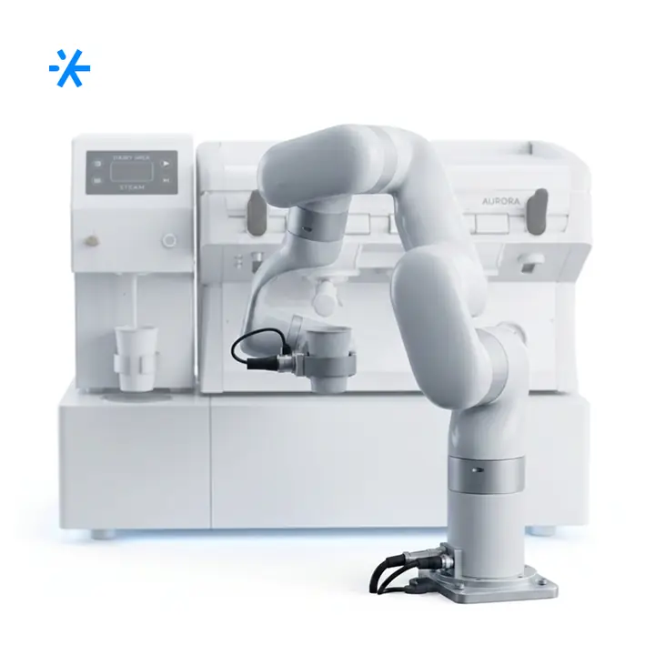
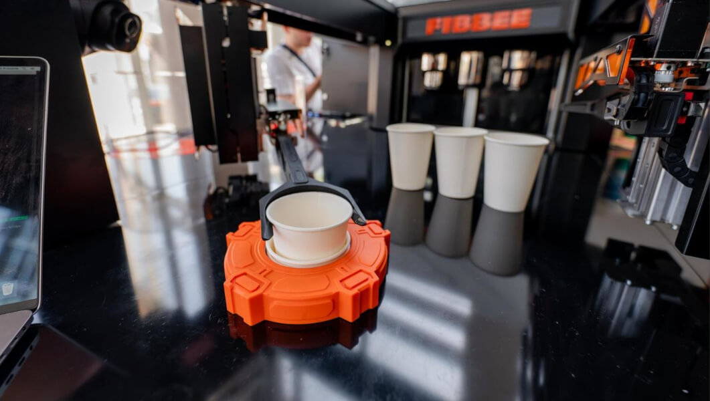
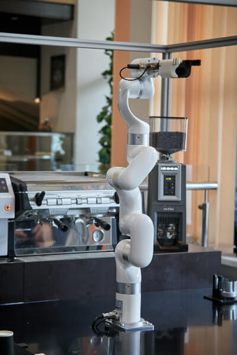
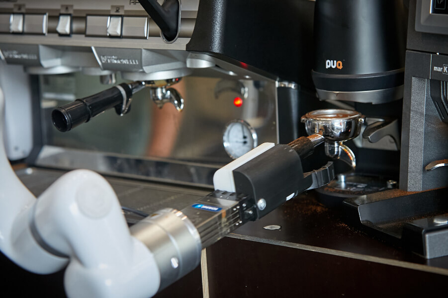
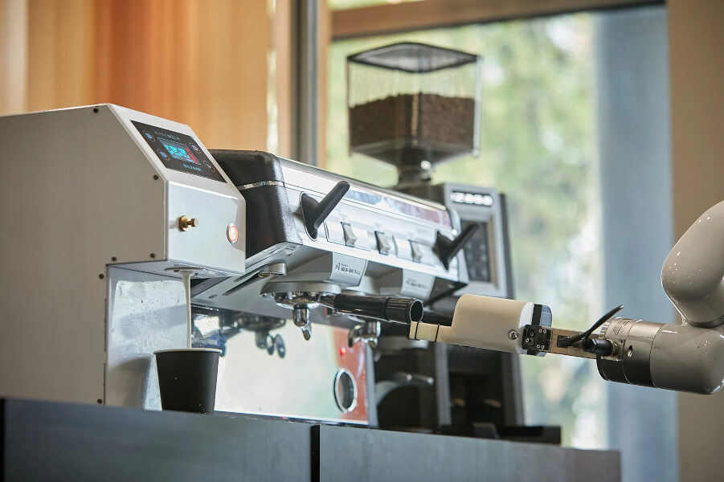

# робота-кофейни

Route: `/robots/arenda-robo-kofeyni/`

Source-of-truth meaningful images: `11`
Upper gallery block near hero: `5`
Lower gallery block near photo section: `6`

Status: `approved_by_owner_for_production_media_use`; production media use for this card is approved by the owner review evidence below.

Approval:

- Approved by: Александр Маркин
- Approved at: `2026-08-29T00:55:09Z`
- Evidence: first five full cards reviewed directly; all remaining cards approved because they follow the same validated schema/principle.

- [x] approve for production
- [ ] replace before production
- [ ] block for production
- [x] rights/source holder confirmed

## Why earlier visual cards showed too few gallery images

The earlier visual card used the rebuilt short gallery subset. The original live page has two gallery blocks, so this card now separates the upper gallery block near the hero area and the lower gallery block near the photo section.

## Legacy horizontal hero

- role: `legacy_horizontal_hero`
- src: `/images/tild3166-3530-4635-a635-326430303162__08.jpg`
- projectPath: `site-export/images/tild3166-3530-4635-a635-326430303162__08.jpg`
- actualDescription: Горизонтальный hero-кадр: робот-кофейня в аренду — роборука готовит кофе гостям мероприятия.
- seoAlt: Аренда робо-кофейни робота-кофейни: робот-кофейня в аренду — роборука готовит кофе гостям мероприятия.
- caption: Горизонтальный hero-кадр: робот-кофейня в аренду — роборука готовит кофе гостям мероприятия.
- sourceGalleryBlock: `n/a`
- rightsStatus: `approved_for_production`
- textSource: legacy-hero-generated from extracted live hero evidence; needs human text/right review

## Current generated hero

- role: `current_generated_hero`
- src: `/images/kiber-45/arenda-robo-kofeyni.webp`
- projectPath: `public/images/kiber-45/arenda-robo-kofeyni.webp`
- actualDescription: Роботизированная рука Robo-Кофейни наливает готовый кофе в стакан.
- seoAlt: Робо-кофейня: Роботизированная рука Robo-Кофейни наливает готовый кофе в стакан.
- caption: Robo-Кофейня наливает готовый кофе в стакан.
- sourceGalleryBlock: `n/a`
- rightsStatus: `approved_for_production`
- textSource: data/models/robots.source-of-truth.json (previous human+agent media review, mapped from role=hero to optimized generated hero)

## Catalog card

- role: `catalog_card`
- src: `/images/tild6461-3763-4635-b532-666633626634__010.jpg`
- projectPath: `site-export/images/tild6461-3763-4635-b532-666633626634__010.jpg`
- actualDescription: Процесс приготовления кофе в Robo-Кофейне крупным планом, технологичное фото.
- seoAlt: Аренда робота-бариста для HoReCa-зоны и события с гостями: Процесс приготовления кофе в Robo-Кофейне крупным планом, технологичное фото.
- caption: Технологичный процесс приготовления кофе в Robo-Кофейне.
- sourceGalleryBlock: `upper_near_hero`
- rightsStatus: `approved_for_production`
- textSource: data/models/robots.source-of-truth.json (previous human+agent media review)

## Upper gallery block

### arenda-robo-kofeyni__04

- role: `source_gallery_hero_candidate`
- src: `/images/tild3539-6161-4962-b461-313766373363__01.jpg`
- projectPath: `site-export/images/tild3539-6161-4962-b461-313766373363__01.jpg`
- actualDescription: Роботизированная рука Robo-Кофейни наливает готовый кофе в стакан.
- seoAlt: Робо-кофейня: Роботизированная рука Robo-Кофейни наливает готовый кофе в стакан.
- caption: Robo-Кофейня наливает готовый кофе в стакан.
- sourceGalleryBlock: `upper_near_hero`
- rightsStatus: `approved_for_production`
- textSource: data/models/robots.source-of-truth.json (previous human+agent media review)

### arenda-robo-kofeyni__06

- role: `gallery`
- src: `/images/tild6235-3566-4030-b434-383765343333__03.jpg`
- projectPath: `site-export/images/tild6235-3566-4030-b434-383765343333__03.jpg`
- actualDescription: Манипулятор Robo-Кофейни засыпает молотый кофе в кофемашину, крупный план.
- seoAlt: Роботизированная кофейня Робо-Кофейня, автоматическая кофейня Робо-Кофейня: Манипулятор Robo-Кофейни засыпает молотый кофе в кофемашину, крупный план.
- caption: Манипулятор засыпает молотый кофе в кофемашину.
- sourceGalleryBlock: `upper_near_hero`
- rightsStatus: `approved_for_production`
- textSource: data/models/robots.source-of-truth.json (previous human+agent media review)

### arenda-robo-kofeyni__07

- role: `gallery`
- src: `/images/tild3737-6237-4465-a132-393964613265__noroot.png`
- projectPath: `site-export/images/tild3737-6237-4465-a132-393964613265__noroot.png`
- actualDescription: Крупное изображение стакана кофе, небольшого тканевого мешочка с кофе и кофейных зёрен как иллюстрация к робокофейне.
- seoAlt: Прокат автоматической кофейни для HoReCa-зоны и события с гостями: Крупное изображение стакана кофе, небольшого тканевого мешочка с кофе и кофейных зёрен как.
- caption: Кофейная иллюстрация со стаканом, мешочком и зёрнами.
- sourceGalleryBlock: `upper_near_hero`
- rightsStatus: `approved_for_production`
- textSource: data/models/robots.source-of-truth.json (previous human+agent media review)

### arenda-robo-kofeyni__08

- role: `gallery`
- src: `/images/tild3739-3864-4263-b630-616561386635__06.jpg`
- projectPath: `site-export/images/tild3739-3864-4263-b630-616561386635__06.jpg`
- actualDescription: Манипулятор робокофейни держит стакан кофе и готов передать его человеку на мероприятии.
- seoAlt: Робот для кофе Робо-Кофейня, кофейный робот Робо-Кофейня: Манипулятор робокофейни держит стакан кофе и готов передать его человеку на мероприятии.
- caption: Манипулятор готов передать стакан кофе человеку.
- sourceGalleryBlock: `upper_near_hero`
- rightsStatus: `approved_for_production`
- textSource: data/models/robots.source-of-truth.json (previous human+agent media review)

## Lower gallery block

### arenda-robo-kofeyni__10

- role: `gallery`
- src: `/images/tild3438-3161-4562-b937-626434386232__05.jpg`
- projectPath: `site-export/images/tild3438-3161-4562-b937-626434386232__05.jpg`
- actualDescription: Человек выбирает кофе на планшете: видно планшет крупным планом и руку человека, которая нажимает на экран.
- seoAlt: Заказать робота-бариста на HoReCa-зоны и события с гостями: Человек выбирает кофе на планшете: видно планшет крупным планом и руку человека, которая.
- caption: Выбор кофе на планшете Robo-Кофейни.
- sourceGalleryBlock: `lower_near_photo_section`
- rightsStatus: `approved_for_production`
- textSource: data/models/robots.source-of-truth.json (previous human+agent media review)

### arenda-robo-kofeyni__11

- role: `gallery`
- src: `/images/tild3166-3530-4635-a635-326430303162__08.jpg`
- projectPath: `site-export/images/tild3166-3530-4635-a635-326430303162__08.jpg`
- actualDescription: Манипулятор Robo-Кофейни крупным планом держит стакан только что приготовленного свежего кофе и готов передать его человеку.
- seoAlt: Робо-кофейня: Манипулятор Robo-Кофейни крупным планом держит стакан только что приготовленного свежего кофе и.
- caption: Манипулятор держит стакан свежего кофе.
- sourceGalleryBlock: `lower_near_photo_section`
- rightsStatus: `approved_for_production`
- textSource: data/models/robots.source-of-truth.json (previous human+agent media review)

### arenda-robo-kofeyni__12

- role: `gallery`
- src: `/images/tild6663-3336-4432-a366-386435363061__04.jpg`
- projectPath: `site-export/images/tild6663-3336-4432-a366-386435363061__04.jpg`
- actualDescription: Крупный план: робот-манипулятор достаёт держатель для кофе из кофемашины на мероприятии.
- seoAlt: Арендовать автоматической кофейни для HoReCa-зоны и события с гостями: Крупный план: робот-манипулятор достаёт держатель для кофе из кофемашины на мероприятии.
- caption: Робот-манипулятор достаёт держатель из кофемашины.
- sourceGalleryBlock: `lower_near_photo_section`
- rightsStatus: `approved_for_production`
- textSource: data/models/robots.source-of-truth.json (previous human+agent media review)

### arenda-robo-kofeyni__13

- role: `gallery`
- src: `/images/tild6463-3134-4936-b237-313365313966__02.jpg`
- projectPath: `site-export/images/tild6463-3134-4936-b237-313365313966__02.jpg`
- actualDescription: Робокофейня манипулятором взаимодействует с кофемашиной, крупный план на выставке.
- seoAlt: Роботизированная кофейня Робо-Кофейня, автоматическая кофейня Робо-Кофейня: Робокофейня манипулятором взаимодействует с кофемашиной, крупный план на выставке.
- caption: Робокофейня взаимодействует с кофемашиной.
- sourceGalleryBlock: `lower_near_photo_section`
- rightsStatus: `approved_for_production`
- textSource: data/models/robots.source-of-truth.json (previous human+agent media review)

### arenda-robo-kofeyni__14

- role: `gallery`
- src: `/images/tild6262-3165-4135-b861-333361383432__noroot.png`
- projectPath: `site-export/images/tild6262-3165-4135-b861-333361383432__noroot.png`
- actualDescription: Robo-Кофейня на корпоративе делает кофе для девушки, которая стоит в ожидании.
- seoAlt: Взять в прокат робота-бариста для HoReCa-зоны и события с гостями: Robo-Кофейня на корпоративе делает кофе для девушки, которая стоит в ожидании.
- caption: Robo-Кофейня готовит кофе для гостьи на корпоративе.
- sourceGalleryBlock: `lower_near_photo_section`
- rightsStatus: `approved_for_production`
- textSource: data/models/robots.source-of-truth.json (previous human+agent media review)

### arenda-robo-kofeyni__15

- role: `gallery`
- src: `/images/tild6236-3632-4465-a262-303930336164__07.jpg`
- projectPath: `site-export/images/tild6236-3632-4465-a262-303930336164__07.jpg`
- actualDescription: Робокофейня крупным планом изготавливает кофе на конференции.
- seoAlt: Робот для кофе Робо-Кофейня, кофейный робот Робо-Кофейня: Робокофейня крупным планом изготавливает кофе на конференции.
- caption: Робокофейня готовит кофе крупным планом.
- sourceGalleryBlock: `lower_near_photo_section`
- rightsStatus: `approved_for_production`
- textSource: data/models/robots.source-of-truth.json (previous human+agent media review)
