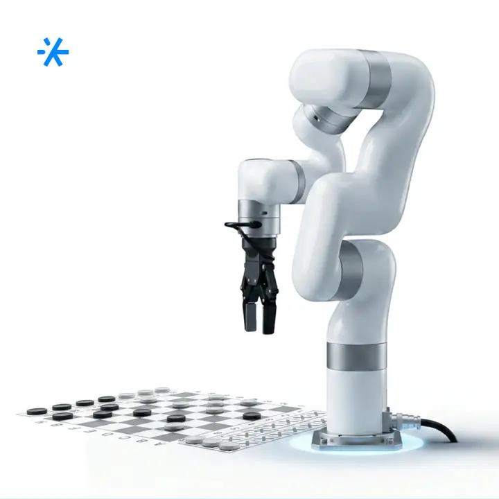
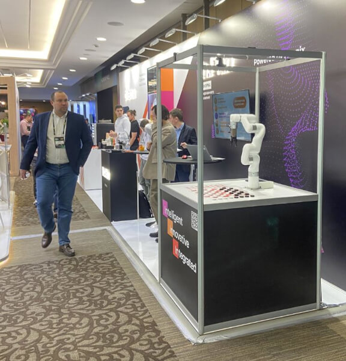
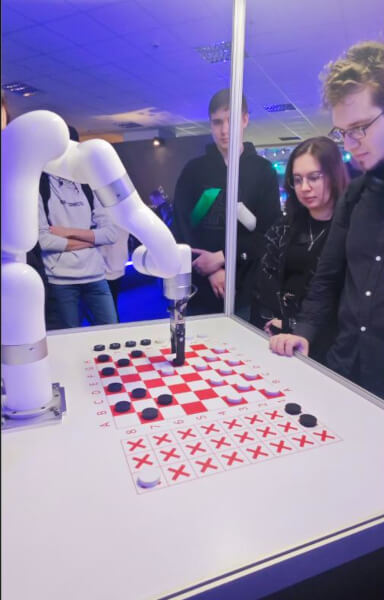
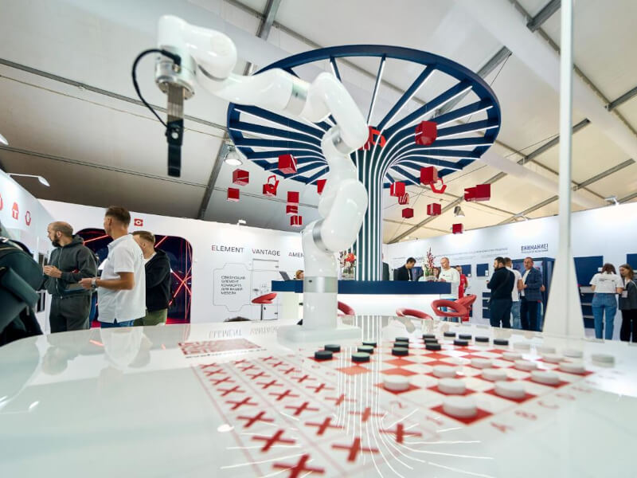
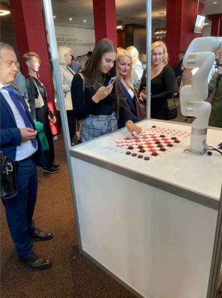
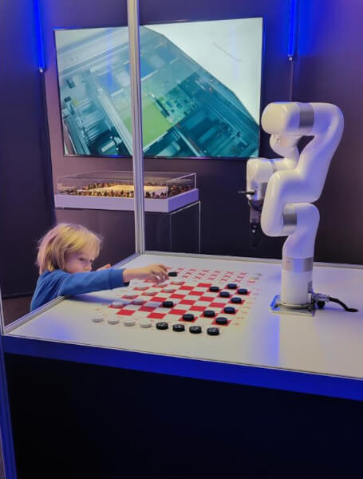
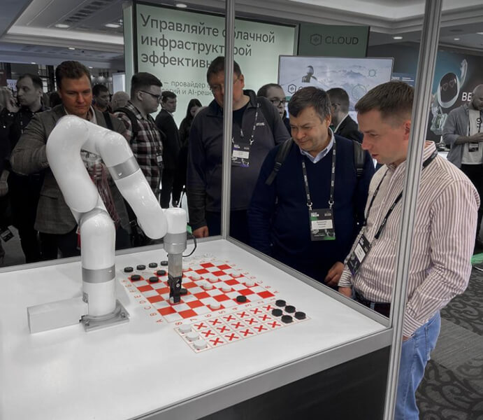

# робота для игры в шашки

Route: `/robots/arenda-roboshashki/`

Source-of-truth meaningful images: `10`
Upper gallery block near hero: `5`
Lower gallery block near photo section: `5`

Status: `needs_rights_review`; production use is **not approved** until a human confirms rights.

Approval:

- [ ] approve for production
- [ ] replace before production
- [ ] block for production
- [ ] rights/source holder confirmed

## Why earlier visual cards showed too few gallery images

The earlier visual card used the rebuilt short gallery subset. The original live page has two gallery blocks, so this card now separates the upper gallery block near the hero area and the lower gallery block near the photo section.

## Legacy horizontal hero

- role: `legacy_horizontal_hero`
- src: `/images/tild3830-6431-4535-a363-663663343965__photo.jpg`
- projectPath: `site-export/images/tild3830-6431-4535-a363-663663343965__photo.jpg`
- actualDescription: Горизонтальный hero-кадр: робот с манипулятором играет в шашки с гостем мероприятия.
- seoAlt: Аренда робота робота для игры в шашки: робот с манипулятором играет в шашки с гостем мероприятия.
- caption: Горизонтальный hero-кадр: робот с манипулятором играет в шашки с гостем мероприятия.
- sourceGalleryBlock: `n/a`
- rightsStatus: `needs_rights_review`
- textSource: legacy-hero-generated from extracted live hero evidence; needs human text/right review

## Current generated hero

- role: `current_generated_hero`
- src: `/images/kiber-45/arenda-roboshashki.webp`
- projectPath: `public/images/kiber-45/arenda-roboshashki.webp`
- actualDescription: Роботизированная рука переставляет шашку с места на место в процессе игры с человеком.
- seoAlt: Робот-шашист Робошашки: Роботизированная рука переставляет шашку с места на место в процессе игры с человеком.
- caption: Роботизированная рука переставляет шашку во время партии.
- sourceGalleryBlock: `n/a`
- rightsStatus: `needs_rights_review`
- textSource: data/models/robots.source-of-truth.json (previous human+agent media review, mapped from role=hero to optimized generated hero)

## Catalog card

- role: `catalog_card`
- src: `/images/tild3366-3065-4233-b732-643537393938__08.jpg`
- projectPath: `site-export/images/tild3366-3065-4233-b732-643537393938__08.jpg`
- actualDescription: Роботизированная рука для игры в шашки стоит на стенде компании и ожидает человека, который подойдёт поиграть с ней в шашки.
- seoAlt: Аренда робота для игры в шашки для выставочного стенда: Роботизированная рука для игры в шашки стоит на стенде компании и ожидает человека, который.
- caption: Робот-шашист ждёт игрока на стенде.
- sourceGalleryBlock: `upper_near_hero`
- rightsStatus: `needs_rights_review`
- textSource: data/models/robots.source-of-truth.json (previous human+agent media review)

## Upper gallery block

### arenda-roboshashki__04

- role: `source_gallery_hero_candidate`
- src: `/images/tild3033-6163-4730-b438-633462613631__03.jpg`
- projectPath: `site-export/images/tild3033-6163-4730-b438-633462613631__03.jpg`
- actualDescription: Роботизированная рука переставляет шашку с места на место в процессе игры с человеком.
- seoAlt: Робот-шашист Робошашки: Роботизированная рука переставляет шашку с места на место в процессе игры с человеком.
- caption: Роботизированная рука переставляет шашку во время партии.
- sourceGalleryBlock: `upper_near_hero`
- rightsStatus: `needs_rights_review`
- textSource: data/models/robots.source-of-truth.json (previous human+agent media review)

### arenda-roboshashki__06

- role: `gallery`
- src: `/images/tild6237-6438-4661-a563-393364353366__01.jpg`
- projectPath: `site-export/images/tild6237-6438-4661-a563-393364353366__01.jpg`
- actualDescription: Робошашки выставили шашки в правильной последовательности и ждут начала игры на технологичной выставке.
- seoAlt: Игровой робот Робошашки, робот-манипулятор для шашек Робошашки: выставили шашки в правильной последовательности и ждут начала игры на технологичной выставке.
- caption: Робошашки готовы к началу игры.
- sourceGalleryBlock: `upper_near_hero`
- rightsStatus: `needs_rights_review`
- textSource: data/models/robots.source-of-truth.json (previous human+agent media review)

### arenda-roboshashki__07

- role: `gallery`
- src: `/images/tild3363-3066-4533-a662-373435393838__06.jpg`
- projectPath: `site-export/images/tild3363-3066-4533-a662-373435393838__06.jpg`
- actualDescription: Игровая доска для робота-шашиста расположена на выставке; рядом подошёл ребёнок и взаимодействует с роботом, играет в шашки.
- seoAlt: Прокат интерактивного робота для шашек для выставочного стенда: Игровая доска для робота-шашиста расположена на выставке; рядом подошёл ребёнок и.
- caption: Ребёнок играет в шашки с роботом на выставке.
- sourceGalleryBlock: `upper_near_hero`
- rightsStatus: `needs_rights_review`
- textSource: data/models/robots.source-of-truth.json (previous human+agent media review)

### arenda-roboshashki__08

- role: `gallery`
- src: `/images/tild6662-3163-4339-b535-393537623661__09.jpg`
- projectPath: `site-export/images/tild6662-3163-4339-b535-393537623661__09.jpg`
- actualDescription: Робот-шашист установлен на турнире по игре в шашки и ожидает претендента на игру.
- seoAlt: Интерактивный робот для настольной игры Робошашки, робот-шашист Робошашки: Робот-шашист установлен на турнире по игре в шашки и ожидает претендента на игру.
- caption: Робот-шашист ждёт соперника за игровой доской.
- sourceGalleryBlock: `upper_near_hero`
- rightsStatus: `needs_rights_review`
- textSource: data/models/robots.source-of-truth.json (previous human+agent media review)

## Lower gallery block

### arenda-roboshashki__10

- role: `gallery`
- src: `/images/tild3939-6338-4836-b630-333563303035__02.jpg`
- projectPath: `site-export/images/tild3939-6338-4836-b630-333563303035__02.jpg`
- actualDescription: Девушку фотографируют во время процесса игры с роботом-шашистом на мероприятии.
- seoAlt: Заказать робота для игры в шашки на интерактивной игровой зоны: Девушку фотографируют во время процесса игры с роботом-шашистом на мероприятии.
- caption: Девушку фотографируют во время игры с роботом-шашистом.
- sourceGalleryBlock: `lower_near_photo_section`
- rightsStatus: `needs_rights_review`
- textSource: data/models/robots.source-of-truth.json (previous human+agent media review)

### arenda-roboshashki__11

- role: `gallery`
- src: `/images/tild6337-3337-4531-a264-306436333637__07.jpg`
- projectPath: `site-export/images/tild6337-3337-4531-a264-306436333637__07.jpg`
- actualDescription: Гости выставки обсуждают процесс игры с роботом в шашки.
- seoAlt: Робот для игры в шашки Робошашки: Гости выставки обсуждают процесс игры с роботом в шашки.
- caption: Люди обсуждают игру с роботом-шашистом.
- sourceGalleryBlock: `lower_near_photo_section`
- rightsStatus: `needs_rights_review`
- textSource: data/models/robots.source-of-truth.json (previous human+agent media review)

### arenda-roboshashki__12

- role: `gallery`
- src: `/images/tild3736-3630-4564-b964-333336653665__04.jpg`
- projectPath: `site-export/images/tild3736-3630-4564-b964-333336653665__04.jpg`
- actualDescription: Ребёнок соревнуется с роботом-шашистом в игре на праздничном мероприятии.
- seoAlt: Арендовать интерактивного робота для шашек для интерактивной игровой зоны: Ребёнок соревнуется с роботом-шашистом в игре на праздничном мероприятии.
- caption: Ребёнок соревнуется с роботом-шашистом.
- sourceGalleryBlock: `lower_near_photo_section`
- rightsStatus: `needs_rights_review`
- textSource: data/models/robots.source-of-truth.json (previous human+agent media review)

### arenda-roboshashki__13

- role: `gallery`
- src: `/images/tild3034-3761-4137-a336-346133313336__010.jpg`
- projectPath: `site-export/images/tild3034-3761-4137-a336-346133313336__010.jpg`
- actualDescription: Несколько человек наблюдают на конференции, как робот играет с мужчиной партию в шашки.
- seoAlt: Робот-манипулятор для шашек Робошашки, интерактивный робот для настольной игры Робошашки: Несколько человек наблюдают на конференции, как робот играет с мужчиной партию в шашки.
- caption: Робот играет партию в шашки с мужчиной.
- sourceGalleryBlock: `lower_near_photo_section`
- rightsStatus: `needs_rights_review`
- textSource: data/models/robots.source-of-truth.json (previous human+agent media review)

### arenda-roboshashki__14

- role: `gallery`
- src: `/images/tild3063-3536-4364-a161-653762356231__05.jpg`
- projectPath: `site-export/images/tild3063-3536-4364-a161-653762356231__05.jpg`
- actualDescription: Гости мероприятия участвуют в турнире по шашкам с роботом.
- seoAlt: Взять в прокат робота для игры в шашки для интерактивной игровой зоны: Гости мероприятия участвуют в турнире по шашкам с роботом.
- caption: Гости участвуют в турнире по шашкам с роботом.
- sourceGalleryBlock: `lower_near_photo_section`
- rightsStatus: `needs_rights_review`
- textSource: data/models/robots.source-of-truth.json (previous human+agent media review)
