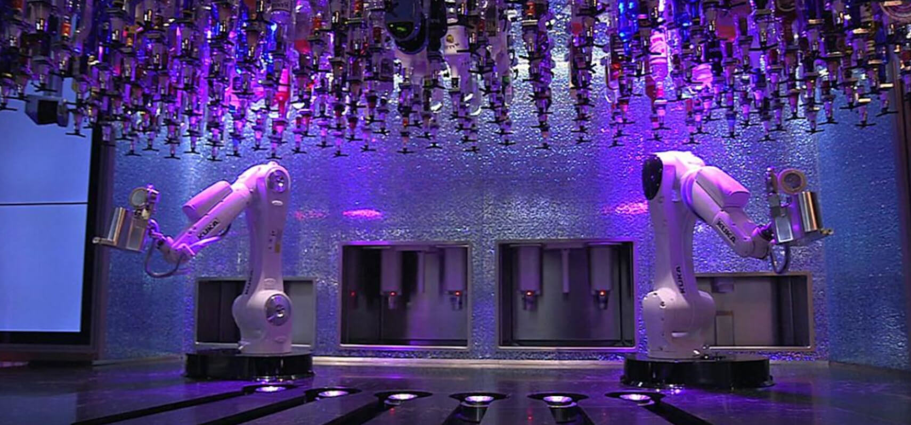
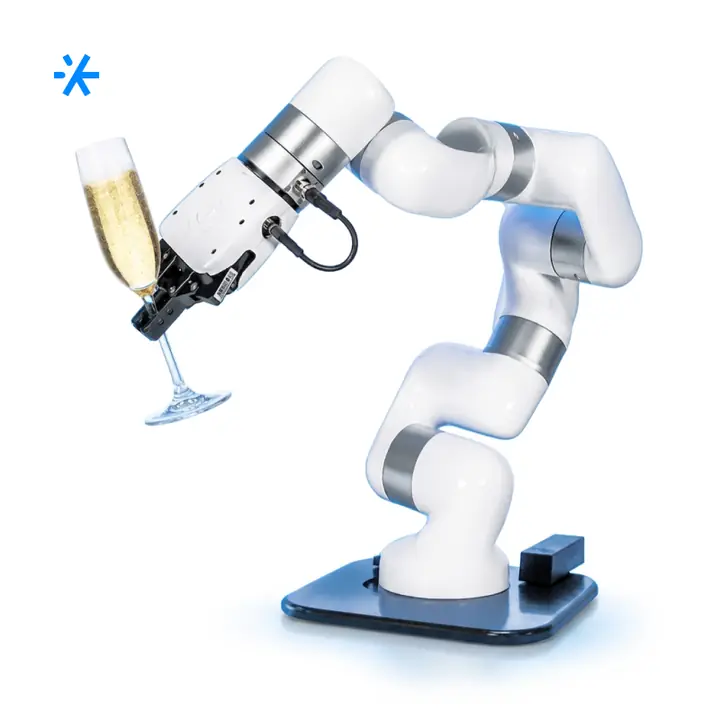
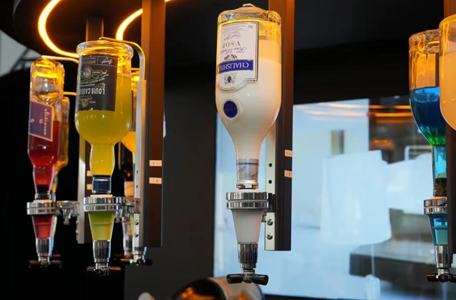
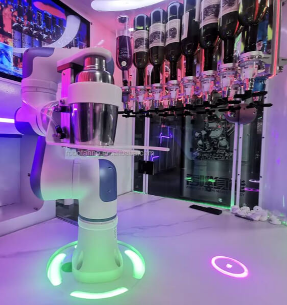
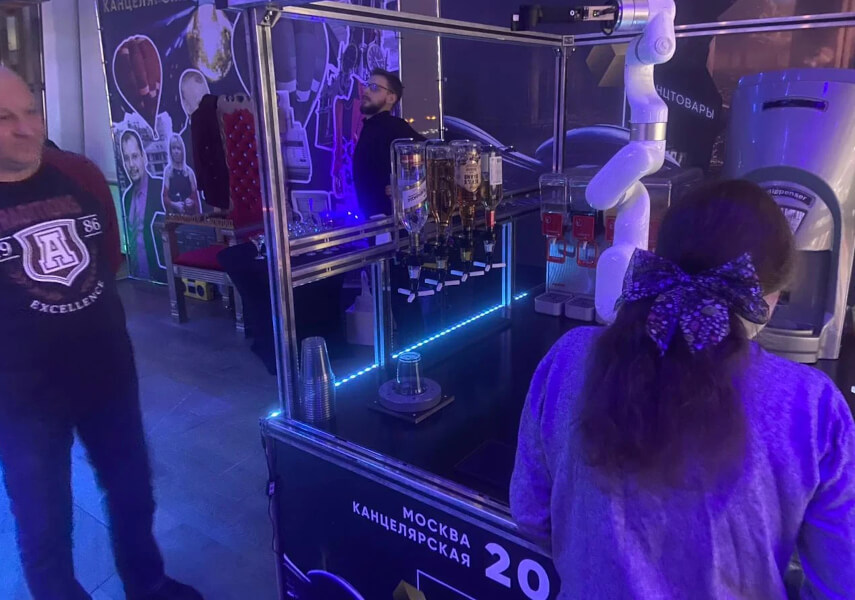

# робота-бармена «Робобар»

Route: `/robots/arenda-robot-barmen/`

Status: `needs_rights_review`; production use is **not approved** until a human confirms rights.

Approval:

- [ ] approve for production
- [ ] replace before production
- [ ] block for production
- [ ] rights/source holder confirmed

## Legacy horizontal hero

- role: `legacy_horizontal_hero`
- src: `/images/tild3530-3630-4038-b865-333964376335__photo.jpg`
- projectPath: `site-export/images/tild3530-3630-4038-b865-333964376335__photo.jpg`
- actualDescription: Горизонтальный hero-кадр: робот-бармен Робобар в аренду готовит коктейль по заказу с сенсорного планшета.
- seoAlt: Аренда робота-бармена робота-бармена «Робобар»: робот-бармен Робобар в аренду готовит коктейль по заказу с сенсорного планшета.
- caption: Горизонтальный hero-кадр: робот-бармен Робобар в аренду готовит коктейль по заказу с сенсорного.
- rightsStatus: `needs_rights_review`
- textSource: legacy-hero-generated from extracted live hero evidence; needs human text/right review

## Current generated hero

- role: `current_generated_hero`
- src: `/images/kiber-45/arenda-robot-barmen.webp`
- projectPath: `public/images/kiber-45/arenda-robot-barmen.webp`
- actualDescription: Манипулятор робота-бармена крупным планом на неоновом фоне.
- seoAlt: Робот-бармен Робобар: Манипулятор робота-бармена крупным планом на неоновом фоне.
- caption: Манипулятор робота-бармена на неоновом фоне.
- rightsStatus: `needs_rights_review`
- textSource: data/models/robots.source-of-truth.json (previous human+agent media review, mapped from role=hero to optimized generated hero)

## Gallery

### Gallery 0

- role: `gallery`
- src: `/images/tild3864-6538-4231-b239-656133613061__noroot.png`
- projectPath: `site-export/images/tild3864-6538-4231-b239-656133613061__noroot.png`
- actualDescription: Роботизированная рука робота-бармена крупным планом на мероприятии.
- seoAlt: Робот для бара Робобар, роботизированный бармен Робобар: Роботизированная рука робота-бармена крупным планом на мероприятии.
- caption: Крупный план роботизированной руки робота-бармена.
- rightsStatus: `needs_rights_review`
- textSource: data/models/robots.source-of-truth.json (previous human+agent media review)

### Gallery 1

- role: `gallery`
- src: `/images/tild6337-3061-4562-b138-326565643530__07.jpg`
- projectPath: `site-export/images/tild6337-3061-4562-b138-326565643530__07.jpg`
- actualDescription: Крупный план бутылок с алкоголем, установленных внутри куба робота-бармена.
- seoAlt: Прокат роботизированного бармена для HoReCa-зоны и события с гостями: Крупный план бутылок с алкоголем, установленных внутри куба робота-бармена.
- caption: Бутылки внутри куба робота-бармена.
- rightsStatus: `needs_rights_review`
- textSource: data/models/robots.source-of-truth.json (previous human+agent media review)

### Gallery 2

- role: `gallery`
- src: `/images/tild3465-6639-4631-b436-313332343335__noroot.png`
- projectPath: `site-export/images/tild3465-6639-4631-b436-313332343335__noroot.png`
- actualDescription: Рука-манипулятор робота-бармена передвигается внутри куба, чтобы налить алкоголь в коктейль.
- seoAlt: Сервисный робот для напитков Робобар, автоматический бармен Робобар: Рука-манипулятор робота-бармена передвигается внутри куба, чтобы налить алкоголь в коктейль.
- caption: Манипулятор наливает алкоголь в коктейль.
- rightsStatus: `needs_rights_review`
- textSource: data/models/robots.source-of-truth.json (previous human+agent media review)

### Gallery 3

- role: `gallery`
- src: `/images/tild3039-3761-4238-b036-383439386666__01.jpg`
- projectPath: `site-export/images/tild3039-3761-4238-b036-383439386666__01.jpg`
- actualDescription: Мужчина наблюдает, как робот-бармен изготавливает фирменный коктейль для девушки на корпоративе.
- seoAlt: Заказать робобара на HoReCa-зоны и события с гостями: Мужчина наблюдает, как робот-бармен изготавливает фирменный коктейль для девушки на корпоративе.
- caption: Робот-бармен готовит фирменный коктейль на корпоративе.
- rightsStatus: `needs_rights_review`
- textSource: data/models/robots.source-of-truth.json (previous human+agent media review)

### Gallery 4

- role: `gallery`
- src: `/images/tild3132-3731-4235-b666-306330316665__noroot.png`
- projectPath: `site-export/images/tild3132-3731-4235-b666-306330316665__noroot.png`
- actualDescription: Робобар готовит фирменные коктейли на выставке для девушки, люди наблюдают за процессом.
- seoAlt: Робот-бармен Робобар: готовит фирменные коктейли на выставке для девушки, люди наблюдают за процессом.
- caption: Робобар готовит коктейль на выставочной площадке.
- rightsStatus: `needs_rights_review`
- textSource: data/models/robots.source-of-truth.json (previous human+agent media review)

### Gallery 5

- role: `gallery`
- src: `/images/tild3533-3065-4934-b435-656434356665__05.jpg`
- projectPath: `site-export/images/tild3533-3065-4934-b435-656434356665__05.jpg`
- actualDescription: Крупный план процесса разлива алкоголя по стаканам: в стакане лёд, манипулятор наливает алкогольный напиток, вид спереди.
- seoAlt: Арендовать роботизированного бармена для мероприятия: Красивое фото процесса разлива алкоголя по стаканам: в стакане лёд, манипулятор наливает.
- caption: Разлив напитка со льдом крупным планом.
- rightsStatus: `needs_rights_review`
- textSource: data/models/robots.source-of-truth.json (previous human+agent media review)
