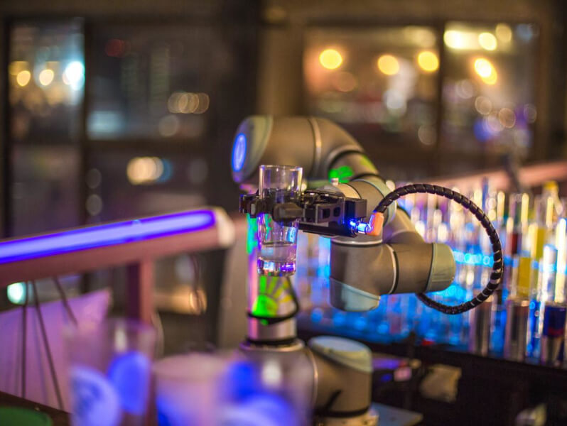
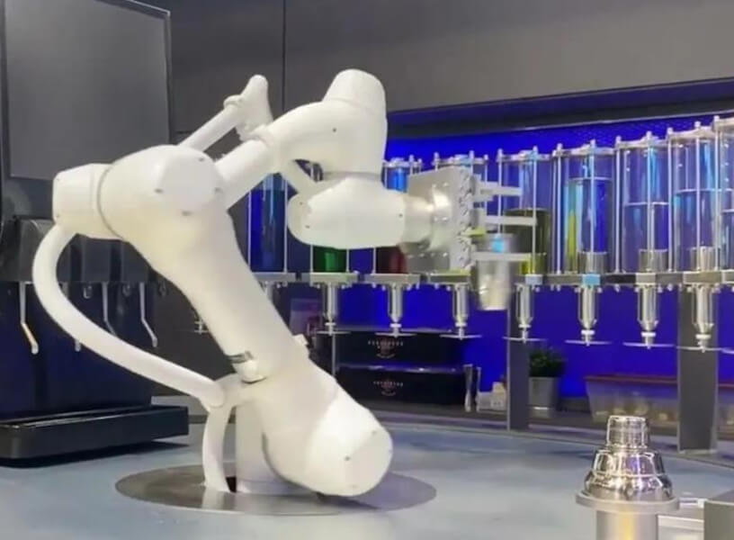

# робота-бармена «Робобар»

Route: `/robots/arenda-robot-barmen/`

Source-of-truth meaningful images: `10`
Upper gallery block near hero: `4`
Lower gallery block near photo section: `6`

Status: `approved_by_owner_for_production_media_use`; production media use for this card is approved by the owner review evidence below.

Approval:

- Approved by: Александр Маркин
- Approved at: `2026-08-29T00:55:09Z`
- Evidence: first five full cards reviewed directly; all remaining cards approved because they follow the same validated schema/principle.

- [x] approve for production
- [ ] replace before production
- [ ] block for production
- [x] rights/source holder confirmed

## Why earlier visual cards showed too few gallery images

The earlier visual card used the rebuilt short gallery subset. The original live page has two gallery blocks, so this card now separates the upper gallery block near the hero area and the lower gallery block near the photo section.

## Legacy horizontal hero

- role: `legacy_horizontal_hero`
- src: `/images/tild3530-3630-4038-b865-333964376335__photo.jpg`
- projectPath: `site-export/images/tild3530-3630-4038-b865-333964376335__photo.jpg`
- actualDescription: Горизонтальный hero-кадр: робот-бармен Робобар в аренду готовит коктейль по заказу с сенсорного планшета.
- seoAlt: Аренда робота-бармена робота-бармена «Робобар»: робот-бармен Робобар в аренду готовит коктейль по заказу с сенсорного планшета.
- caption: Горизонтальный hero-кадр: робот-бармен Робобар в аренду готовит коктейль по заказу с сенсорного.
- sourceGalleryBlock: `n/a`
- rightsStatus: `approved_for_production`
- textSource: legacy-hero-generated from extracted live hero evidence; needs human text/right review

## Current generated hero

- role: `current_generated_hero`
- src: `/images/kiber-45/arenda-robot-barmen.webp`
- projectPath: `public/images/kiber-45/arenda-robot-barmen.webp`
- actualDescription: Манипулятор робота-бармена крупным планом на неоновом фоне.
- seoAlt: Робот-бармен Робобар: Манипулятор робота-бармена крупным планом на неоновом фоне.
- caption: Манипулятор робота-бармена на неоновом фоне.
- sourceGalleryBlock: `n/a`
- rightsStatus: `approved_for_production`
- textSource: data/models/robots.source-of-truth.json (previous human+agent media review, mapped from role=hero to optimized generated hero)

## Catalog card

- role: `catalog_card`
- src: `/images/tild3165-3834-4637-b363-633935616133__06.jpg`
- projectPath: `site-export/images/tild3165-3834-4637-b363-633935616133__06.jpg`
- actualDescription: Робот-бармен держит в руке рюмку и готов наливать в неё алкоголь.
- seoAlt: Аренда робобара для HoReCa-зоны и события с гостями: Робот-бармен держит в руке рюмку и готов наливать в неё алкоголь.
- caption: Робот-бармен держит рюмку перед наливом напитка.
- sourceGalleryBlock: `upper_near_hero`
- rightsStatus: `approved_for_production`
- textSource: data/models/robots.source-of-truth.json (previous human+agent media review)

## Upper gallery block

### arenda-robot-barmen__04

- role: `source_gallery_hero_candidate`
- src: `/images/tild3630-3731-4165-b139-303235633465__noroot.png`
- projectPath: `site-export/images/tild3630-3731-4165-b139-303235633465__noroot.png`
- actualDescription: Манипулятор робота-бармена крупным планом на неоновом фоне.
- seoAlt: Робот-бармен Робобар: Манипулятор робота-бармена крупным планом на неоновом фоне.
- caption: Манипулятор робота-бармена на неоновом фоне.
- sourceGalleryBlock: `upper_near_hero`
- rightsStatus: `approved_for_production`
- textSource: data/models/robots.source-of-truth.json (previous human+agent media review)

### arenda-robot-barmen__06

- role: `gallery`
- src: `/images/tild3864-6538-4231-b239-656133613061__noroot.png`
- projectPath: `site-export/images/tild3864-6538-4231-b239-656133613061__noroot.png`
- actualDescription: Роботизированная рука робота-бармена крупным планом на мероприятии.
- seoAlt: Робот для бара Робобар, роботизированный бармен Робобар: Роботизированная рука робота-бармена крупным планом на мероприятии.
- caption: Крупный план роботизированной руки робота-бармена.
- sourceGalleryBlock: `upper_near_hero`
- rightsStatus: `approved_for_production`
- textSource: data/models/robots.source-of-truth.json (previous human+agent media review)

### arenda-robot-barmen__07

- role: `gallery`
- src: `/images/tild6337-3061-4562-b138-326565643530__07.jpg`
- projectPath: `site-export/images/tild6337-3061-4562-b138-326565643530__07.jpg`
- actualDescription: Крупный план бутылок с алкоголем, установленных внутри куба робота-бармена.
- seoAlt: Прокат роботизированного бармена для HoReCa-зоны и события с гостями: Крупный план бутылок с алкоголем, установленных внутри куба робота-бармена.
- caption: Бутылки внутри куба робота-бармена.
- sourceGalleryBlock: `upper_near_hero`
- rightsStatus: `approved_for_production`
- textSource: data/models/robots.source-of-truth.json (previous human+agent media review)

## Lower gallery block

### arenda-robot-barmen__09

- role: `gallery`
- src: `/images/tild3465-6639-4631-b436-313332343335__noroot.png`
- projectPath: `site-export/images/tild3465-6639-4631-b436-313332343335__noroot.png`
- actualDescription: Рука-манипулятор робота-бармена передвигается внутри куба, чтобы налить алкоголь в коктейль.
- seoAlt: Сервисный робот для напитков Робобар, автоматический бармен Робобар: Рука-манипулятор робота-бармена передвигается внутри куба, чтобы налить алкоголь в коктейль.
- caption: Манипулятор наливает алкоголь в коктейль.
- sourceGalleryBlock: `lower_near_photo_section`
- rightsStatus: `approved_for_production`
- textSource: data/models/robots.source-of-truth.json (previous human+agent media review)

### arenda-robot-barmen__10

- role: `gallery`
- src: `/images/tild3039-3761-4238-b036-383439386666__01.jpg`
- projectPath: `site-export/images/tild3039-3761-4238-b036-383439386666__01.jpg`
- actualDescription: Мужчина наблюдает, как робот-бармен изготавливает фирменный коктейль для девушки на корпоративе.
- seoAlt: Заказать робобара на HoReCa-зоны и события с гостями: Мужчина наблюдает, как робот-бармен изготавливает фирменный коктейль для девушки на корпоративе.
- caption: Робот-бармен готовит фирменный коктейль на корпоративе.
- sourceGalleryBlock: `lower_near_photo_section`
- rightsStatus: `approved_for_production`
- textSource: data/models/robots.source-of-truth.json (previous human+agent media review)

### arenda-robot-barmen__11

- role: `gallery`
- src: `/images/tild3132-3731-4235-b666-306330316665__noroot.png`
- projectPath: `site-export/images/tild3132-3731-4235-b666-306330316665__noroot.png`
- actualDescription: Робобар готовит фирменные коктейли на выставке для девушки, люди наблюдают за процессом.
- seoAlt: Робот-бармен Робобар: готовит фирменные коктейли на выставке для девушки, люди наблюдают за процессом.
- caption: Робобар готовит коктейль на выставочной площадке.
- sourceGalleryBlock: `lower_near_photo_section`
- rightsStatus: `approved_for_production`
- textSource: data/models/robots.source-of-truth.json (previous human+agent media review)

### arenda-robot-barmen__12

- role: `gallery`
- src: `/images/tild3533-3065-4934-b435-656434356665__05.jpg`
- projectPath: `site-export/images/tild3533-3065-4934-b435-656434356665__05.jpg`
- actualDescription: Крупный план процесса разлива алкоголя по стаканам: в стакане лёд, манипулятор наливает алкогольный напиток, вид спереди.
- seoAlt: Арендовать роботизированного бармена для мероприятия: Красивое фото процесса разлива алкоголя по стаканам: в стакане лёд, манипулятор наливает.
- caption: Разлив напитка со льдом крупным планом.
- sourceGalleryBlock: `lower_near_photo_section`
- rightsStatus: `approved_for_production`
- textSource: data/models/robots.source-of-truth.json (previous human+agent media review)

### arenda-robot-barmen__13

- role: `gallery`
- src: `/images/tild6437-3562-4431-b965-616331636230__09.jpg`
- projectPath: `site-export/images/tild6437-3562-4431-b965-616331636230__09.jpg`
- actualDescription: Девушка через планшет заказывает себе напиток у робота-бармена.
- seoAlt: Робот для бара Робобар, роботизированный бармен Робобар: Девушка через планшет заказывает себе напиток у робота-бармена.
- caption: Заказ напитка у робота-бармена через планшет.
- sourceGalleryBlock: `lower_near_photo_section`
- rightsStatus: `approved_for_production`
- textSource: data/models/robots.source-of-truth.json (previous human+agent media review)

### arenda-robot-barmen__14

- role: `gallery`
- src: `/images/tild6662-3732-4264-b635-613633623363__010.jpg`
- projectPath: `site-export/images/tild6662-3732-4264-b635-613633623363__010.jpg`
- actualDescription: Умный робобар работает на площадке городского фестиваля и наливает напитки.
- seoAlt: Взять в прокат робобара для HoReCa-зоны и события с гостями: Умный робобар работает на площадке городского фестиваля и наливает напитки.
- caption: Умный робобар наливает напитки на городском фестивале.
- sourceGalleryBlock: `lower_near_photo_section`
- rightsStatus: `approved_for_production`
- textSource: data/models/robots.source-of-truth.json (previous human+agent media review)
