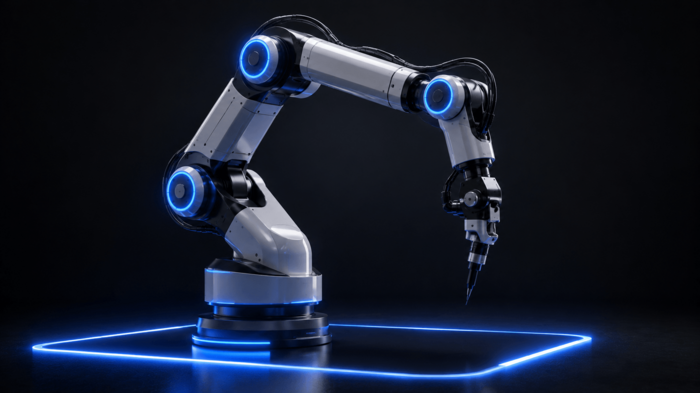
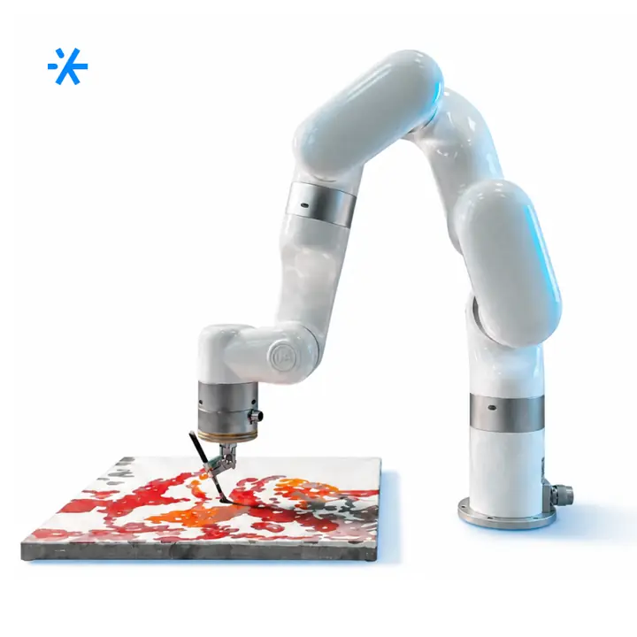
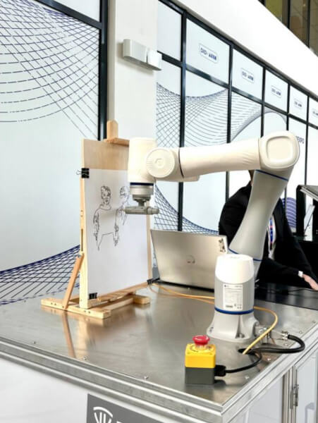

# робота-художника большого формата

Route: `/robots/arenda-robota-hudozhnika-a4/`

Status: `needs_rights_review`; production use is **not approved** until a human confirms rights.

Approval:

- [ ] approve for production
- [ ] replace before production
- [ ] block for production
- [ ] rights/source holder confirmed

## Legacy horizontal hero

- role: `legacy_horizontal_hero`
- src: `/images/tild6238-6164-4062-b731-363861666132__photo.png`
- projectPath: `site-export/images/tild6238-6164-4062-b731-363861666132__photo.png`
- actualDescription: Горизонтальный hero-кадр: роборука рисует гостю мероприятия детальный портрет карандашом.
- seoAlt: Прокат робота-художника робота-художника большого формата: роборука рисует гостю мероприятия детальный портрет карандашом.
- caption: Горизонтальный hero-кадр: роборука рисует гостю мероприятия детальный портрет карандашом.
- rightsStatus: `needs_rights_review`
- textSource: legacy-hero-generated from extracted live hero evidence; needs human text/right review

## Current generated hero

- role: `current_generated_hero`
- src: `/images/kiber-45/arenda-robota-hudozhnika-a4.webp`
- projectPath: `public/images/kiber-45/arenda-robota-hudozhnika-a4.webp`
- actualDescription: Робот-художник A4 крупным планом на светлом фоне: виден только манипулятор, который держит карандаш.
- seoAlt: Робот-художник A4: крупным планом на светлом фоне: виден только манипулятор, который держит карандаш.
- caption: Манипулятор робота-художника A4 держит карандаш.
- rightsStatus: `needs_rights_review`
- textSource: data/models/robots.source-of-truth.json (previous human+agent media review, mapped from role=hero to optimized generated hero)

## Gallery

### Gallery 0

- role: `gallery`
- src: `/images/tild3364-3836-4633-b538-633865636364__01.jpg`
- projectPath: `site-export/images/tild3364-3836-4633-b538-633865636364__01.jpg`
- actualDescription: Изображение роботизированной руки робота-художника A4 на сером фоне.
- seoAlt: Робот-портретист робот-художник A4, робот для рисования робот-художник A4: Красивое изображение роботизированной руки робота-художника A4 на сером фоне.
- caption: Роботизированная рука A4 на сером фоне.
- rightsStatus: `needs_rights_review`
- textSource: data/models/robots.source-of-truth.json (previous human+agent media review)

### Gallery 1

- role: `gallery`
- src: `/images/tild3438-3431-4038-b939-396465653237__02.jpg`
- projectPath: `site-export/images/tild3438-3431-4038-b939-396465653237__02.jpg`
- actualDescription: Манипулятор робота-художника A4 крупным планом рисует изображение на мероприятии; виден сам процесс рисования.
- seoAlt: Прокат арт-робота A4 для арт-зоны и портретной активности: Манипулятор робота-художника A4 крупным планом рисует изображение на мероприятии; виден сам.
- caption: A4 рисует изображение на мероприятии.
- rightsStatus: `needs_rights_review`
- textSource: data/models/robots.source-of-truth.json (previous human+agent media review)

### Gallery 2

- role: `gallery`
- src: `/images/tild3138-6562-4865-b933-313264613765__06.jpg`
- projectPath: `site-export/images/tild3138-6562-4865-b933-313264613765__06.jpg`
- actualDescription: Крупный план манипулятора робота-художника A4 на мероприятии, на фоне проходят люди.
- seoAlt: Арт-робот робот-художник A4, робот-манипулятор для рисунков робот-художник A4: Красивое фото манипулятора робота-художника A4 на мероприятии, на фоне проходят люди.
- caption: Манипулятор A4 на мероприятии на фоне людей.
- rightsStatus: `needs_rights_review`
- textSource: data/models/robots.source-of-truth.json (previous human+agent media review)

### Gallery 3

- role: `gallery`
- src: `/images/tild6339-3766-4133-a566-356232306263__08.jpg`
- projectPath: `site-export/images/tild6339-3766-4133-a566-356232306263__08.jpg`
- actualDescription: Роботизированная рука робота-художника A4 установлена на столе; рядом лежит холст и масляные краски, манипулятор кисточкой рисует изображение красками.
- seoAlt: Заказать рисующего робота A4 на арт-зоны и портретной активности: Роботизированная рука робота-художника A4 установлена на столе; рядом лежит холст и масляные.
- caption: A4 рисует красками на холсте.
- rightsStatus: `needs_rights_review`
- textSource: data/models/robots.source-of-truth.json (previous human+agent media review)

### Gallery 4

- role: `gallery`
- src: `/images/tild3135-3665-4635-a234-313737613137__07.jpg`
- projectPath: `site-export/images/tild3135-3665-4635-a234-313737613137__07.jpg`
- actualDescription: Роботизированная рука робота-художника A4 в офисе компании в процессе тестирования; на заднем фоне стол, монитор и компьютер.
- seoAlt: Робот-художник A4: Роботизированная рука робота-художника A4 в офисе компании в процессе тестирования; на заднем.
- caption: Тестирование роботизированной руки A4 в офисе.
- rightsStatus: `needs_rights_review`
- textSource: data/models/robots.source-of-truth.json (previous human+agent media review)

### Gallery 5

- role: `gallery`
- src: `/images/tild3033-3262-4138-b338-326636666339__04.jpg`
- projectPath: `site-export/images/tild3033-3262-4138-b338-326636666339__04.jpg`
- actualDescription: Процесс создания изображения: на металлическом столе на конференции установлен робот-художник A4, перед ним деревянная конструкция с закреплённым листом бумаги, идёт рисование.
- seoAlt: Арендовать арт-робота A4 для мероприятия: Процесс создания изображения: на металлическом столе на конференции установлен робот-художник.
- caption: A4 создаёт изображение на конференции.
- rightsStatus: `needs_rights_review`
- textSource: data/models/robots.source-of-truth.json (previous human+agent media review)
