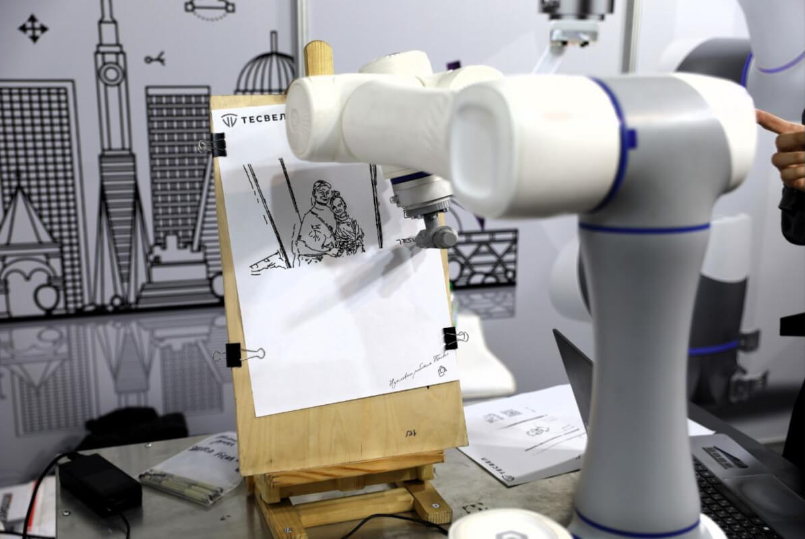
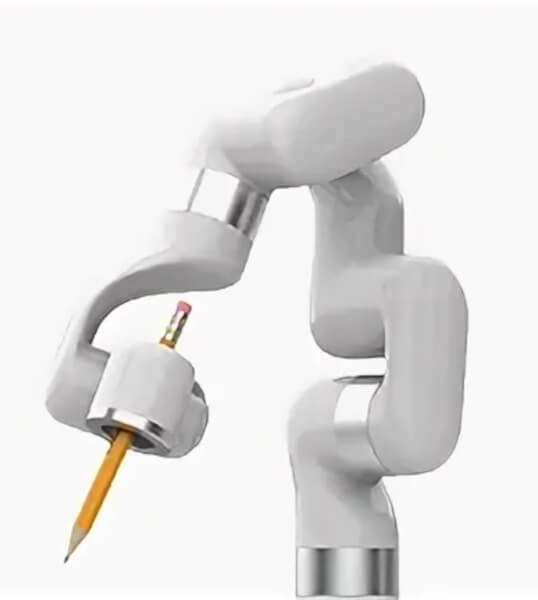
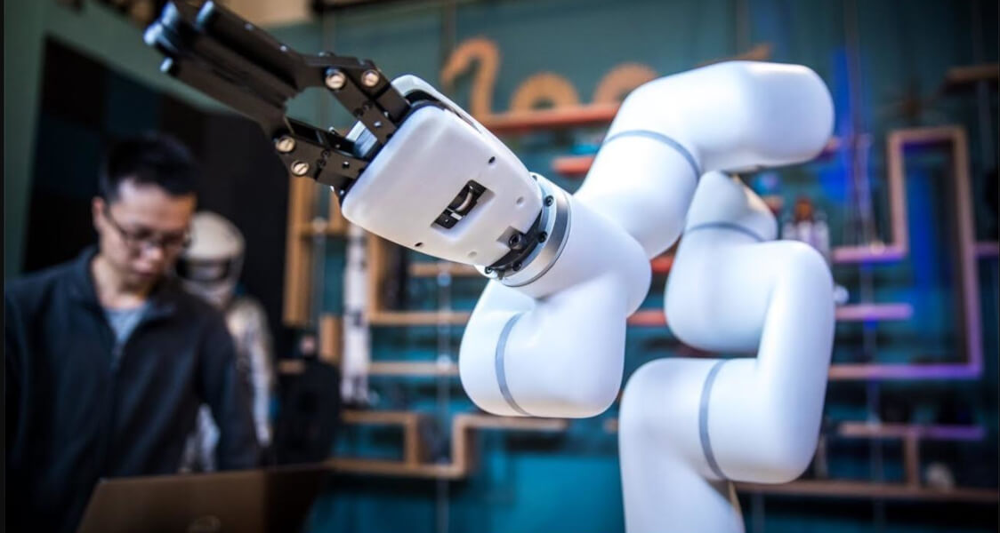

# робота-художника большого формата

Route: `/robots/arenda-robota-hudozhnika-a4/`

Source-of-truth meaningful images: `9`
Upper gallery block near hero: `4`
Lower gallery block near photo section: `5`

Status: `needs_rights_review`; production use is **not approved** until a human confirms rights.

Approval:

- [ ] approve for production
- [ ] replace before production
- [ ] block for production
- [ ] rights/source holder confirmed

## Why earlier visual cards showed too few gallery images

The earlier visual card used the rebuilt short gallery subset. The original live page has two gallery blocks, so this card now separates the upper gallery block near the hero area and the lower gallery block near the photo section.

## Legacy horizontal hero

- role: `legacy_horizontal_hero`
- src: `/images/tild6238-6164-4062-b731-363861666132__photo.png`
- projectPath: `site-export/images/tild6238-6164-4062-b731-363861666132__photo.png`
- actualDescription: Горизонтальный hero-кадр: роборука рисует гостю мероприятия детальный портрет карандашом.
- seoAlt: Прокат робота-художника робота-художника большого формата: роборука рисует гостю мероприятия детальный портрет карандашом.
- caption: Горизонтальный hero-кадр: роборука рисует гостю мероприятия детальный портрет карандашом.
- sourceGalleryBlock: `n/a`
- rightsStatus: `needs_rights_review`
- textSource: legacy-hero-generated from extracted live hero evidence; needs human text/right review

## Current generated hero

- role: `current_generated_hero`
- src: `/images/kiber-45/arenda-robota-hudozhnika-a4.webp`
- projectPath: `public/images/kiber-45/arenda-robota-hudozhnika-a4.webp`
- actualDescription: Робот-художник A4 крупным планом на светлом фоне: виден только манипулятор, который держит карандаш.
- seoAlt: Робот-художник A4: крупным планом на светлом фоне: виден только манипулятор, который держит карандаш.
- caption: Манипулятор робота-художника A4 держит карандаш.
- sourceGalleryBlock: `n/a`
- rightsStatus: `needs_rights_review`
- textSource: data/models/robots.source-of-truth.json (previous human+agent media review, mapped from role=hero to optimized generated hero)

## Catalog card

- role: `catalog_card`
- src: `/images/tild3034-3566-4665-b136-633866383265__03.jpg`
- projectPath: `site-export/images/tild3034-3566-4665-b136-633866383265__03.jpg`
- actualDescription: Робот-художник A4 рисует портрет: лист закреплён на деревянном холсте, виден манипулятор сзади, стол, холст и стена на фоне.
- seoAlt: Аренда рисующего робота A4 для арт-зоны и портретной активности: рисует портрет: лист закреплён на деревянном холсте, виден манипулятор сзади, стол, холст и.
- caption: Робот-художник A4 рисует портрет на закреплённом листе.
- sourceGalleryBlock: `upper_near_hero`
- rightsStatus: `needs_rights_review`
- textSource: data/models/robots.source-of-truth.json (previous human+agent media review)

## Upper gallery block

### arenda-robota-hudozhnika-a4__04

- role: `source_gallery_hero_candidate`
- src: `/images/tild6434-3038-4462-a265-313833396538__09.jpg`
- projectPath: `site-export/images/tild6434-3038-4462-a265-313833396538__09.jpg`
- actualDescription: Робот-художник A4 крупным планом на светлом фоне: виден только манипулятор, который держит карандаш.
- seoAlt: Робот-художник A4: крупным планом на светлом фоне: виден только манипулятор, который держит карандаш.
- caption: Манипулятор робота-художника A4 держит карандаш.
- sourceGalleryBlock: `upper_near_hero`
- rightsStatus: `needs_rights_review`
- textSource: data/models/robots.source-of-truth.json (previous human+agent media review)

### arenda-robota-hudozhnika-a4__06

- role: `gallery`
- src: `/images/tild3364-3836-4633-b538-633865636364__01.jpg`
- projectPath: `site-export/images/tild3364-3836-4633-b538-633865636364__01.jpg`
- actualDescription: Изображение роботизированной руки робота-художника A4 на сером фоне.
- seoAlt: Робот-портретист робот-художник A4, робот для рисования робот-художник A4: Красивое изображение роботизированной руки робота-художника A4 на сером фоне.
- caption: Роботизированная рука A4 на сером фоне.
- sourceGalleryBlock: `upper_near_hero`
- rightsStatus: `needs_rights_review`
- textSource: data/models/robots.source-of-truth.json (previous human+agent media review)

### arenda-robota-hudozhnika-a4__07

- role: `gallery`
- src: `/images/tild3438-3431-4038-b939-396465653237__02.jpg`
- projectPath: `site-export/images/tild3438-3431-4038-b939-396465653237__02.jpg`
- actualDescription: Манипулятор робота-художника A4 крупным планом рисует изображение на мероприятии; виден сам процесс рисования.
- seoAlt: Прокат арт-робота A4 для арт-зоны и портретной активности: Манипулятор робота-художника A4 крупным планом рисует изображение на мероприятии; виден сам.
- caption: A4 рисует изображение на мероприятии.
- sourceGalleryBlock: `upper_near_hero`
- rightsStatus: `needs_rights_review`
- textSource: data/models/robots.source-of-truth.json (previous human+agent media review)

## Lower gallery block

### arenda-robota-hudozhnika-a4__09

- role: `gallery`
- src: `/images/tild3138-6562-4865-b933-313264613765__06.jpg`
- projectPath: `site-export/images/tild3138-6562-4865-b933-313264613765__06.jpg`
- actualDescription: Крупный план манипулятора робота-художника A4 на мероприятии, на фоне проходят люди.
- seoAlt: Арт-робот робот-художник A4, робот-манипулятор для рисунков робот-художник A4: Красивое фото манипулятора робота-художника A4 на мероприятии, на фоне проходят люди.
- caption: Манипулятор A4 на мероприятии на фоне людей.
- sourceGalleryBlock: `lower_near_photo_section`
- rightsStatus: `needs_rights_review`
- textSource: data/models/robots.source-of-truth.json (previous human+agent media review)

### arenda-robota-hudozhnika-a4__10

- role: `gallery`
- src: `/images/tild6339-3766-4133-a566-356232306263__08.jpg`
- projectPath: `site-export/images/tild6339-3766-4133-a566-356232306263__08.jpg`
- actualDescription: Роботизированная рука робота-художника A4 установлена на столе; рядом лежит холст и масляные краски, манипулятор кисточкой рисует изображение красками.
- seoAlt: Заказать рисующего робота A4 на арт-зоны и портретной активности: Роботизированная рука робота-художника A4 установлена на столе; рядом лежит холст и масляные.
- caption: A4 рисует красками на холсте.
- sourceGalleryBlock: `lower_near_photo_section`
- rightsStatus: `needs_rights_review`
- textSource: data/models/robots.source-of-truth.json (previous human+agent media review)

### arenda-robota-hudozhnika-a4__11

- role: `gallery`
- src: `/images/tild3135-3665-4635-a234-313737613137__07.jpg`
- projectPath: `site-export/images/tild3135-3665-4635-a234-313737613137__07.jpg`
- actualDescription: Роботизированная рука робота-художника A4 в офисе компании в процессе тестирования; на заднем фоне стол, монитор и компьютер.
- seoAlt: Робот-художник A4: Роботизированная рука робота-художника A4 в офисе компании в процессе тестирования; на заднем.
- caption: Тестирование роботизированной руки A4 в офисе.
- sourceGalleryBlock: `lower_near_photo_section`
- rightsStatus: `needs_rights_review`
- textSource: data/models/robots.source-of-truth.json (previous human+agent media review)

### arenda-robota-hudozhnika-a4__12

- role: `gallery`
- src: `/images/tild3033-3262-4138-b338-326636666339__04.jpg`
- projectPath: `site-export/images/tild3033-3262-4138-b338-326636666339__04.jpg`
- actualDescription: Процесс создания изображения: на металлическом столе на конференции установлен робот-художник A4, перед ним деревянная конструкция с закреплённым листом бумаги, идёт рисование.
- seoAlt: Арендовать арт-робота A4 для мероприятия: Процесс создания изображения: на металлическом столе на конференции установлен робот-художник.
- caption: A4 создаёт изображение на конференции.
- sourceGalleryBlock: `lower_near_photo_section`
- rightsStatus: `needs_rights_review`
- textSource: data/models/robots.source-of-truth.json (previous human+agent media review)

### arenda-robota-hudozhnika-a4__13

- role: `gallery`
- src: `/images/tild3865-6264-4061-b232-616230326430__05.jpg`
- projectPath: `site-export/images/tild3865-6264-4061-b232-616230326430__05.jpg`
- actualDescription: Крупный план манипулятора робота-художника A4: рука пустая, на заднем фоне человек занимается программированием и готовит руку к работе.
- seoAlt: Робот-портретист робот-художник A4, робот для рисования робот-художник A4: Крупный план манипулятора робота-художника A4: рука пустая, на заднем фоне человек занимается.
- caption: Манипулятор A4 готовят к работе и программированию.
- sourceGalleryBlock: `lower_near_photo_section`
- rightsStatus: `needs_rights_review`
- textSource: data/models/robots.source-of-truth.json (previous human+agent media review)
