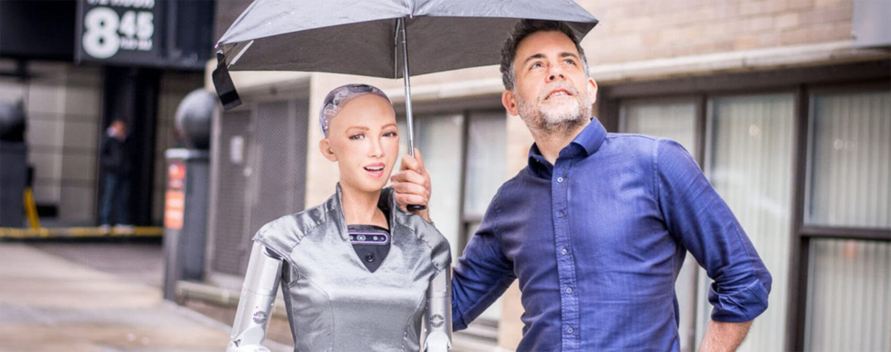
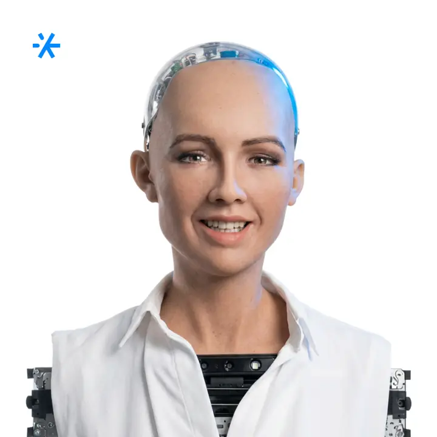
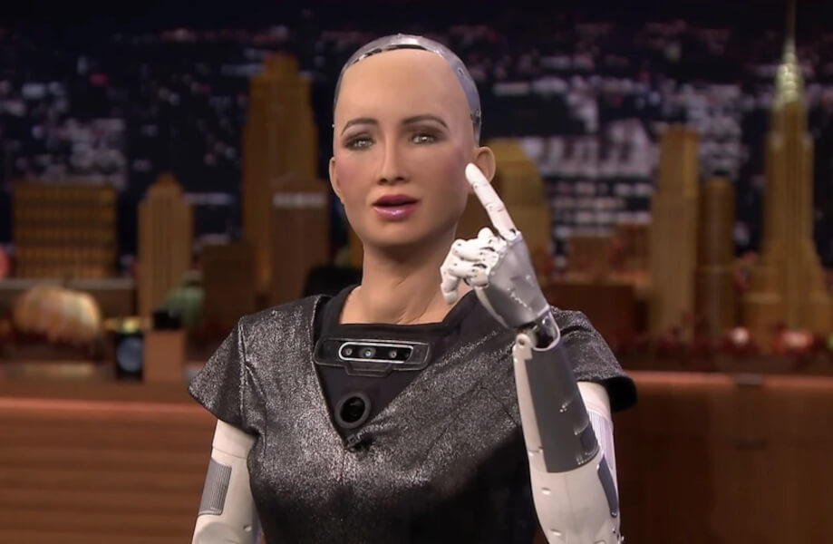
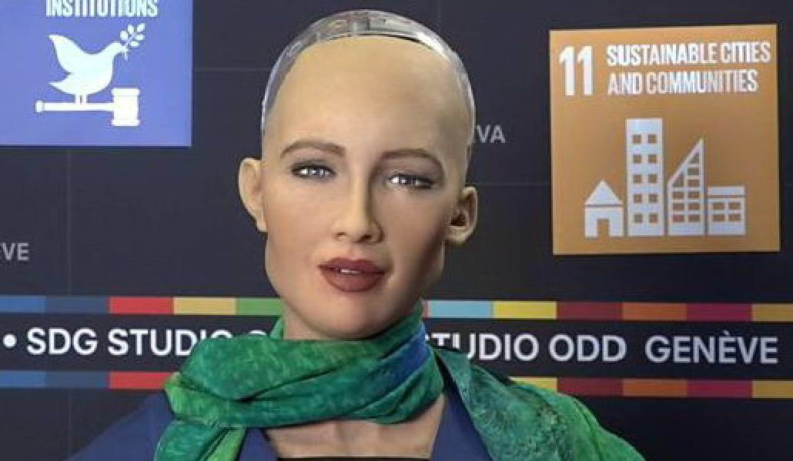
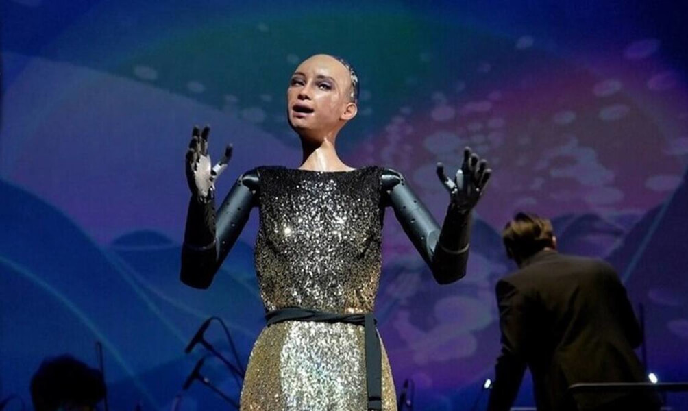
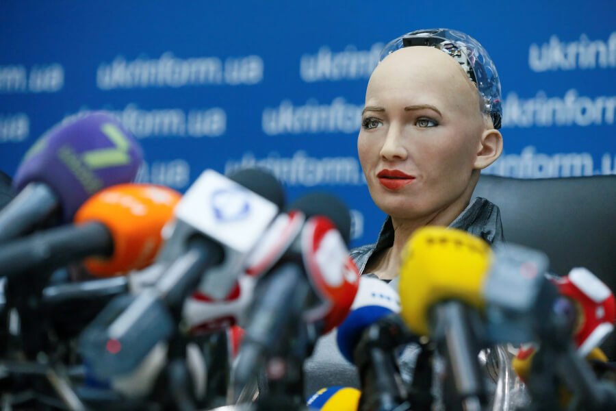
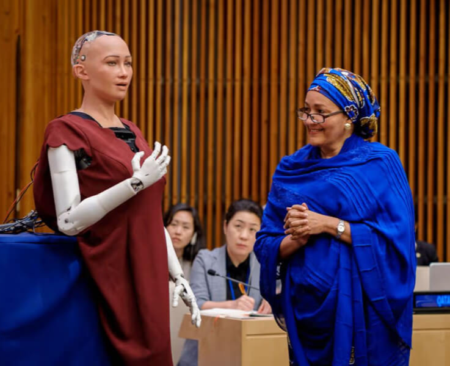
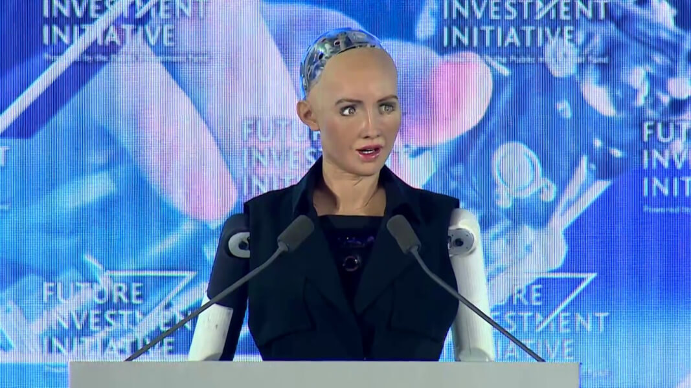
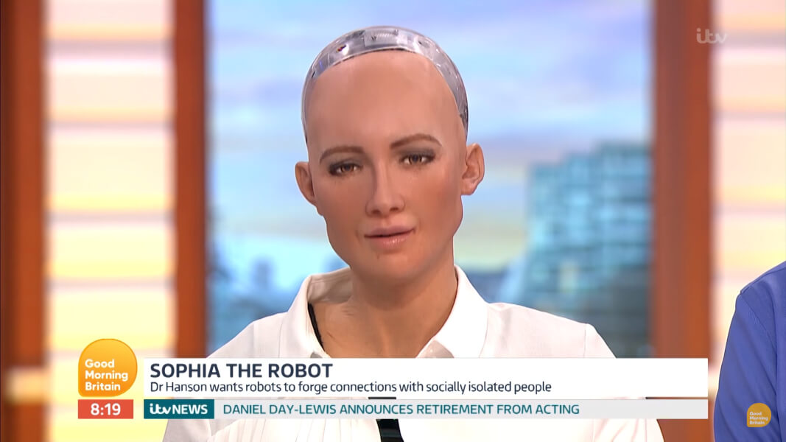

# робота София

Route: `/robots/arenda-robota-sofiya/`

Source-of-truth meaningful images: `11`
Upper gallery block near hero: `5`
Lower gallery block near photo section: `6`

Status: `approved_by_owner_for_production_media_use`; production media use for this card is approved by the owner review evidence below.

Approval:

- Approved by: Александр Маркин
- Approved at: `2026-08-29T00:55:09Z`
- Evidence: first five full cards reviewed directly; all remaining cards approved because they follow the same validated schema/principle.

- [x] approve for production
- [ ] replace before production
- [ ] block for production
- [x] rights/source holder confirmed

## Why earlier visual cards showed too few gallery images

The earlier visual card used the rebuilt short gallery subset. The original live page has two gallery blocks, so this card now separates the upper gallery block near the hero area and the lower gallery block near the photo section.

## Legacy horizontal hero

- role: `legacy_horizontal_hero`
- src: `/images/tild3736-3131-4533-a430-626665346166__photo.jpg`
- projectPath: `site-export/images/tild3736-3131-4533-a430-626665346166__photo.jpg`
- actualDescription: Горизонтальный hero-кадр: робот-гуманоид Sophia (Hanson Robotics) — премиальная модель в аренду на мероприятие.
- seoAlt: Аренда робота-гуманоида робота София: робот-гуманоид Sophia (Hanson Robotics) — премиальная модель в аренду на мероприятие.
- caption: Горизонтальный hero-кадр: робот-гуманоид Sophia (Hanson Robotics) — премиальная модель в аренду.
- sourceGalleryBlock: `n/a`
- rightsStatus: `approved_for_production`
- textSource: legacy-hero-generated from extracted live hero evidence; needs human text/right review

## Current generated hero

- role: `current_generated_hero`
- src: `/images/kiber-45/arenda-robota-sofiya.webp`
- projectPath: `public/images/kiber-45/arenda-robota-sofiya.webp`
- actualDescription: София крупным планом на мероприятии, одета в светлую рубашку и улыбается.
- seoAlt: Робот София: крупным планом на мероприятии, одета в светлую рубашку и улыбается.
- caption: Робот София улыбается крупным планом.
- sourceGalleryBlock: `n/a`
- rightsStatus: `approved_for_production`
- textSource: data/models/robots.source-of-truth.json (previous human+agent media review, mapped from role=hero to optimized generated hero)

## Catalog card

- role: `catalog_card`
- src: `/images/tild3935-3734-4466-a662-653161376362__02.jpg`
- projectPath: `site-export/images/tild3935-3734-4466-a662-653161376362__02.jpg`
- actualDescription: Робот София показана по пояс в телестудии; левая рука поднята вверх на уровне головы, указательный палец вытянут вверх. София одета в серое платье.
- seoAlt: Аренда человекоподобного робота София для презентации: крупным планом по пояс сидит в телестудии и что-то рассказывает; левая рука поднята вверх на.
- caption: София выступает в телестудии с поднятой рукой.
- sourceGalleryBlock: `upper_near_hero`
- rightsStatus: `approved_for_production`
- textSource: data/models/robots.source-of-truth.json (previous human+agent media review)

## Upper gallery block

### arenda-robota-sofiya__04

- role: `source_gallery_hero_candidate`
- src: `/images/tild6362-6166-4134-b566-363330363430__03.jpg`
- projectPath: `site-export/images/tild6362-6166-4134-b566-363330363430__03.jpg`
- actualDescription: София крупным планом на мероприятии, одета в светлую рубашку и улыбается.
- seoAlt: Робот София: крупным планом на мероприятии, одета в светлую рубашку и улыбается.
- caption: Робот София улыбается крупным планом.
- sourceGalleryBlock: `upper_near_hero`
- rightsStatus: `approved_for_production`
- textSource: data/models/robots.source-of-truth.json (previous human+agent media review)

### arenda-robota-sofiya__06

- role: `gallery`
- src: `/images/tild6138-3464-4439-a336-323663313833__07.jpg`
- projectPath: `site-export/images/tild6138-3464-4439-a336-323663313833__07.jpg`
- actualDescription: Робот София крупным планом: на лице выражено удивление, она находится в фотозоне или похожей обстановке, одета в чёрную футболку. Видны только плечи и голова.
- seoAlt: Андроид София, робот-гуманоид София: Крупный план робота Софии: на лице выражено удивление, она находится в фотозоне или похожей.
- caption: Крупный план Софии с удивлённым выражением лица.
- sourceGalleryBlock: `upper_near_hero`
- rightsStatus: `approved_for_production`
- textSource: data/models/robots.source-of-truth.json (previous human+agent media review)

### arenda-robota-sofiya__07

- role: `gallery`
- src: `/images/tild6630-3139-4562-b532-363137613763__08.jpg`
- projectPath: `site-export/images/tild6630-3139-4562-b532-363137613763__08.jpg`
- actualDescription: Робот София крупным планом: она даёт интервью телекомпании, вид спереди, на шее зелёный шарф.
- seoAlt: Прокат робота-гуманоида София для мероприятия: Красивое фото робота Софии крупным планом: она даёт интервью телекомпании, вид спереди, на шее.
- caption: София даёт интервью телекомпании.
- sourceGalleryBlock: `upper_near_hero`
- rightsStatus: `approved_for_production`
- textSource: data/models/robots.source-of-truth.json (previous human+agent media review)

### arenda-robota-sofiya__08

- role: `gallery`
- src: `/images/tild3765-3435-4633-b862-323837616537__05.jpg`
- projectPath: `site-export/images/tild3765-3435-4633-b862-323837616537__05.jpg`
- actualDescription: Робот София на сцене оперного театра поёт под аккомпанемент оркестра; руки подняты и выражают эмоции. На Софии серо-золотистое платье.
- seoAlt: Робот-человек София, гуманоид Hanson Robotics София: на сцене оперного театра поёт под аккомпанемент оркестра; руки подняты и выражают эмоции. На.
- caption: София поёт на сцене оперного театра.
- sourceGalleryBlock: `upper_near_hero`
- rightsStatus: `approved_for_production`
- textSource: data/models/robots.source-of-truth.json (previous human+agent media review)

## Lower gallery block

### arenda-robota-sofiya__10

- role: `gallery`
- src: `/images/tild3231-3464-4138-b632-653036383765__06.jpg`
- projectPath: `site-export/images/tild3231-3464-4138-b632-653036383765__06.jpg`
- actualDescription: Робот София идёт по тротуару городской улицы и катит перед собой тележку. Она одета в серую блузку и длинную чёрную юбку.
- seoAlt: Заказать человекоподобного робота София на уличной площадки: идёт по тротуару городской улицы и катит перед собой тележку. Она одета в серую блузку и.
- caption: София идёт по городской улице с тележкой.
- sourceGalleryBlock: `lower_near_photo_section`
- rightsStatus: `approved_for_production`
- textSource: data/models/robots.source-of-truth.json (previous human+agent media review)

### arenda-robota-sofiya__11

- role: `gallery`
- src: `/images/tild3165-6261-4366-b538-336262343464__04.jpg`
- projectPath: `site-export/images/tild3165-6261-4366-b538-336262343464__04.jpg`
- actualDescription: Робот София крупным планом даёт интервью, перед ней множество микрофонов разных телекомпаний.
- seoAlt: Робот София: крупным планом даёт интервью, перед ней множество микрофонов разных телекомпаний.
- caption: София крупным планом перед микрофонами.
- sourceGalleryBlock: `lower_near_photo_section`
- rightsStatus: `approved_for_production`
- textSource: data/models/robots.source-of-truth.json (previous human+agent media review)

### arenda-robota-sofiya__12

- role: `gallery`
- src: `/images/tild3134-6537-4237-b337-396630643233__noroot.png`
- projectPath: `site-export/images/tild3134-6537-4237-b337-396630643233__noroot.png`
- actualDescription: Робот София читает речь на выступлении в ООН в основном зале совещаний; рядом стоит женщина в синем, на заднем фоне сидят две женщины и наблюдают за разговором.
- seoAlt: Арендовать робота-гуманоида София для сцены и публичного выступления: читает речь на выступлении в ООН в основном зале совещаний; рядом стоит женщина в синем, на.
- caption: София выступает в зале ООН.
- sourceGalleryBlock: `lower_near_photo_section`
- rightsStatus: `approved_for_production`
- textSource: data/models/robots.source-of-truth.json (previous human+agent media review)

### arenda-robota-sofiya__13

- role: `gallery`
- src: `/images/tild3734-3332-4338-b166-383336376131__010.jpg`
- projectPath: `site-export/images/tild3734-3332-4338-b166-383336376131__010.jpg`
- actualDescription: Робот София даёт интервью или выступает на сцене: сзади интерактивный экран, перед ней тумба и два микрофона. Она ведёт эмоциональную речь и одета в чёрное платье без рукавов.
- seoAlt: Андроид София, робот-гуманоид София: даёт интервью или выступает на сцене: сзади интерактивный экран, перед ней тумба и два.
- caption: София произносит эмоциональную речь на сцене.
- sourceGalleryBlock: `lower_near_photo_section`
- rightsStatus: `approved_for_production`
- textSource: data/models/robots.source-of-truth.json (previous human+agent media review)

### arenda-robota-sofiya__14

- role: `gallery`
- src: `/images/tild6436-3932-4231-b931-653434363937__noroot.png`
- projectPath: `site-export/images/tild6436-3932-4231-b931-653434363937__noroot.png`
- actualDescription: Робот София ведёт эмоциональное выступление на событии Citizen Robot; она одета в красно-белое одеяние, рот открыт, словно она говорит.
- seoAlt: Взять в прокат человекоподобного робота София для сцены и публичного выступления: ведёт эмоциональное выступление на событии Citizen Robot; она одета в красно-белое одеяние, рот.
- caption: София выступает на событии Citizen Robot.
- sourceGalleryBlock: `lower_near_photo_section`
- rightsStatus: `approved_for_production`
- textSource: data/models/robots.source-of-truth.json (previous human+agent media review)

### arenda-robota-sofiya__15

- role: `gallery`
- src: `/images/tild3735-6536-4366-b133-363031306330__011.jpg`
- projectPath: `site-export/images/tild3735-6536-4366-b133-363031306330__011.jpg`
- actualDescription: Фото сделано с экрана телевизора: робот София в студии телекомпании, внизу экрана бегущая строка и описание происходящего. София в белой рубашке.
- seoAlt: Робот-человек София, гуманоид Hanson Robotics София: на экране телевизора: робот София в студии телекомпании, внизу экрана бегущая строка и описание.
- caption: София в студии на экране телевизора.
- sourceGalleryBlock: `lower_near_photo_section`
- rightsStatus: `approved_for_production`
- textSource: data/models/robots.source-of-truth.json (previous human+agent media review)
