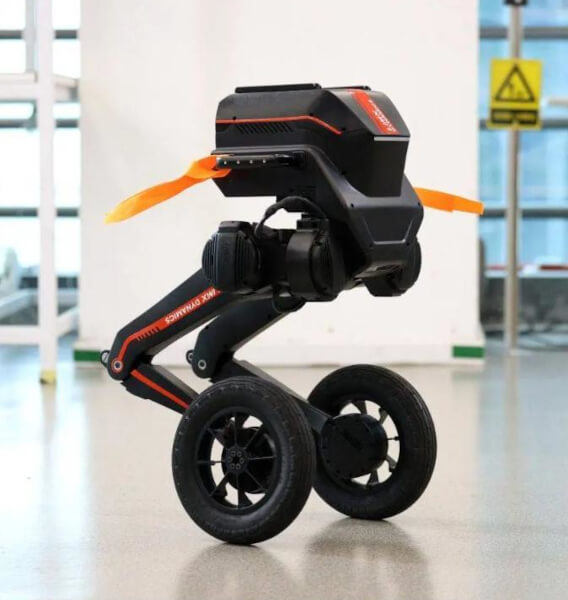
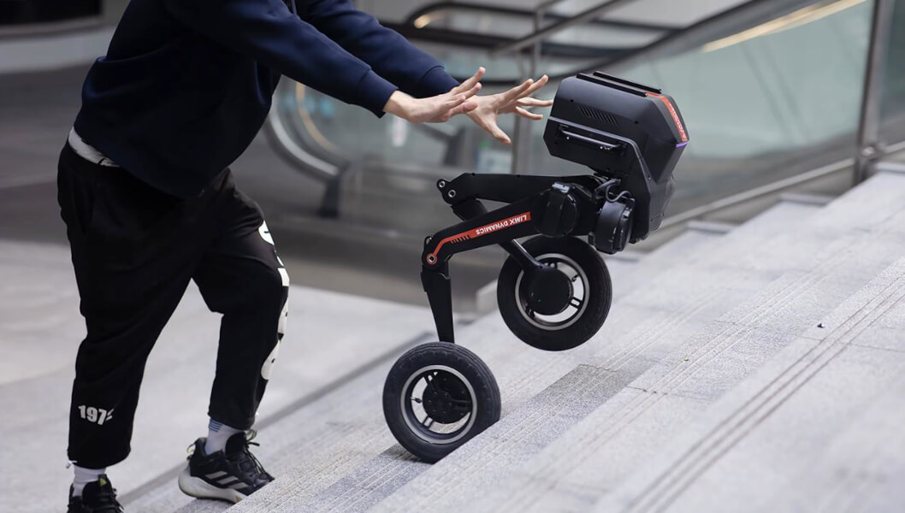
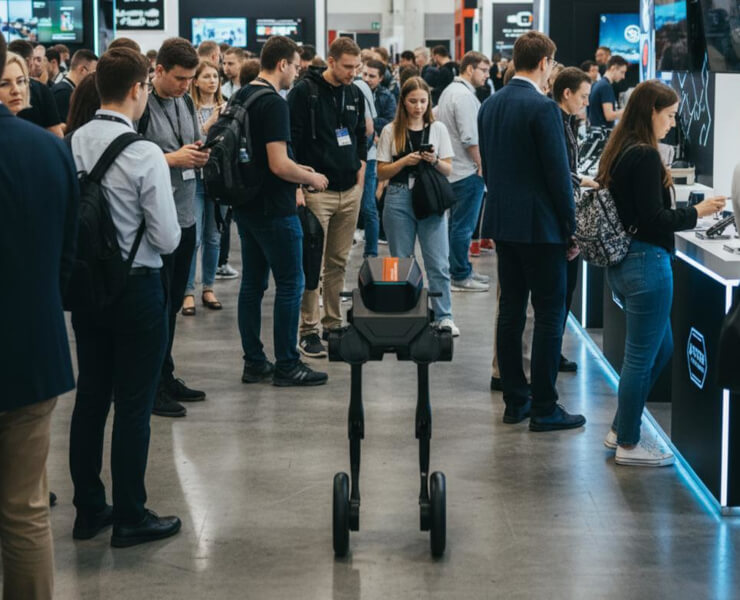
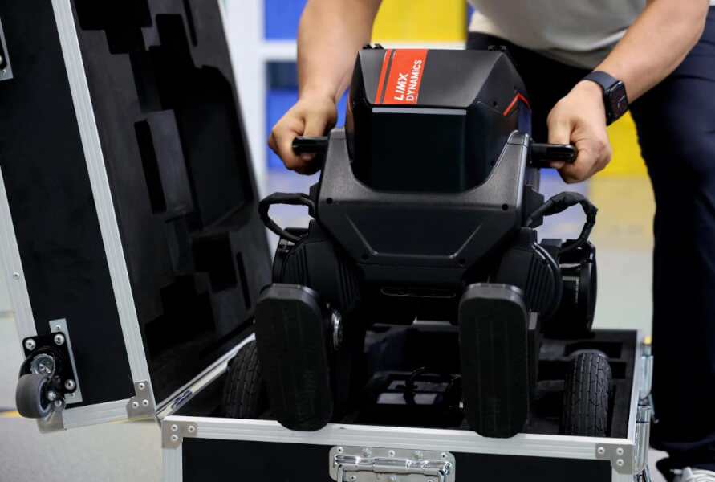

# модульного робота Tron

Route: `/robots/arenda-robota-tron/`

Source-of-truth meaningful images: `12`
Upper gallery block near hero: `5`
Lower gallery block near photo section: `7`

Status: `approved_by_owner_for_production_media_use`; production media use for this card is approved by the owner review evidence below.

Approval:

- Approved by: Александр Маркин
- Approved at: `2026-08-29T00:55:09Z`
- Evidence: first five full cards reviewed directly; all remaining cards approved because they follow the same validated schema/principle.

- [x] approve for production
- [ ] replace before production
- [ ] block for production
- [x] rights/source holder confirmed

## Why earlier visual cards showed too few gallery images

The earlier visual card used the rebuilt short gallery subset. The original live page has two gallery blocks, so this card now separates the upper gallery block near the hero area and the lower gallery block near the photo section.

## Legacy horizontal hero

- role: `legacy_horizontal_hero`
- src: `/images/tild3564-3966-4730-b831-326530313339__photo.jpg`
- projectPath: `site-export/images/tild3564-3966-4730-b831-326530313339__photo.jpg`
- actualDescription: Горизонтальный hero-кадр: модульный двуногий робот Tron на колёсно-шаговой платформе.
- seoAlt: Аренда робота модульного робота Tron: модульный двуногий робот Tron на колёсно-шаговой платформе.
- caption: Горизонтальный hero-кадр: модульный двуногий робот Tron на колёсно-шаговой платформе.
- sourceGalleryBlock: `n/a`
- rightsStatus: `approved_for_production`
- textSource: legacy-hero-generated from extracted live hero evidence; needs human text/right review

## Current generated hero

- role: `current_generated_hero`
- src: `/images/kiber-45/arenda-robota-tron.webp`
- projectPath: `public/images/kiber-45/arenda-robota-tron.webp`
- actualDescription: Робот Tron крупным планом на сером фоне, изображение спереди немного сбоку. Фирменное изображение сайта производителя.
- seoAlt: Модульный робот Tron: крупным планом на сером фоне, изображение спереди немного сбоку. Фирменное изображение сайта.
- caption: Фирменный крупный план робота Tron на сером фоне.
- sourceGalleryBlock: `n/a`
- rightsStatus: `approved_for_production`
- textSource: data/models/robots.source-of-truth.json (previous human+agent media review, mapped from role=hero to optimized generated hero)

## Catalog card

- role: `catalog_card`
- src: `/images/tild6261-3238-4164-b338-656234623538__06.jpg`
- projectPath: `site-export/images/tild6261-3238-4164-b338-656234623538__06.jpg`
- actualDescription: Робот Tron показан сбоку на колёсной базе, немного присевший, словно движется на скорости.
- seoAlt: Аренда робота Tron на колёсной базе для демонстрации возможностей: изображён сбоку на колёсной базе, немного присевший, как будто движется на скорости.
- caption: Tron на колёсной базе в динамичном боковом ракурсе.
- sourceGalleryBlock: `upper_near_hero`
- rightsStatus: `approved_for_production`
- textSource: data/models/robots.source-of-truth.json (previous human+agent media review)

## Upper gallery block

### arenda-robota-tron__04

- role: `source_gallery_hero_candidate`
- src: `/images/tild3264-6563-4733-a463-623736396633__noroot.png`
- projectPath: `site-export/images/tild3264-6563-4733-a463-623736396633__noroot.png`
- actualDescription: Робот Tron крупным планом на сером фоне, изображение спереди немного сбоку. Фирменное изображение сайта производителя.
- seoAlt: Модульный робот Tron: крупным планом на сером фоне, изображение спереди немного сбоку. Фирменное изображение сайта.
- caption: Фирменный крупный план робота Tron на сером фоне.
- sourceGalleryBlock: `upper_near_hero`
- rightsStatus: `approved_for_production`
- textSource: data/models/robots.source-of-truth.json (previous human+agent media review)

### arenda-robota-tron__06

- role: `gallery`
- src: `/images/tild6362-3431-4465-b132-356532616262__07.jpg`
- projectPath: `site-export/images/tild6362-3431-4465-b132-356532616262__07.jpg`
- actualDescription: Фирменное изображение с тремя роботами Tron, у каждого разная база передвижения: ноги, ступни и колёсные базы.
- seoAlt: Робот-трансформер Tron, мобильный робот Tron: Фирменное изображение с тремя роботами Tron, у каждого разная база передвижения: ноги, ступни и.
- caption: Три варианта Tron с разными базами передвижения.
- sourceGalleryBlock: `upper_near_hero`
- rightsStatus: `approved_for_production`
- textSource: data/models/robots.source-of-truth.json (previous human+agent media review)

### arenda-robota-tron__07

- role: `gallery`
- src: `/images/tild3463-3739-4766-b036-376366613534__noroot.png`
- projectPath: `site-export/images/tild3463-3739-4766-b036-376366613534__noroot.png`
- actualDescription: Робот Tron крупным планом на технологичном фоне со стеклом, стоит на колёсной базе и смотрит на зрителя.
- seoAlt: Прокат демонстрационного робота Tron для мероприятия: крупным планом на технологичном фоне со стеклом, стоит на колёсной базе и смотрит на зрителя.
- caption: Крупный план Tron на технологичном фоне.
- sourceGalleryBlock: `upper_near_hero`
- rightsStatus: `approved_for_production`
- textSource: data/models/robots.source-of-truth.json (previous human+agent media review)

### arenda-robota-tron__08

- role: `gallery`
- src: `/images/tild3536-3736-4337-b632-643630306235__01.jpg`
- projectPath: `site-export/images/tild3536-3736-4337-b632-643630306235__01.jpg`
- actualDescription: Робот Tron на колёсной базе спускается вниз по широкой лестнице.
- seoAlt: Интерактивный робот Tron, демонстрационный робот Tron: на колёсной базе спускается вниз по широкой лестнице.
- caption: Tron спускается по широкой лестнице.
- sourceGalleryBlock: `upper_near_hero`
- rightsStatus: `approved_for_production`
- textSource: data/models/robots.source-of-truth.json (previous human+agent media review)

## Lower gallery block

### arenda-robota-tron__10

- role: `gallery`
- src: `/images/tild3839-6235-4164-a665-346361626166__noroot.png`
- projectPath: `site-export/images/tild3839-6235-4164-a665-346361626166__noroot.png`
- actualDescription: Робот Tron крупным планом на сером фоне на колёсной базе. Фирменное изображение сайта производителя.
- seoAlt: Заказать робота Tron на колёсной базе на презентации: крупным планом на сером фоне на колёсной базе. Фирменное изображение сайта производителя.
- caption: Фирменное изображение Tron на колёсной базе.
- sourceGalleryBlock: `lower_near_photo_section`
- rightsStatus: `approved_for_production`
- textSource: data/models/robots.source-of-truth.json (previous human+agent media review)

### arenda-robota-tron__11

- role: `gallery`
- src: `/images/tild6637-3136-4133-b838-616337386661__011.jpg`
- projectPath: `site-export/images/tild6637-3136-4133-b838-616337386661__011.jpg`
- actualDescription: Робот Tron преодолевает полосу препятствий, как бегун на барьерной дорожке. Крупное изображение, вид спереди.
- seoAlt: Модульный робот Tron: преодолевает полосу препятствий, как бегун на барьерной дорожке. Крупное изображение, вид.
- caption: Tron преодолевает полосу препятствий.
- sourceGalleryBlock: `lower_near_photo_section`
- rightsStatus: `approved_for_production`
- textSource: data/models/robots.source-of-truth.json (previous human+agent media review)

### arenda-robota-tron__12

- role: `gallery`
- src: `/images/tild3530-3730-4030-b432-386539343765__02.jpg`
- projectPath: `site-export/images/tild3530-3730-4030-b432-386539343765__02.jpg`
- actualDescription: Робот Tron на колёсной базе движется на выставке среди множества людей, вид спереди.
- seoAlt: Арендовать демонстрационного робота Tron для выставочного стенда: на колёсной базе движется на выставке среди множества людей, вид спереди.
- caption: Tron движется среди посетителей выставки.
- sourceGalleryBlock: `lower_near_photo_section`
- rightsStatus: `approved_for_production`
- textSource: data/models/robots.source-of-truth.json (previous human+agent media review)

### arenda-robota-tron__13

- role: `gallery`
- src: `/images/tild3235-3966-4364-b635-306562343464__013.jpg`
- projectPath: `site-export/images/tild3235-3966-4364-b635-306562343464__013.jpg`
- actualDescription: Робот Tron находится в положении сидя на полу; виден сам робот и руки человека, который держит пульт управления роботом.
- seoAlt: Робот-трансформер Tron, мобильный робот Tron: находится в положении сидя на полу; виден сам робот и руки человека, который держит пульт.
- caption: Tron рядом с пультом управления оператора.
- sourceGalleryBlock: `lower_near_photo_section`
- rightsStatus: `approved_for_production`
- textSource: data/models/robots.source-of-truth.json (previous human+agent media review)

### arenda-robota-tron__14

- role: `gallery`
- src: `/images/tild3031-3435-4261-b363-393361623934__05.jpg`
- projectPath: `site-export/images/tild3031-3435-4261-b363-393361623934__05.jpg`
- actualDescription: Робот Tron поднимается вверх по лестнице на колёсной базе, рядом человек подталкивает его, демонстрируя возможности робота.
- seoAlt: Взять в прокат робота Tron на колёсной базе для демонстрации возможностей: поднимается вверх по лестнице на колёсной базе, рядом человек подталкивает его, демонстрируя.
- caption: Tron поднимается по лестнице на колёсной базе.
- sourceGalleryBlock: `lower_near_photo_section`
- rightsStatus: `approved_for_production`
- textSource: data/models/robots.source-of-truth.json (previous human+agent media review)

### arenda-robota-tron__15

- role: `gallery`
- src: `/images/tild6535-6131-4931-b562-646633363134__03.jpg`
- projectPath: `site-export/images/tild6535-6131-4931-b562-646633363134__03.jpg`
- actualDescription: Робот Tron на колёсной базе движется на выставке среди толпы людей, все смотрят на него.
- seoAlt: Интерактивный робот Tron, демонстрационный робот Tron: на колёсной базе движется на выставке среди толпы людей, все смотрят на него.
- caption: Tron привлекает внимание гостей на выставке.
- sourceGalleryBlock: `lower_near_photo_section`
- rightsStatus: `approved_for_production`
- textSource: data/models/robots.source-of-truth.json (previous human+agent media review)

### arenda-robota-tron__16

- role: `gallery`
- src: `/images/tild3238-3533-4861-a431-303533306661__012.jpg`
- projectPath: `site-export/images/tild3238-3533-4861-a431-303533306661__012.jpg`
- actualDescription: Человек укладывает сложенного робота Tron в чемодан для перевозки, показывая компактность и удобство транспортировки.
- seoAlt: Аренда демонстрационного робота Tron для мероприятия: Человек укладывает сложенного робота Tron в чемодан для перевозки, показывая компактность и.
- caption: Сложенный Tron укладывают в чемодан для перевозки.
- sourceGalleryBlock: `lower_near_photo_section`
- rightsStatus: `approved_for_production`
- textSource: data/models/robots.source-of-truth.json (previous human+agent media review)
