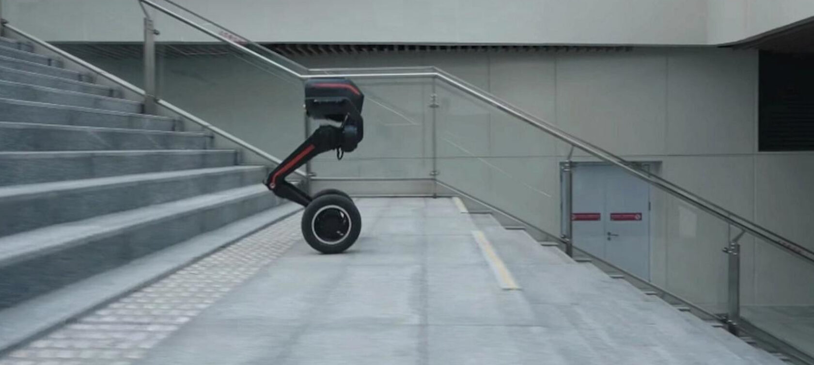
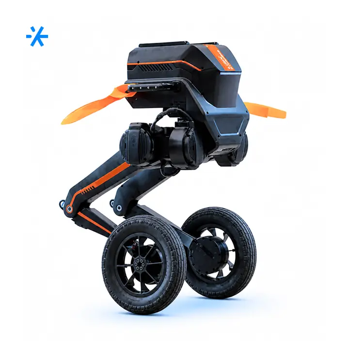
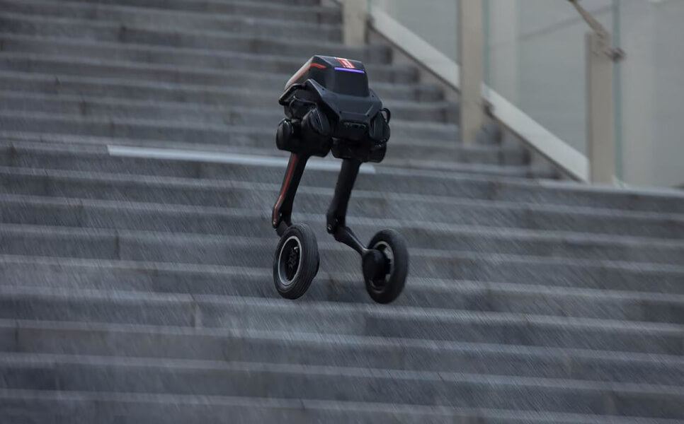

# модульного робота Tron

Route: `/robots/arenda-robota-tron/`

Status: `needs_rights_review`; production use is **not approved** until a human confirms rights.

Approval:

- [ ] approve for production
- [ ] replace before production
- [ ] block for production
- [ ] rights/source holder confirmed

## Legacy horizontal hero

- role: `legacy_horizontal_hero`
- src: `/images/tild3564-3966-4730-b831-326530313339__photo.jpg`
- projectPath: `site-export/images/tild3564-3966-4730-b831-326530313339__photo.jpg`
- actualDescription: Горизонтальный hero-кадр: модульный двуногий робот Tron на колёсно-шаговой платформе.
- seoAlt: Аренда робота модульного робота Tron: модульный двуногий робот Tron на колёсно-шаговой платформе.
- caption: Горизонтальный hero-кадр: модульный двуногий робот Tron на колёсно-шаговой платформе.
- rightsStatus: `needs_rights_review`
- textSource: legacy-hero-generated from extracted live hero evidence; needs human text/right review

## Current generated hero

- role: `current_generated_hero`
- src: `/images/kiber-45/arenda-robota-tron.webp`
- projectPath: `public/images/kiber-45/arenda-robota-tron.webp`
- actualDescription: Робот Tron крупным планом на сером фоне, изображение спереди немного сбоку. Фирменное изображение сайта производителя.
- seoAlt: Модульный робот Tron: крупным планом на сером фоне, изображение спереди немного сбоку. Фирменное изображение сайта.
- caption: Фирменный крупный план робота Tron на сером фоне.
- rightsStatus: `needs_rights_review`
- textSource: data/models/robots.source-of-truth.json (previous human+agent media review, mapped from role=hero to optimized generated hero)

## Gallery

### Gallery 0

- role: `gallery`
- src: `/images/tild6362-3431-4465-b132-356532616262__07.jpg`
- projectPath: `site-export/images/tild6362-3431-4465-b132-356532616262__07.jpg`
- actualDescription: Фирменное изображение с тремя роботами Tron, у каждого разная база передвижения: ноги, ступни и колёсные базы.
- seoAlt: Робот-трансформер Tron, мобильный робот Tron: Фирменное изображение с тремя роботами Tron, у каждого разная база передвижения: ноги, ступни и.
- caption: Три варианта Tron с разными базами передвижения.
- rightsStatus: `needs_rights_review`
- textSource: data/models/robots.source-of-truth.json (previous human+agent media review)

### Gallery 1

- role: `gallery`
- src: `/images/tild3463-3739-4766-b036-376366613534__noroot.png`
- projectPath: `site-export/images/tild3463-3739-4766-b036-376366613534__noroot.png`
- actualDescription: Робот Tron крупным планом на технологичном фоне со стеклом, стоит на колёсной базе и смотрит на зрителя.
- seoAlt: Прокат демонстрационного робота Tron для мероприятия: крупным планом на технологичном фоне со стеклом, стоит на колёсной базе и смотрит на зрителя.
- caption: Крупный план Tron на технологичном фоне.
- rightsStatus: `needs_rights_review`
- textSource: data/models/robots.source-of-truth.json (previous human+agent media review)

### Gallery 2

- role: `gallery`
- src: `/images/tild3536-3736-4337-b632-643630306235__01.jpg`
- projectPath: `site-export/images/tild3536-3736-4337-b632-643630306235__01.jpg`
- actualDescription: Робот Tron на колёсной базе спускается вниз по широкой лестнице.
- seoAlt: Интерактивный робот Tron, демонстрационный робот Tron: на колёсной базе спускается вниз по широкой лестнице.
- caption: Tron спускается по широкой лестнице.
- rightsStatus: `needs_rights_review`
- textSource: data/models/robots.source-of-truth.json (previous human+agent media review)

### Gallery 3

- role: `gallery`
- src: `/images/tild3839-6235-4164-a665-346361626166__noroot.png`
- projectPath: `site-export/images/tild3839-6235-4164-a665-346361626166__noroot.png`
- actualDescription: Робот Tron крупным планом на сером фоне на колёсной базе. Фирменное изображение сайта производителя.
- seoAlt: Заказать робота Tron на колёсной базе на презентации: крупным планом на сером фоне на колёсной базе. Фирменное изображение сайта производителя.
- caption: Фирменное изображение Tron на колёсной базе.
- rightsStatus: `needs_rights_review`
- textSource: data/models/robots.source-of-truth.json (previous human+agent media review)

### Gallery 4

- role: `gallery`
- src: `/images/tild6637-3136-4133-b838-616337386661__011.jpg`
- projectPath: `site-export/images/tild6637-3136-4133-b838-616337386661__011.jpg`
- actualDescription: Робот Tron преодолевает полосу препятствий, как бегун на барьерной дорожке. Крупное изображение, вид спереди.
- seoAlt: Модульный робот Tron: преодолевает полосу препятствий, как бегун на барьерной дорожке. Крупное изображение, вид.
- caption: Tron преодолевает полосу препятствий.
- rightsStatus: `needs_rights_review`
- textSource: data/models/robots.source-of-truth.json (previous human+agent media review)

### Gallery 5

- role: `gallery`
- src: `/images/tild3530-3730-4030-b432-386539343765__02.jpg`
- projectPath: `site-export/images/tild3530-3730-4030-b432-386539343765__02.jpg`
- actualDescription: Робот Tron на колёсной базе движется на выставке среди множества людей, вид спереди.
- seoAlt: Арендовать демонстрационного робота Tron для выставочного стенда: на колёсной базе движется на выставке среди множества людей, вид спереди.
- caption: Tron движется среди посетителей выставки.
- rightsStatus: `needs_rights_review`
- textSource: data/models/robots.source-of-truth.json (previous human+agent media review)
