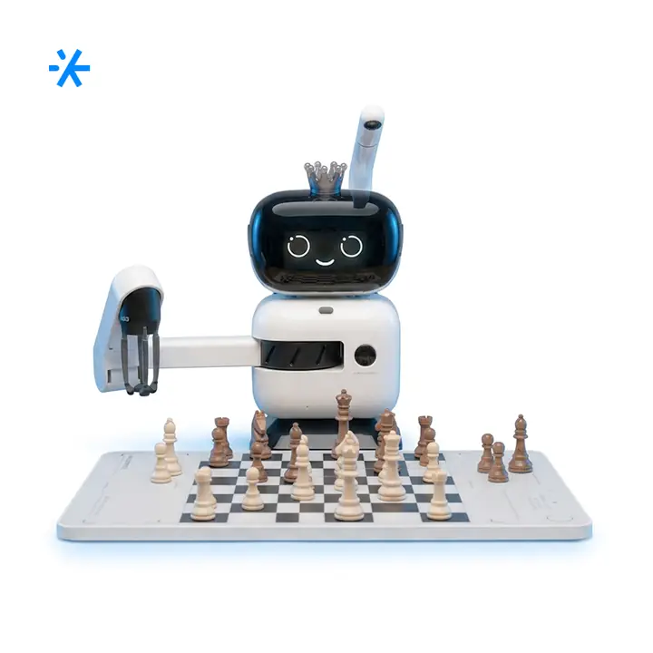
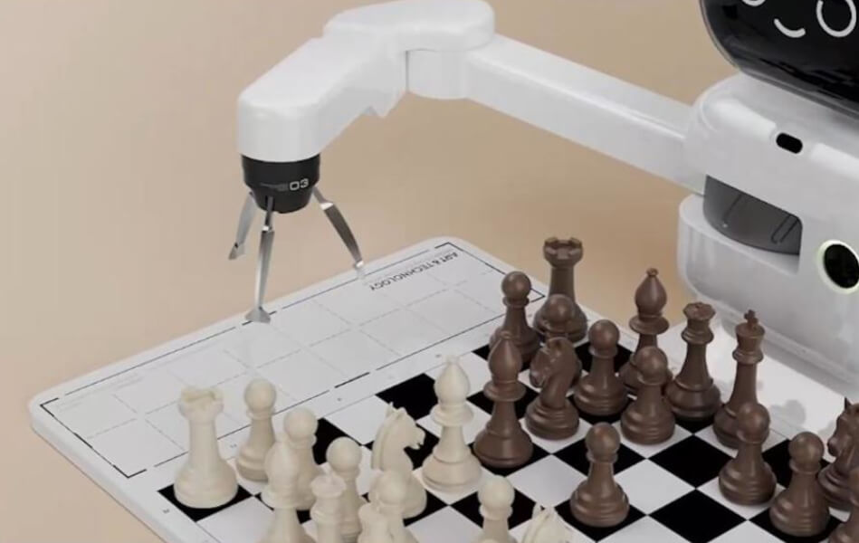
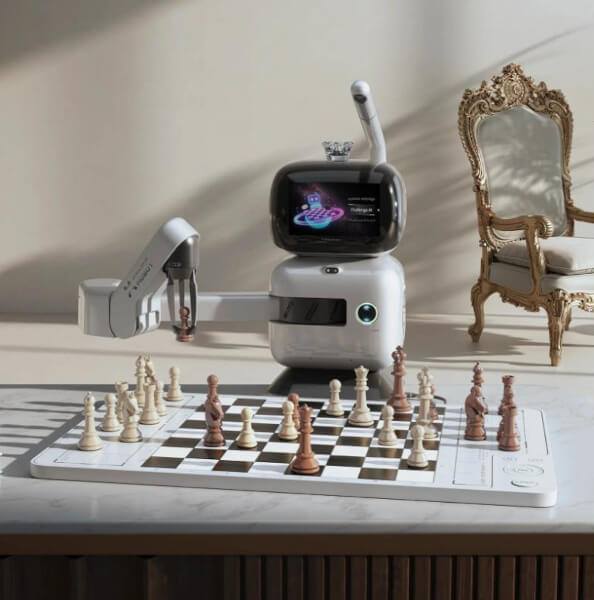
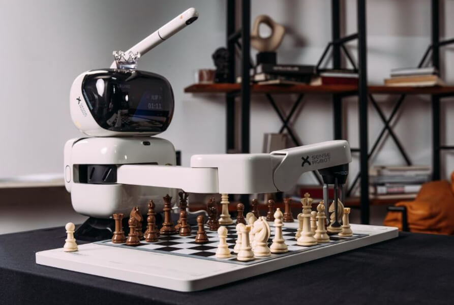

# робота-шахматиста SenseRobot

Route: `/robots/arenda-senserobot/`

Status: `needs_rights_review`; production use is **not approved** until a human confirms rights.

Approval:

- [ ] approve for production
- [ ] replace before production
- [ ] block for production
- [ ] rights/source holder confirmed

## Legacy horizontal hero

- role: `legacy_horizontal_hero`
- src: `/images/tild3063-3131-4232-b234-393062353332__photo.jpg`
- projectPath: `site-export/images/tild3063-3131-4232-b234-393062353332__photo.jpg`
- actualDescription: Горизонтальный hero-кадр: робот-шахматист SenseRobot играет в шахматы, сам передвигая фигуры.
- seoAlt: Аренда робота робота-шахматиста SenseRobot: робот-шахматист SenseRobot играет в шахматы, сам передвигая фигуры.
- caption: Горизонтальный hero-кадр: робот-шахматист SenseRobot играет в шахматы, сам передвигая фигуры.
- rightsStatus: `needs_rights_review`
- textSource: legacy-hero-generated from extracted live hero evidence; needs human text/right review

## Current generated hero

- role: `current_generated_hero`
- src: `/images/kiber-45/arenda-senserobot.webp`
- projectPath: `public/images/kiber-45/arenda-senserobot.webp`
- actualDescription: Крупный план манипулятора робота-шахматиста Senserobot, который собирается взять шахматную фигуру.
- seoAlt: Робот-шахматист SenseRobot: Крупный план манипулятора робота-шахматиста Senserobot, который собирается взять шахматную.
- caption: Манипулятор Senserobot готовится взять шахматную фигуру.
- rightsStatus: `needs_rights_review`
- textSource: data/models/robots.source-of-truth.json (previous human+agent media review, mapped from role=hero to optimized generated hero)

## Gallery

### Gallery 0

- role: `gallery`
- src: `/images/tild3761-6664-4265-b236-313865633932__02.jpg`
- projectPath: `site-export/images/tild3761-6664-4265-b236-313865633932__02.jpg`
- actualDescription: Крупный план: манипулятор робота-шахматиста Senserobot готовится взять фигуру с шахматной доски; видны манипулятор, доска, белые и чёрные фигуры.
- seoAlt: Робот-манипулятор для шахмат SenseRobot, интерактивный робот для игры в шахматы SenseRobot: Крупный план: манипулятор робота-шахматиста Senserobot готовится взять фигуру с шахматной.
- caption: Манипулятор Senserobot над шахматной доской.
- rightsStatus: `needs_rights_review`
- textSource: data/models/robots.source-of-truth.json (previous human+agent media review)

### Gallery 1

- role: `gallery`
- src: `/images/tild3630-6162-4864-b262-303132393161__08.jpg`
- projectPath: `site-export/images/tild3630-6162-4864-b262-303132393161__08.jpg`
- actualDescription: Робот-шахматист Senserobot установлен на столе в помещении; манипулятор поднят вверх и ожидает хода соперника. Видны робот, шахматная доска, фигуры и стул на фоне.
- seoAlt: Прокат интерактивного робота для шахмат SenseRobot для интерактивной игровой зоны: установлен на столе в помещении; манипулятор поднят вверх и ожидает хода соперника. Видны.
- caption: Senserobot ожидает хода соперника.
- rightsStatus: `needs_rights_review`
- textSource: data/models/robots.source-of-truth.json (previous human+agent media review)

### Gallery 2

- role: `gallery`
- src: `/images/tild6535-6534-4332-b931-333537643739__05.jpg`
- projectPath: `site-export/images/tild6535-6534-4332-b931-333537643739__05.jpg`
- actualDescription: Крупный план робота-шахматиста Senserobot сбоку: манипулятор находится над шахматной доской, видны фигуры, металлический и деревянный стеллаж с декоративными предметами на заднем плане.
- seoAlt: Робот с шахматной доской SenseRobot, робот-шахматист SenseRobot: Крупный план робота-шахматиста Senserobot сбоку: манипулятор находится над шахматной доской.
- caption: Senserobot сбоку над шахматной доской.
- rightsStatus: `needs_rights_review`
- textSource: data/models/robots.source-of-truth.json (previous human+agent media review)

### Gallery 3

- role: `gallery`
- src: `/images/tild3936-3039-4339-a464-636466646534__011.jpg`
- projectPath: `site-export/images/tild3936-3039-4339-a464-636466646534__011.jpg`
- actualDescription: Крупный план робота-шахматиста Senserobot на выставке: робот установлен на столе, сзади виден рекламный слоган, доска и фигуры сняты немного сверху.
- seoAlt: Заказать шахматного робота SenseRobot на выставочного стенда: Крупный план робота-шахматиста Senserobot на выставке: робот установлен на столе, сзади виден.
- caption: Senserobot на выставке с шахматной доской.
- rightsStatus: `needs_rights_review`
- textSource: data/models/robots.source-of-truth.json (previous human+agent media review)

### Gallery 4

- role: `gallery`
- src: `/images/tild3063-3131-4232-b234-393062353332__photo.jpg`
- projectPath: `site-export/images/tild3063-3131-4232-b234-393062353332__photo.jpg`
- actualDescription: Соревнование по шахматам в большом технологическом помещении: на столах установлено много роботов-шахматистов Senserobot, перед каждым человеком идёт партия.
- seoAlt: Шахматный робот SenseRobot: Соревнование по шахматам в большом технологическом помещении: на столах установлено много.
- caption: Несколько Senserobot играют партии с людьми.
- rightsStatus: `needs_rights_review`
- textSource: data/models/robots.source-of-truth.json (previous human+agent media review)

### Gallery 5

- role: `gallery`
- src: `/images/tild3230-3831-4936-a465-656439373766__noroot.png`
- projectPath: `site-export/images/tild3230-3831-4936-a465-656439373766__noroot.png`
- actualDescription: Робот-шахматист Senserobot стоит на столе в комнате квартиры; перед ним человек, который играет с ним и обдумывает ход.
- seoAlt: Арендовать интерактивного робота для шахмат SenseRobot для интерактивной игровой зоны: стоит на столе в комнате квартиры; перед ним человек, который играет с ним и обдумывает ход.
- caption: Senserobot играет с человеком дома.
- rightsStatus: `needs_rights_review`
- textSource: data/models/robots.source-of-truth.json (previous human+agent media review)
