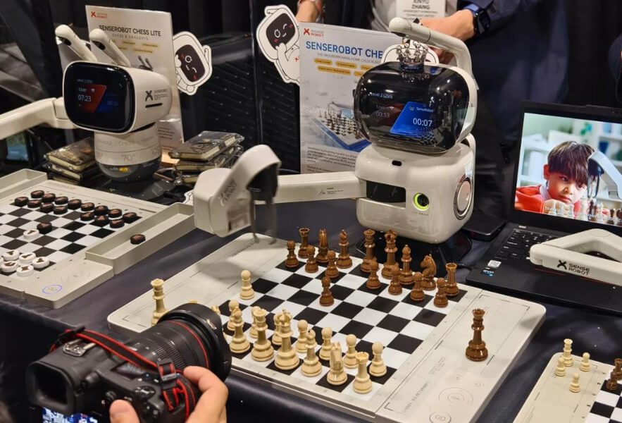

# робота-шахматиста SenseRobot

Route: `/robots/arenda-senserobot/`

Source-of-truth meaningful images: `11`
Upper gallery block near hero: `5`
Lower gallery block near photo section: `6`

Status: `needs_rights_review`; production use is **not approved** until a human confirms rights.

Approval:

- [ ] approve for production
- [ ] replace before production
- [ ] block for production
- [ ] rights/source holder confirmed

## Why earlier visual cards showed too few gallery images

The earlier visual card used the rebuilt short gallery subset. The original live page has two gallery blocks, so this card now separates the upper gallery block near the hero area and the lower gallery block near the photo section.

## Legacy horizontal hero

- role: `legacy_horizontal_hero`
- src: `/images/tild3063-3131-4232-b234-393062353332__photo.jpg`
- projectPath: `site-export/images/tild3063-3131-4232-b234-393062353332__photo.jpg`
- actualDescription: Горизонтальный hero-кадр: робот-шахматист SenseRobot играет в шахматы, сам передвигая фигуры.
- seoAlt: Аренда робота робота-шахматиста SenseRobot: робот-шахматист SenseRobot играет в шахматы, сам передвигая фигуры.
- caption: Горизонтальный hero-кадр: робот-шахматист SenseRobot играет в шахматы, сам передвигая фигуры.
- sourceGalleryBlock: `n/a`
- rightsStatus: `needs_rights_review`
- textSource: legacy-hero-generated from extracted live hero evidence; needs human text/right review

## Current generated hero

- role: `current_generated_hero`
- src: `/images/kiber-45/arenda-senserobot.webp`
- projectPath: `public/images/kiber-45/arenda-senserobot.webp`
- actualDescription: Крупный план манипулятора робота-шахматиста Senserobot, который собирается взять шахматную фигуру.
- seoAlt: Робот-шахматист SenseRobot: Крупный план манипулятора робота-шахматиста Senserobot, который собирается взять шахматную.
- caption: Манипулятор Senserobot готовится взять шахматную фигуру.
- sourceGalleryBlock: `n/a`
- rightsStatus: `needs_rights_review`
- textSource: data/models/robots.source-of-truth.json (previous human+agent media review, mapped from role=hero to optimized generated hero)

## Catalog card

- role: `catalog_card`
- src: `/images/tild6333-3365-4137-b135-663036323961__07.jpg`
- projectPath: `site-export/images/tild6333-3365-4137-b135-663036323961__07.jpg`
- actualDescription: Крупный план робота-шахматиста Senserobot, установленного на полу в помещении; перед ним шахматная доска и сдвинутые фигуры, идёт процесс игры.
- seoAlt: Аренда шахматного робота SenseRobot для интерактивной игровой зоны: Крупный план робота-шахматиста Senserobot, установленного на полу в помещении; перед ним.
- caption: Senserobot играет партию в шахматы в помещении.
- sourceGalleryBlock: `upper_near_hero`
- rightsStatus: `needs_rights_review`
- textSource: data/models/robots.source-of-truth.json (previous human+agent media review)

## Upper gallery block

### arenda-senserobot__04

- role: `source_gallery_hero_candidate`
- src: `/images/tild3636-6336-4332-b330-626232396236__010.jpg`
- projectPath: `site-export/images/tild3636-6336-4332-b330-626232396236__010.jpg`
- actualDescription: Крупный план манипулятора робота-шахматиста Senserobot, который собирается взять шахматную фигуру.
- seoAlt: Робот-шахматист SenseRobot: Крупный план манипулятора робота-шахматиста Senserobot, который собирается взять шахматную.
- caption: Манипулятор Senserobot готовится взять шахматную фигуру.
- sourceGalleryBlock: `upper_near_hero`
- rightsStatus: `needs_rights_review`
- textSource: data/models/robots.source-of-truth.json (previous human+agent media review)

### arenda-senserobot__06

- role: `gallery`
- src: `/images/tild3761-6664-4265-b236-313865633932__02.jpg`
- projectPath: `site-export/images/tild3761-6664-4265-b236-313865633932__02.jpg`
- actualDescription: Крупный план: манипулятор робота-шахматиста Senserobot готовится взять фигуру с шахматной доски; видны манипулятор, доска, белые и чёрные фигуры.
- seoAlt: Робот-манипулятор для шахмат SenseRobot, интерактивный робот для игры в шахматы SenseRobot: Крупный план: манипулятор робота-шахматиста Senserobot готовится взять фигуру с шахматной.
- caption: Манипулятор Senserobot над шахматной доской.
- sourceGalleryBlock: `upper_near_hero`
- rightsStatus: `needs_rights_review`
- textSource: data/models/robots.source-of-truth.json (previous human+agent media review)

### arenda-senserobot__07

- role: `gallery`
- src: `/images/tild3630-6162-4864-b262-303132393161__08.jpg`
- projectPath: `site-export/images/tild3630-6162-4864-b262-303132393161__08.jpg`
- actualDescription: Робот-шахматист Senserobot установлен на столе в помещении; манипулятор поднят вверх и ожидает хода соперника. Видны робот, шахматная доска, фигуры и стул на фоне.
- seoAlt: Прокат интерактивного робота для шахмат SenseRobot для интерактивной игровой зоны: установлен на столе в помещении; манипулятор поднят вверх и ожидает хода соперника. Видны.
- caption: Senserobot ожидает хода соперника.
- sourceGalleryBlock: `upper_near_hero`
- rightsStatus: `needs_rights_review`
- textSource: data/models/robots.source-of-truth.json (previous human+agent media review)

### arenda-senserobot__08

- role: `gallery`
- src: `/images/tild6535-6534-4332-b931-333537643739__05.jpg`
- projectPath: `site-export/images/tild6535-6534-4332-b931-333537643739__05.jpg`
- actualDescription: Крупный план робота-шахматиста Senserobot сбоку: манипулятор находится над шахматной доской, видны фигуры, металлический и деревянный стеллаж с декоративными предметами на заднем плане.
- seoAlt: Робот с шахматной доской SenseRobot, робот-шахматист SenseRobot: Крупный план робота-шахматиста Senserobot сбоку: манипулятор находится над шахматной доской.
- caption: Senserobot сбоку над шахматной доской.
- sourceGalleryBlock: `upper_near_hero`
- rightsStatus: `needs_rights_review`
- textSource: data/models/robots.source-of-truth.json (previous human+agent media review)

## Lower gallery block

### arenda-senserobot__10

- role: `gallery`
- src: `/images/tild3936-3039-4339-a464-636466646534__011.jpg`
- projectPath: `site-export/images/tild3936-3039-4339-a464-636466646534__011.jpg`
- actualDescription: Крупный план робота-шахматиста Senserobot на выставке: робот установлен на столе, сзади виден рекламный слоган, доска и фигуры сняты немного сверху.
- seoAlt: Заказать шахматного робота SenseRobot на выставочного стенда: Крупный план робота-шахматиста Senserobot на выставке: робот установлен на столе, сзади виден.
- caption: Senserobot на выставке с шахматной доской.
- sourceGalleryBlock: `lower_near_photo_section`
- rightsStatus: `needs_rights_review`
- textSource: data/models/robots.source-of-truth.json (previous human+agent media review)

### arenda-senserobot__11

- role: `gallery`
- src: `/images/tild3063-3131-4232-b234-393062353332__photo.jpg`
- projectPath: `site-export/images/tild3063-3131-4232-b234-393062353332__photo.jpg`
- actualDescription: Соревнование по шахматам в большом технологическом помещении: на столах установлено много роботов-шахматистов Senserobot, перед каждым человеком идёт партия.
- seoAlt: Шахматный робот SenseRobot: Соревнование по шахматам в большом технологическом помещении: на столах установлено много.
- caption: Несколько Senserobot играют партии с людьми.
- sourceGalleryBlock: `lower_near_photo_section`
- rightsStatus: `needs_rights_review`
- textSource: data/models/robots.source-of-truth.json (previous human+agent media review)

### arenda-senserobot__12

- role: `gallery`
- src: `/images/tild3230-3831-4936-a465-656439373766__noroot.png`
- projectPath: `site-export/images/tild3230-3831-4936-a465-656439373766__noroot.png`
- actualDescription: Робот-шахматист Senserobot стоит на столе в комнате квартиры; перед ним человек, который играет с ним и обдумывает ход.
- seoAlt: Арендовать интерактивного робота для шахмат SenseRobot для интерактивной игровой зоны: стоит на столе в комнате квартиры; перед ним человек, который играет с ним и обдумывает ход.
- caption: Senserobot играет с человеком дома.
- sourceGalleryBlock: `lower_near_photo_section`
- rightsStatus: `needs_rights_review`
- textSource: data/models/robots.source-of-truth.json (previous human+agent media review)

### arenda-senserobot__13

- role: `gallery`
- src: `/images/tild6336-6239-4361-b166-323936646632__09.jpg`
- projectPath: `site-export/images/tild6336-6239-4361-b166-323936646632__09.jpg`
- actualDescription: Несколько роботов-шахматистов Senserobot на выставке или турнире крупным планом; видны два робота и человеческая рука с фотоаппаратом, фотографирующая одного из роботов.
- seoAlt: Интерактивный робот для игры в шахматы SenseRobot, робот с шахматной доской SenseRobot: Несколько роботов-шахматистов Senserobot на выставке или турнире крупным планом; видны два.
- caption: Роботов Senserobot фотографируют на площадке.
- sourceGalleryBlock: `lower_near_photo_section`
- rightsStatus: `needs_rights_review`
- textSource: data/models/robots.source-of-truth.json (previous human+agent media review)

### arenda-senserobot__14

- role: `gallery`
- src: `/images/tild3464-6432-4039-b665-643532636433__06.jpg`
- projectPath: `site-export/images/tild3464-6432-4039-b665-643532636433__06.jpg`
- actualDescription: Крупный план робота-шахматиста Senserobot, который играет в шахматы с девочкой; оба расположены лицом к зрителю, на заднем плане стеллаж с книгами, видны шахматная доска и фигуры.
- seoAlt: Взять в прокат шахматного робота SenseRobot для интерактивной игровой зоны: Крупный план робота-шахматиста Senserobot, который играет в шахматы с девочкой; оба расположены.
- caption: Senserobot играет в шахматы с девочкой.
- sourceGalleryBlock: `lower_near_photo_section`
- rightsStatus: `needs_rights_review`
- textSource: data/models/robots.source-of-truth.json (previous human+agent media review)

### arenda-senserobot__15

- role: `gallery`
- src: `/images/tild3839-3537-4431-a234-626632626533__01.jpg`
- projectPath: `site-export/images/tild3839-3537-4431-a234-626632626533__01.jpg`
- actualDescription: Крупный план робота-шахматиста Senserobot немного сверху и сбоку: видны робот, шахматная доска, фигуры и человеческая рука, протянутая к фигуре, чтобы сделать ход.
- seoAlt: Робот-шахматист SenseRobot, шахматный робот SenseRobot: Крупный план робота-шахматиста Senserobot немного сверху и сбоку: видны робот, шахматная доска.
- caption: Человек делает ход в партии с Senserobot.
- sourceGalleryBlock: `lower_near_photo_section`
- rightsStatus: `needs_rights_review`
- textSource: data/models/robots.source-of-truth.json (previous human+agent media review)
