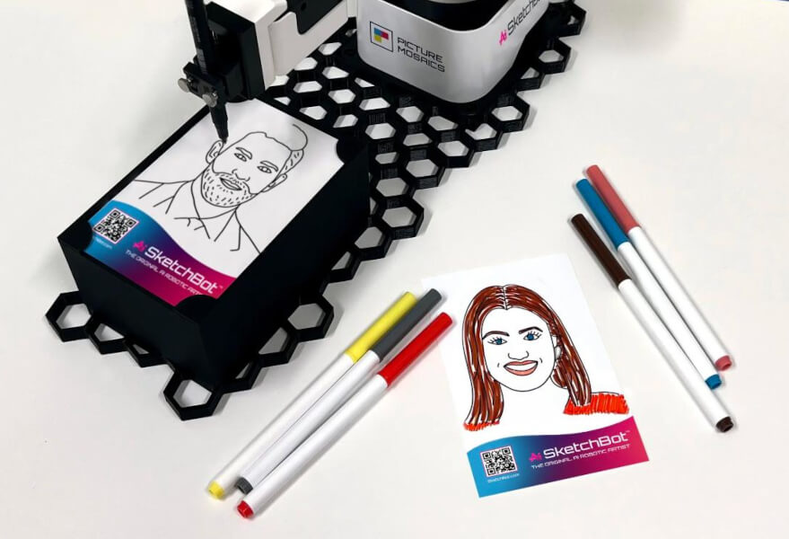
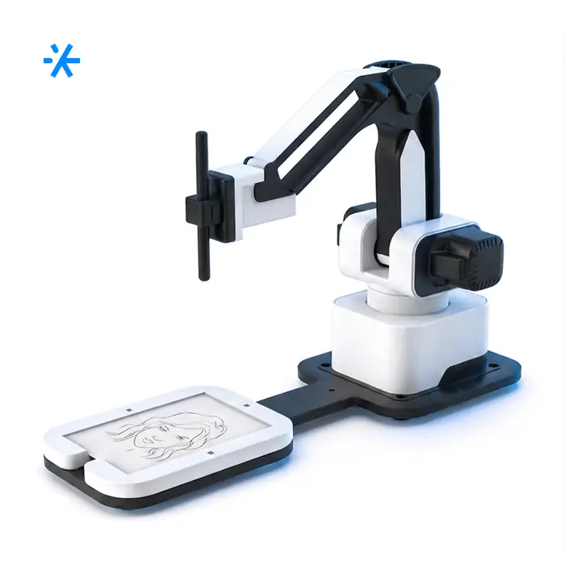
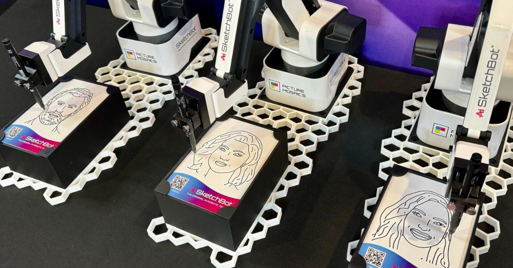
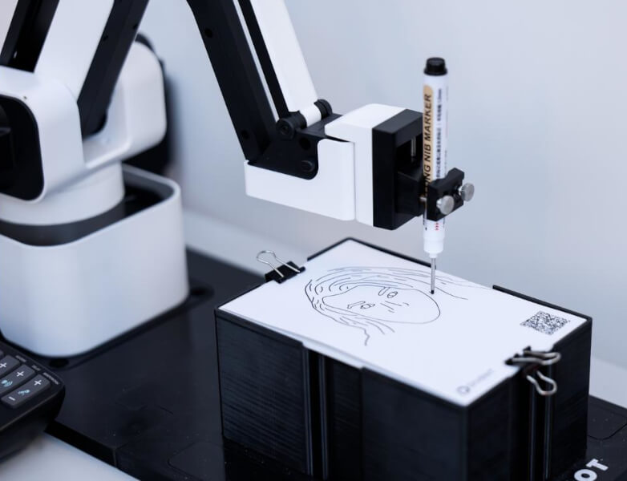
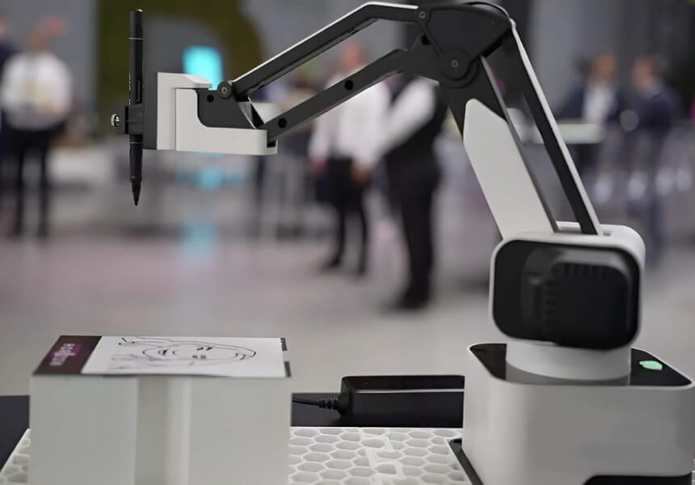
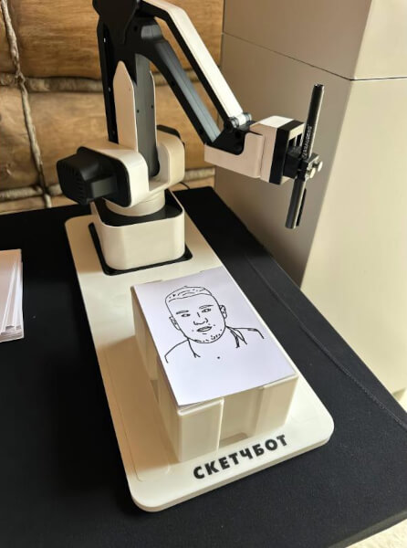
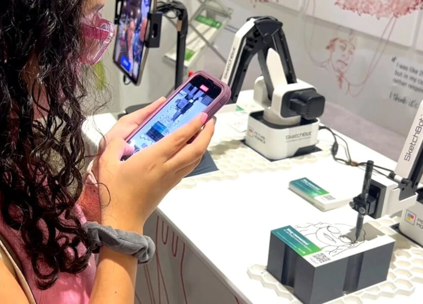
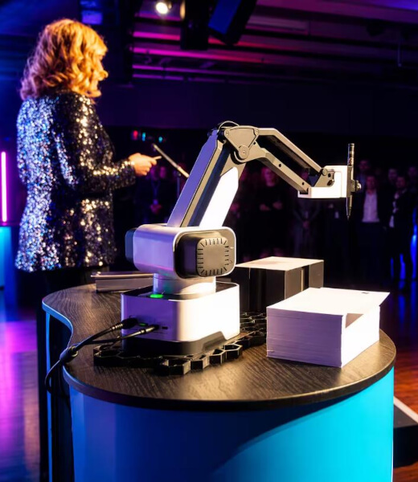
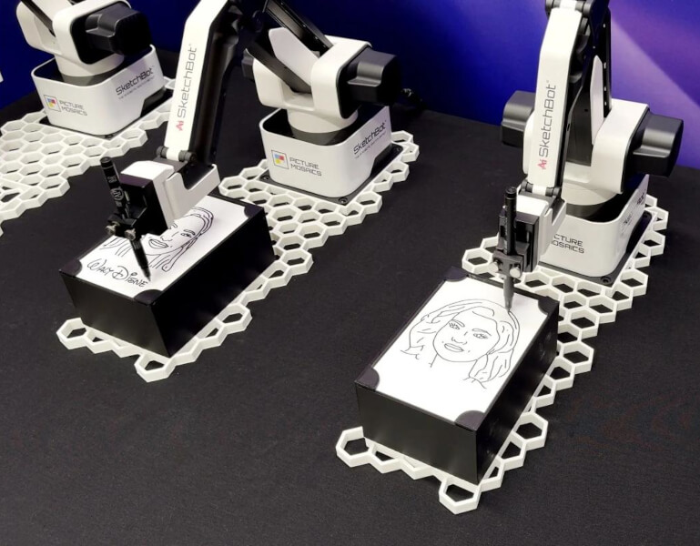

# робота-художника Sketchbot

Route: `/robots/arenda-sketchbot/`

Source-of-truth meaningful images: `16`
Upper gallery block near hero: `8`
Lower gallery block near photo section: `8`

Status: `approved_by_owner_for_production_media_use`; production media use for this card is approved by the owner review evidence below.

Approval:

- Approved by: Александр Маркин
- Approved at: `2026-08-29T00:55:09Z`
- Evidence: first five full cards reviewed directly; all remaining cards approved because they follow the same validated schema/principle.

- [x] approve for production
- [ ] replace before production
- [ ] block for production
- [x] rights/source holder confirmed

## Why earlier visual cards showed too few gallery images

The earlier visual card used the rebuilt short gallery subset. The original live page has two gallery blocks, so this card now separates the upper gallery block near the hero area and the lower gallery block near the photo section.

## Legacy horizontal hero

- role: `legacy_horizontal_hero`
- src: `/images/tild6139-6562-4232-b230-363664373137__017.jpg`
- projectPath: `site-export/images/tild6139-6562-4232-b230-363664373137__017.jpg`
- actualDescription: Горизонтальный hero-кадр: робот-художник Sketchbot в аренду рисует гостю карандашный блиц-портрет.
- seoAlt: Прокат робота-художника робота-художника Sketchbot: робот-художник Sketchbot в аренду рисует гостю карандашный блиц-портрет.
- caption: Горизонтальный hero-кадр: робот-художник Sketchbot в аренду рисует гостю карандашный блиц-портр.
- sourceGalleryBlock: `n/a`
- rightsStatus: `approved_for_production`
- textSource: legacy-hero-generated from extracted live hero evidence; needs human text/right review

## Current generated hero

- role: `current_generated_hero`
- src: `/images/kiber-45/arenda-sketchbot.webp`
- projectPath: `public/images/kiber-45/arenda-sketchbot.webp`
- actualDescription: Робот-художник Sketchbot рисует скетч; виден сам робот и процесс рисования.
- seoAlt: Робот-художник Sketchbot: рисует скетч; виден сам робот и процесс рисования.
- caption: Sketchbot рисует скетч в процессе работы.
- sourceGalleryBlock: `n/a`
- rightsStatus: `approved_for_production`
- textSource: data/models/robots.source-of-truth.json (previous human+agent media review, mapped from role=hero to optimized generated hero)

## Catalog card

- role: `catalog_card`
- src: `/images/tild3064-6338-4337-b230-376434623431__01.jpg`
- projectPath: `site-export/images/tild3064-6338-4337-b230-376434623431__01.jpg`
- actualDescription: Человек держит три скетча, нарисованных роботом-художником Sketchbot. На изображении видны только руки и сами скетчи, человека не видно.
- seoAlt: Аренда рисующего робота Sketchbot для презентации: Человек держит три скетча, нарисованных роботом-художником Sketchbot. На изображении видны.
- caption: Готовые скетчи, созданные роботом-художником Sketchbot.
- sourceGalleryBlock: `upper_near_hero`
- rightsStatus: `approved_for_production`
- textSource: data/models/robots.source-of-truth.json (previous human+agent media review)

## Upper gallery block

### arenda-sketchbot__04

- role: `source_gallery_hero_candidate`
- src: `/images/tild3333-3837-4336-b232-396235623162__09.jpg`
- projectPath: `site-export/images/tild3333-3837-4336-b232-396235623162__09.jpg`
- actualDescription: Робот-художник Sketchbot рисует скетч; виден сам робот и процесс рисования.
- seoAlt: Робот-художник Sketchbot: рисует скетч; виден сам робот и процесс рисования.
- caption: Sketchbot рисует скетч в процессе работы.
- sourceGalleryBlock: `upper_near_hero`
- rightsStatus: `approved_for_production`
- textSource: data/models/robots.source-of-truth.json (previous human+agent media review)

### arenda-sketchbot__06

- role: `gallery`
- src: `/images/tild6139-6562-4232-b230-363664373137__017.jpg`
- projectPath: `site-export/images/tild6139-6562-4232-b230-363664373137__017.jpg`
- actualDescription: Робот-художник Sketchbot расположен на белом фоне и рисует скетчи. Рядом лежат яркие маркеры, скетчи стилизованные и брендированные с логотипами компании, что показывает возможность брендирования рисунков под заказчика.
- seoAlt: Робот-портретист Sketchbot, робот для рисования Sketchbot: расположен на белом фоне и рисует скетчи. Рядом лежат яркие маркеры, скетчи стилизованные и.
- caption: Брендированные скетчи Sketchbot можно адаптировать под заказчика.
- sourceGalleryBlock: `upper_near_hero`
- rightsStatus: `approved_for_production`
- textSource: data/models/robots.source-of-truth.json (previous human+agent media review)

### arenda-sketchbot__07

- role: `gallery`
- src: `/images/tild3834-3838-4137-b333-646164343332__02.jpg`
- projectPath: `site-export/images/tild3834-3838-4137-b333-646164343332__02.jpg`
- actualDescription: На столе расположены сразу три робота-художника Sketchbot, которые рисуют скетчи.
- seoAlt: Прокат арт-робота Sketchbot для мероприятия: На столе расположены сразу три робота-художника Sketchbot, которые рисуют скетчи.
- caption: Три Sketchbot одновременно рисуют скетчи на столе.
- sourceGalleryBlock: `upper_near_hero`
- rightsStatus: `approved_for_production`
- textSource: data/models/robots.source-of-truth.json (previous human+agent media review)

### arenda-sketchbot__08

- role: `gallery`
- src: `/images/tild3834-6463-4234-b165-323762353931__noroot.png`
- projectPath: `site-export/images/tild3834-6463-4234-b165-323762353931__noroot.png`
- actualDescription: Робот-художник Sketchbot крупным планом рисует изображение.
- seoAlt: Арт-робот Sketchbot, робот с манипулятором для рисунков Sketchbot: крупным планом рисует изображение.
- caption: Крупный план Sketchbot во время рисования.
- sourceGalleryBlock: `upper_near_hero`
- rightsStatus: `approved_for_production`
- textSource: data/models/robots.source-of-truth.json (previous human+agent media review)

### arenda-sketchbot__09

- role: `gallery`
- src: `/images/tild3739-6331-4234-b635-633262663663__010.jpg`
- projectPath: `site-export/images/tild3739-6331-4234-b635-633262663663__010.jpg`
- actualDescription: Робот-художник Sketchbot крупным планом, вид сбоку, на выставке рисует изображение. На заднем фоне размыты люди.
- seoAlt: Заказать рисующего робота Sketchbot на выставочного стенда: крупным планом, вид сбоку, на выставке рисует изображение. На заднем фоне размыты люди.
- caption: Sketchbot рисует скетч на выставке, на фоне посетители.
- sourceGalleryBlock: `upper_near_hero`
- rightsStatus: `approved_for_production`
- textSource: data/models/robots.source-of-truth.json (previous human+agent media review)

### arenda-sketchbot__10

- role: `gallery`
- src: `/images/tild6630-3238-4963-b564-316235323834__015.jpg`
- projectPath: `site-export/images/tild6630-3238-4963-b564-316235323834__015.jpg`
- actualDescription: Робот-художник Sketchbot рисует скетч чёрным маркером. Крупное изображение: видны манипулятор, маркер и скетч.
- seoAlt: Робот-художник Sketchbot: рисует скетч чёрным маркером. Крупное изображение: видны манипулятор, маркер и скетч.
- caption: Манипулятор Sketchbot рисует чёрным маркером.
- sourceGalleryBlock: `upper_near_hero`
- rightsStatus: `approved_for_production`
- textSource: data/models/robots.source-of-truth.json (previous human+agent media review)

### arenda-sketchbot__11

- role: `gallery`
- src: `/images/tild6563-3964-4130-a239-393764383362__07.jpg`
- projectPath: `site-export/images/tild6563-3964-4130-a239-393764383362__07.jpg`
- actualDescription: Робот-художник Sketchbot рисует скетч, крупное изображение немного сбоку.
- seoAlt: Арендовать арт-робота Sketchbot для арт-зоны и портретной активности: рисует скетч, крупное изображение немного сбоку.
- caption: Sketchbot рисует скетч крупным планом.
- sourceGalleryBlock: `upper_near_hero`
- rightsStatus: `approved_for_production`
- textSource: data/models/robots.source-of-truth.json (previous human+agent media review)

## Lower gallery block

### arenda-sketchbot__13

- role: `gallery`
- src: `/images/tild6364-3266-4161-b462-643631323864__06.jpg`
- projectPath: `site-export/images/tild6364-3266-4161-b462-643631323864__06.jpg`
- actualDescription: Робот-художник Sketchbot только что закончил рисовать скетч и отвёл манипулятор в сторону. Вид спереди.
- seoAlt: Робот-портретист Sketchbot, робот для рисования Sketchbot: только что закончил рисовать скетч и отвёл манипулятор в сторону. Вид спереди.
- caption: Sketchbot завершил рисунок и отвёл манипулятор.
- sourceGalleryBlock: `lower_near_photo_section`
- rightsStatus: `approved_for_production`
- textSource: data/models/robots.source-of-truth.json (previous human+agent media review)

### arenda-sketchbot__14

- role: `gallery`
- src: `/images/tild3461-6433-4236-a138-303235326332__013.jpg`
- projectPath: `site-export/images/tild3461-6433-4236-a138-303235326332__013.jpg`
- actualDescription: Женщина фотографирует, как несколько роботов-художников Sketchbot рисуют скетчи.
- seoAlt: Взять в прокат рисующего робота Sketchbot для презентации: Женщина фотографирует, как несколько роботов-художников Sketchbot рисуют скетчи.
- caption: Гость фотографирует работу нескольких Sketchbot.
- sourceGalleryBlock: `lower_near_photo_section`
- rightsStatus: `approved_for_production`
- textSource: data/models/robots.source-of-truth.json (previous human+agent media review)

### arenda-sketchbot__15

- role: `gallery`
- src: `/images/tild3536-3633-4266-a162-656265306562__011.jpg`
- projectPath: `site-export/images/tild3536-3633-4266-a162-656265306562__011.jpg`
- actualDescription: Робот-художник Sketchbot установлен на подиуме на сцене, рядом женщина презентует его.
- seoAlt: Арт-робот Sketchbot, робот с манипулятором для рисунков Sketchbot: установлен на подиуме на сцене, рядом женщина презентует его.
- caption: Sketchbot на сцене во время презентации.
- sourceGalleryBlock: `lower_near_photo_section`
- rightsStatus: `approved_for_production`
- textSource: data/models/robots.source-of-truth.json (previous human+agent media review)

### arenda-sketchbot__16

- role: `gallery`
- src: `/images/tild3965-3335-4961-b239-343864373134__016.jpg`
- projectPath: `site-export/images/tild3965-3335-4961-b239-343864373134__016.jpg`
- actualDescription: Несколько роботов-художников Sketchbot стоят на столе на технологической выставке и рисуют скетчи. Рядом двое мужчин наблюдают за процессом.
- seoAlt: Аренда арт-робота Sketchbot для выставочного стенда: Несколько роботов-художников Sketchbot стоят на столе на технологической выставке и рисуют.
- caption: Несколько Sketchbot рисуют скетчи на технологической выставке.
- sourceGalleryBlock: `lower_near_photo_section`
- rightsStatus: `approved_for_production`
- textSource: data/models/robots.source-of-truth.json (previous human+agent media review)

### arenda-sketchbot__17

- role: `gallery`
- src: `/images/tild6133-6665-4665-b135-353337323862__04.jpg`
- projectPath: `site-export/images/tild6133-6665-4665-b135-353337323862__04.jpg`
- actualDescription: Робот-художник Sketchbot только что закончил рисовать изображение; человек протянул руки, чтобы забрать скетч. Видны робот-художник, скетч и руки человека.
- seoAlt: Робот-художник Sketchbot: только что закончил рисовать изображение; человек протянул руки, чтобы забрать скетч. Видны.
- caption: Гость забирает готовый скетч у Sketchbot.
- sourceGalleryBlock: `lower_near_photo_section`
- rightsStatus: `approved_for_production`
- textSource: data/models/robots.source-of-truth.json (previous human+agent media review)

### arenda-sketchbot__18

- role: `gallery`
- src: `/images/tild6436-3331-4430-b861-626331326466__05.jpg`
- projectPath: `site-export/images/tild6436-3331-4430-b861-626331326466__05.jpg`
- actualDescription: Человек крупным планом держит рисунок, который нарисовал робот-художник Sketchbot, демонстрируя его на фотографии.
- seoAlt: Прокат рисующего робота Sketchbot для арт-зоны и портретной активности: Человек крупным планом держит рисунок, который нарисовал робот-художник Sketchbot, демонстрируя.
- caption: Готовый рисунок, созданный роботом-художником Sketchbot.
- sourceGalleryBlock: `lower_near_photo_section`
- rightsStatus: `approved_for_production`
- textSource: data/models/robots.source-of-truth.json (previous human+agent media review)

### arenda-sketchbot__19

- role: `gallery`
- src: `/images/tild6133-3934-4764-a237-376465633230__08.jpg`
- projectPath: `site-export/images/tild6133-3934-4764-a237-376465633230__08.jpg`
- actualDescription: Робот-художник Sketchbot рисует скетч в процессе работы; виден сам робот, рисунок, ракурс сбоку и немного сверху.
- seoAlt: Робот-портретист Sketchbot, робот для рисования Sketchbot: рисует скетч в процессе работы; виден сам робот, рисунок, ракурс сбоку и немного сверху.
- caption: Sketchbot рисует скетч, ракурс сбоку и сверху.
- sourceGalleryBlock: `lower_near_photo_section`
- rightsStatus: `approved_for_production`
- textSource: data/models/robots.source-of-truth.json (previous human+agent media review)

### arenda-sketchbot__20

- role: `gallery`
- src: `/images/tild3662-6636-4134-b830-623562643437__014.jpg`
- projectPath: `site-export/images/tild3662-6636-4134-b830-623562643437__014.jpg`
- actualDescription: Два робота-художника Sketchbot установлены на столе и крупным планом находятся в процессе рисования изображений.
- seoAlt: Заказать арт-робота Sketchbot на арт-зоны и портретной активности: Два робота-художника Sketchbot установлены на столе и крупным планом находятся в процессе.
- caption: Два Sketchbot одновременно рисуют изображения.
- sourceGalleryBlock: `lower_near_photo_section`
- rightsStatus: `approved_for_production`
- textSource: data/models/robots.source-of-truth.json (previous human+agent media review)
