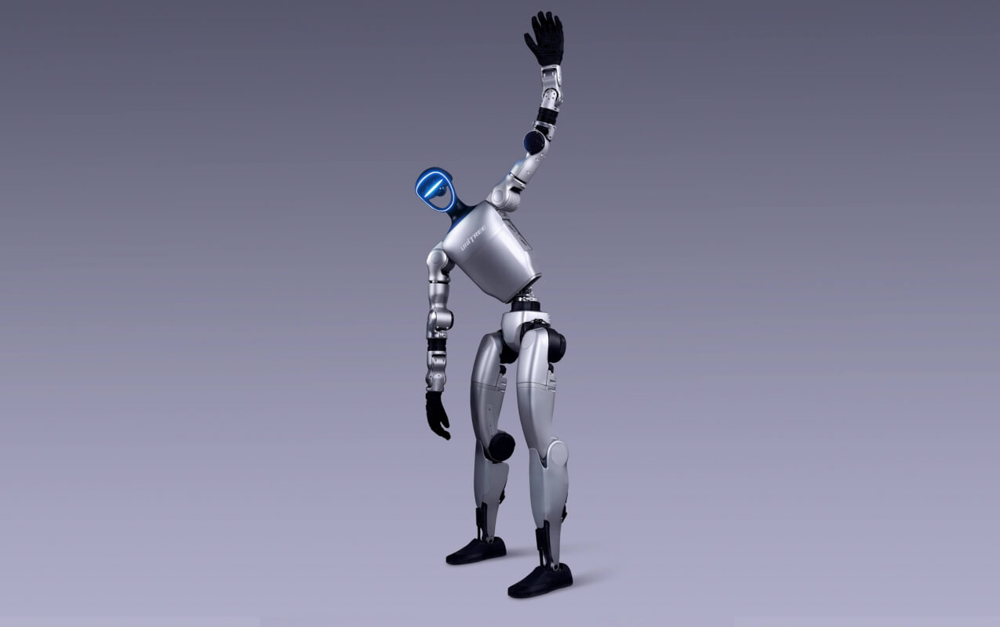
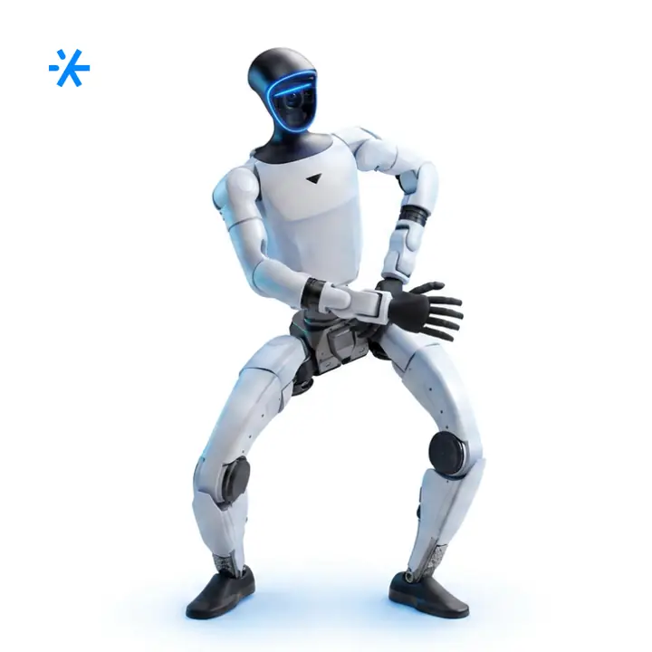
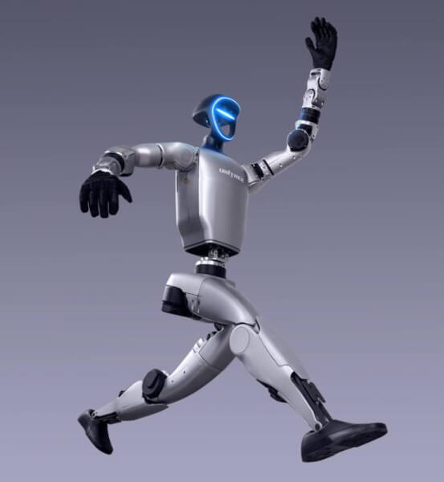
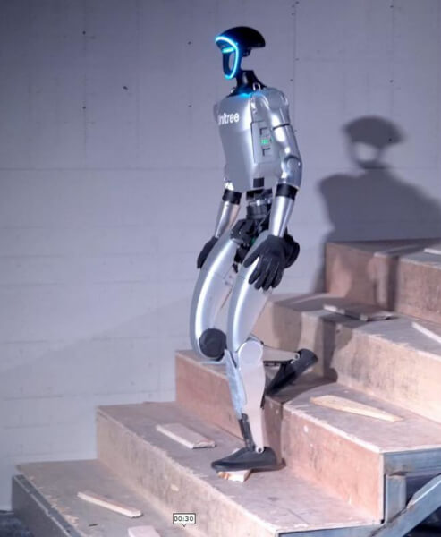
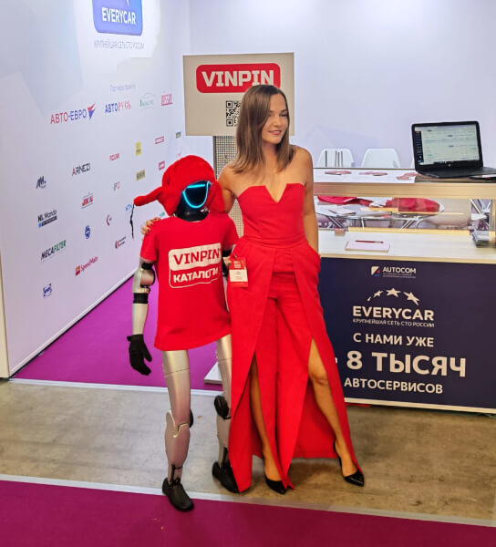

# робота-гуманоида Unitree G1

Route: `/robots/arenda-unitree-g1/`

Status: `needs_rights_review`; production use is **not approved** until a human confirms rights.

Approval:

- [ ] approve for production
- [ ] replace before production
- [ ] block for production
- [ ] rights/source holder confirmed

## Legacy horizontal hero

- role: `legacy_horizontal_hero`
- src: `/images/tild3739-6330-4432-b730-636462313837__photo.jpg`
- projectPath: `site-export/images/tild3739-6330-4432-b730-636462313837__photo.jpg`
- actualDescription: Горизонтальный hero-кадр: робот-гуманоид Unitree G1 кланяется и машет рукой гостям на мероприятии.
- seoAlt: Аренда робота-гуманоида робота-гуманоида Unitree G1: робот-гуманоид Unitree G1 кланяется и машет рукой гостям на мероприятии.
- caption: Горизонтальный hero-кадр: робот-гуманоид Unitree G1 кланяется и машет рукой гостям на мероприят.
- rightsStatus: `needs_rights_review`
- textSource: legacy-hero-generated from extracted live hero evidence; needs human text/right review

## Current generated hero

- role: `current_generated_hero`
- src: `/images/kiber-45/arenda-unitree-g1.webp`
- projectPath: `public/images/kiber-45/arenda-unitree-g1.webp`
- actualDescription: Робот-гуманоид Unitree G1 показан по пояс на нейтральном сером фоне. Корпус развёрнут почти фронтально, голова слегка повернута влево. Это фирменный студийный кадр производителя.
- seoAlt: Робот-гуманоид Unitree G1 на фирменном студийном кадре, человекоподобный робот в виде человека.
- caption: Фирменный портрет Unitree G1 от производителя.
- rightsStatus: `needs_rights_review`
- textSource: data/models/robots.source-of-truth.json (previous human+agent media review, mapped from role=hero to optimized generated hero)

## Gallery

### Gallery 0

- role: `gallery`
- src: `/images/tild6333-3137-4465-b265-323436646539__06.jpg`
- projectPath: `site-export/images/tild6333-3137-4465-b265-323436646539__06.jpg`
- actualDescription: Unitree G1 стоит на выставочном стенде НИЖФАРМ и пожимает руку посетителю. Вокруг робота находятся гости и представители стенда.
- seoAlt: Робот-человек Unitree G1 пожимает руку посетителю на выставке НИЖФАРМ, андроид для делового стенда.
- caption: Unitree G1 на выставке НИЖФАРМ пожимает руку посетителю.
- rightsStatus: `needs_rights_review`
- textSource: data/models/robots.source-of-truth.json (previous human+agent media review)

### Gallery 1

- role: `gallery`
- src: `/images/tild6262-6336-4038-a130-626264326663__02.jpg`
- projectPath: `site-export/images/tild6262-6336-4038-a130-626264326663__02.jpg`
- actualDescription: Unitree G1 бежит вперёд на нейтральном студийном фоне. Робот снят в динамичной позе: одна рука поднята, корпус и ноги находятся в движении.
- seoAlt: Арендовать робота-гуманоида Unitree G1 для презентации: прямоходящий человекоподобный робот бежит на фирменном кадре.
- caption: Динамичный фирменный кадр: Unitree G1 бежит вперёд.
- rightsStatus: `needs_rights_review`
- textSource: data/models/robots.source-of-truth.json (previous human+agent media review)

### Gallery 2

- role: `gallery`
- src: `/images/tild6434-6663-4638-b765-303861663563__05.jpg`
- projectPath: `site-export/images/tild6434-6663-4638-b765-303861663563__05.jpg`
- actualDescription: Unitree G1 спускается по лестнице. Робот показан сбоку, рядом на стене видна его тень.
- seoAlt: Андроид Unitree G1 спускается по лестнице, робот на двух ногах демонстрирует движение в боковом ракурсе.
- caption: Unitree G1 демонстрирует движение по лестнице.
- rightsStatus: `needs_rights_review`
- textSource: data/models/robots.source-of-truth.json (previous human+agent media review)

### Gallery 3

- role: `gallery`
- src: `/images/tild3662-3964-4530-a331-663534313936__01.jpg`
- projectPath: `site-export/images/tild3662-3964-4530-a331-663534313936__01.jpg`
- actualDescription: Unitree G1 стоит на выставочной площадке в фирменном образе: красная шапка-ушанка, красная футболка и нагрудный LED-дисплей. Робот снят фронтально.
- seoAlt: Прокат робота-человека Unitree G1 для выставочного стенда: гуманоид в фирменном образе с LED-дисплеем.
- caption: Выставочный образ Unitree G1 с красной ушанкой и LED-дисплеем на груди.
- rightsStatus: `needs_rights_review`
- textSource: data/models/robots.source-of-truth.json (previous human+agent media review)

### Gallery 4

- role: `gallery`
- src: `/images/tild6134-6536-4662-a134-643063656632__09.jpg`
- projectPath: `site-export/images/tild6134-6536-4662-a134-643063656632__09.jpg`
- actualDescription: Unitree G1 стоит в центре группового фото с командой стенда НИЖФАРМ. В кадре несколько человек в деловой одежде, на фоне видны элементы выставочного пространства.
- seoAlt: Человекоподобный робот Unitree G1 на групповом фото с командой стенда НИЖФАРМ.
- caption: Общее фото Unitree G1 с командой стенда НИЖФАРМ.
- rightsStatus: `needs_rights_review`
- textSource: data/models/robots.source-of-truth.json (previous human+agent media review)

### Gallery 5

- role: `gallery`
- src: `/images/tild6430-3334-4539-b033-633732353634__07.jpg`
- projectPath: `site-export/images/tild6430-3334-4539-b033-633732353634__07.jpg`
- actualDescription: Unitree G1 стоит на стенде Винпин в Крокус Экспо рядом с представительницей компании. Робот одет в красную шапку-ушанку и красную футболку с фирменной надписью.
- seoAlt: Взять в прокат андроида Unitree G1 для стенда Винпин в Крокус Экспо и выставочного интерактива.
- caption: Unitree G1 на стенде компании Винпин в Крокус Экспо.
- rightsStatus: `needs_rights_review`
- textSource: data/models/robots.source-of-truth.json (previous human+agent media review)
