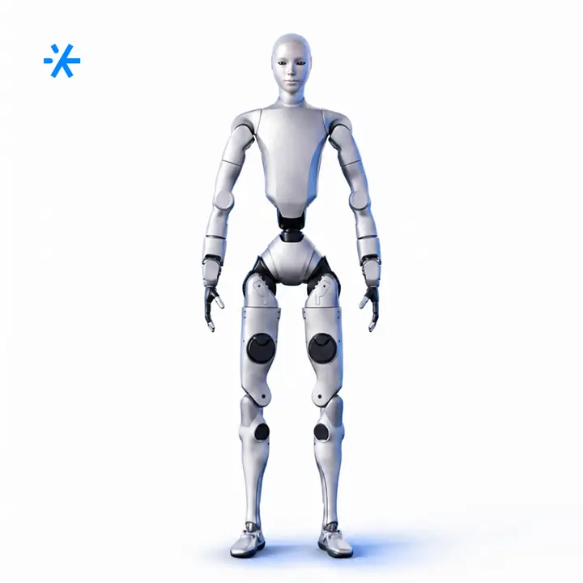
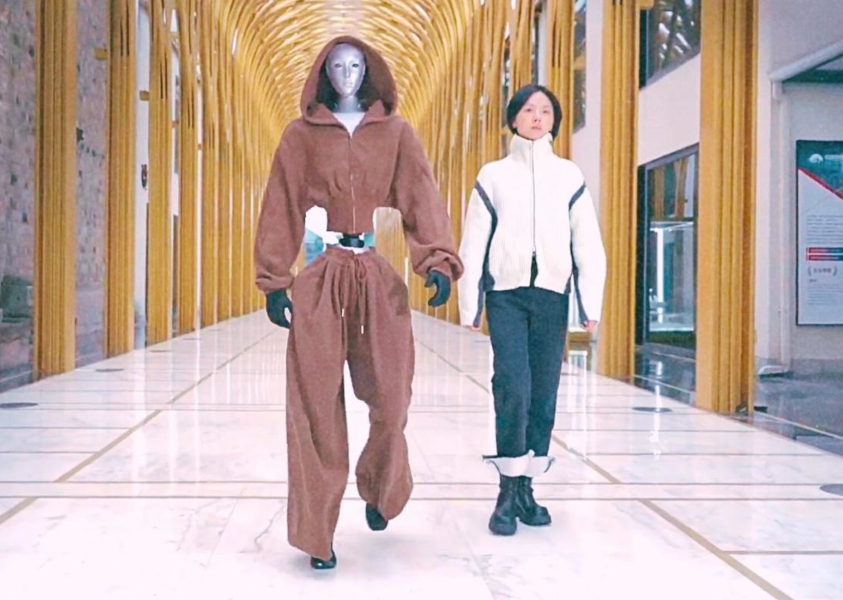
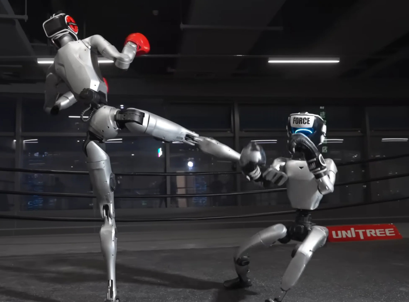
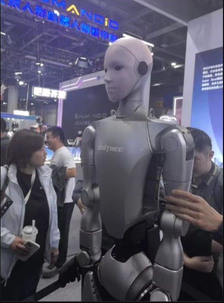
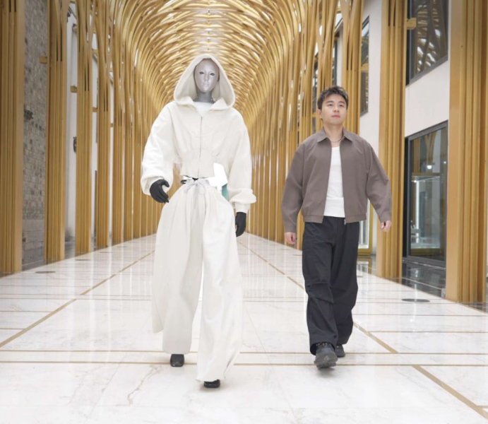
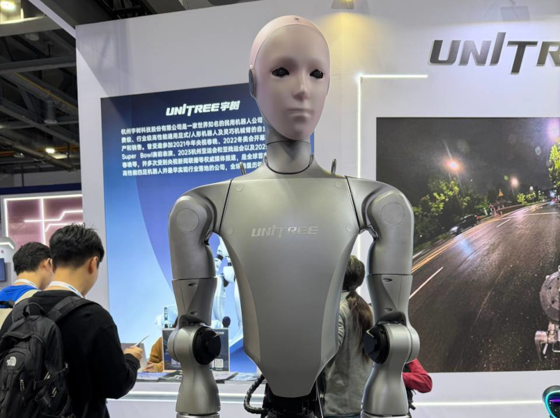

# робота-гуманоида Unitree H2

Route: `/robots/arenda-unitree-h2/`

Source-of-truth meaningful images: `8`
Upper gallery block near hero: `4`
Lower gallery block near photo section: `4`

Status: `approved_by_owner_for_production_media_use`; production media use for this card is approved by the owner review evidence below.

Approval:

- Approved by: Александр Маркин
- Approved at: `2026-08-29T00:55:09Z`
- Evidence: first five full cards reviewed directly; all remaining cards approved because they follow the same validated schema/principle.

- [x] approve for production
- [ ] replace before production
- [ ] block for production
- [x] rights/source holder confirmed

## Why earlier visual cards showed too few gallery images

The earlier visual card used the rebuilt short gallery subset. The original live page has two gallery blocks, so this card now separates the upper gallery block near the hero area and the lower gallery block near the photo section.

## Legacy horizontal hero

- role: `legacy_horizontal_hero`
- src: `/images/tild6566-3862-4532-b338-383238633838__photo.jpg`
- projectPath: `site-export/images/tild6566-3862-4532-b338-383238633838__photo.jpg`
- actualDescription: Горизонтальный hero-кадр: робот-гуманоид Unitree H2 с мимикой лица, рост, близкий к человеческому.
- seoAlt: Аренда робота-гуманоида Unitree H2: робот-гуманоид Unitree H2 с мимикой лица, рост, близкий к человеческому.
- caption: Горизонтальный hero-кадр: робот-гуманоид Unitree H2 с мимикой лица, рост.
- sourceGalleryBlock: `n/a`
- rightsStatus: `approved_for_production`
- textSource: legacy-hero-generated from extracted live hero evidence; needs human text/right review

## Current generated hero

- role: `current_generated_hero`
- src: `/images/kiber-45/arenda-unitree-h2.webp`
- projectPath: `public/images/kiber-45/arenda-unitree-h2.webp`
- actualDescription: Unitree H2 в позе балерины: стоит на одной ноге, руки подняты вверх, вторая нога согнута в колене и ступнёй касается первой ноги.
- seoAlt: Робот-гуманоид Unitree H2: в позе балерины: стоит на одной ноге, руки подняты вверх, вторая нога согнута в колене и.
- caption: Unitree H2 в балетной позе на одной ноге.
- sourceGalleryBlock: `n/a`
- rightsStatus: `approved_for_production`
- textSource: data/models/robots.source-of-truth.json (previous human+agent media review, mapped from role=hero to optimized generated hero)

## Catalog card

- role: `catalog_card`
- src: `/images/tild3334-3266-4136-a131-303836666430__03.jpg`
- projectPath: `site-export/images/tild3334-3266-4136-a131-303836666430__03.jpg`
- actualDescription: Unitree H2 идёт по подиуму на показе мод. Он одет в светло-коричневый костюм с длинными рукавами и штанинами, на голове капюшон; рядом идёт человек в джинсах и светлой куртке.
- seoAlt: Аренда человекоподобного робота Unitree H2 для презентации: идёт по подиуму на показе мод. Он одет в светло-коричневый костюм с длинными рукавами и.
- caption: Unitree H2 идёт по подиуму на показе мод.
- sourceGalleryBlock: `upper_near_hero`
- rightsStatus: `approved_for_production`
- textSource: data/models/robots.source-of-truth.json (previous human+agent media review)

## Upper gallery block

### arenda-unitree-h2__04

- role: `source_gallery_hero_candidate`
- src: `/images/tild3437-6236-4665-a164-653035646238__noroot.png`
- projectPath: `site-export/images/tild3437-6236-4665-a164-653035646238__noroot.png`
- actualDescription: Unitree H2 в позе балерины: стоит на одной ноге, руки подняты вверх, вторая нога согнута в колене и ступнёй касается первой ноги.
- seoAlt: Робот-гуманоид Unitree H2: в позе балерины: стоит на одной ноге, руки подняты вверх, вторая нога согнута в колене и.
- caption: Unitree H2 в балетной позе на одной ноге.
- sourceGalleryBlock: `upper_near_hero`
- rightsStatus: `approved_for_production`
- textSource: data/models/robots.source-of-truth.json (previous human+agent media review)

### arenda-unitree-h2__06

- role: `gallery`
- src: `/images/tild6263-3431-4436-b463-366666346362__noroot.png`
- projectPath: `site-export/images/tild6263-3431-4436-b463-366666346362__noroot.png`
- actualDescription: Робот Unitree H2 крупным планом, обрезан по колено, танцует на фоне пустого зала; сверху на потолке софиты, инженеры наблюдают за ним, похоже на тестовый прогон.
- seoAlt: Робот-человек Unitree H2, андроид Unitree H2: крупным планом, обрезан по колено, танцует на фоне пустого зала; сверху на потолке софиты.
- caption: Unitree H2 танцует во время тестового прогона.
- sourceGalleryBlock: `upper_near_hero`
- rightsStatus: `approved_for_production`
- textSource: data/models/robots.source-of-truth.json (previous human+agent media review)

### arenda-unitree-h2__07

- role: `gallery`
- src: `/images/tild3634-6665-4631-b530-653838623332__07.jpg`
- projectPath: `site-export/images/tild3634-6665-4631-b530-653838623332__07.jpg`
- actualDescription: Unitree H2 стоит на ринге проводит бой с роботом-гуманоидом Unitree G1. Оба в мягких шлемах и перчатках; H2 бьёт G1 ногой, G1 подкашивается и падает.
- seoAlt: Прокат андроида Unitree H2 для мероприятия: на ринге проводит бой с роботом-гуманоидом Unitree G1. Оба в мягких шлемах и перчатках; H2 бьёт.
- caption: Unitree H2 демонстрирует бой с Unitree G1 на ринге.
- sourceGalleryBlock: `upper_near_hero`
- rightsStatus: `approved_for_production`
- textSource: data/models/robots.source-of-truth.json (previous human+agent media review)

## Lower gallery block

### arenda-unitree-h2__09

- role: `gallery`
- src: `/images/tild3338-3033-4761-b961-663635646131__06.jpg`
- projectPath: `site-export/images/tild3338-3033-4761-b961-663635646131__06.jpg`
- actualDescription: Крупный план робота Unitree H2 на выставке: похоже на первую презентацию аудитории, люди смотрят на него, кто-то касается робота рукой.
- seoAlt: Прямоходящий робот Unitree H2, робот на двух ногах Unitree H2: Крупный план робота Unitree H2 на выставке: похоже на первую презентацию аудитории, люди.
- caption: Unitree H2 показывают аудитории на презентации.
- sourceGalleryBlock: `lower_near_photo_section`
- rightsStatus: `approved_for_production`
- textSource: data/models/robots.source-of-truth.json (previous human+agent media review)

### arenda-unitree-h2__10

- role: `gallery`
- src: `/images/tild3465-6438-4039-a362-363565353563__04.jpg`
- projectPath: `site-export/images/tild3465-6438-4039-a362-363565353563__04.jpg`
- actualDescription: Unitree H2 идёт по подиуму в светлом костюме с длинными рукавами, штанинами и капюшоном; рядом идёт человек в тёмных брюках, белой футболке и светло-коричневой куртке. Вид спереди.
- seoAlt: Заказать человекоподобного робота Unitree H2 на презентации: идёт по подиуму в светлом костюме с длинными рукавами, штанинами и капюшоном; рядом идёт.
- caption: Unitree H2 идёт по подиуму рядом с человеком.
- sourceGalleryBlock: `lower_near_photo_section`
- rightsStatus: `approved_for_production`
- textSource: data/models/robots.source-of-truth.json (previous human+agent media review)

### arenda-unitree-h2__11

- role: `gallery`
- src: `/images/tild3132-6631-4237-a432-326664313536__02.jpg`
- projectPath: `site-export/images/tild3132-6631-4237-a432-326664313536__02.jpg`
- actualDescription: Unitree H2 стоит в полный рост в стойке единоборств, похожей на каратэ. Он на улице на фоне стеклянного здания, на заднем плане две лавочки, на которых сидят люди и наблюдают за ним.
- seoAlt: Интерактивный гуманоид Unitree H2: стоит в полный рост в стойке единоборств, похожей на каратэ. Он на улице на фоне стеклянного.
- caption: Unitree H2 в стойке единоборств на улице.
- sourceGalleryBlock: `lower_near_photo_section`
- rightsStatus: `approved_for_production`
- textSource: data/models/robots.source-of-truth.json (previous human+agent media review)

### arenda-unitree-h2__12

- role: `gallery`
- src: `/images/tild6665-6262-4230-b331-653935303135__01.jpg`
- projectPath: `site-export/images/tild6665-6262-4230-b331-653935303135__01.jpg`
- actualDescription: Крупный план робота Unitree H2 по пояс на выставочном стенде Unitree; на заднем фоне рекламные материалы на стенде и люди, которые читают материалы. Робот смотрит на зрителя, вид спереди.
- seoAlt: Арендовать андроида Unitree H2 для выставочного стенда: Крупный план робота Unitree H2 по пояс на выставочном стенде Unitree; на заднем фоне рекламные.
- caption: Unitree H2 крупным планом на стенде Unitree.
- sourceGalleryBlock: `lower_near_photo_section`
- rightsStatus: `approved_for_production`
- textSource: data/models/robots.source-of-truth.json (previous human+agent media review)
