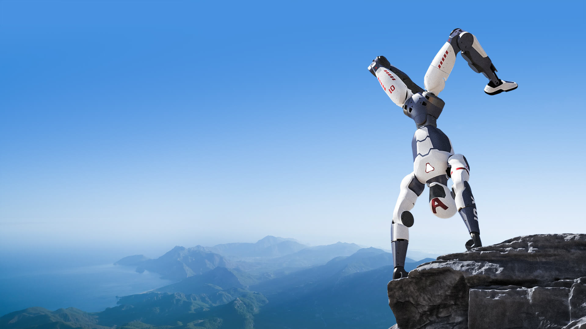
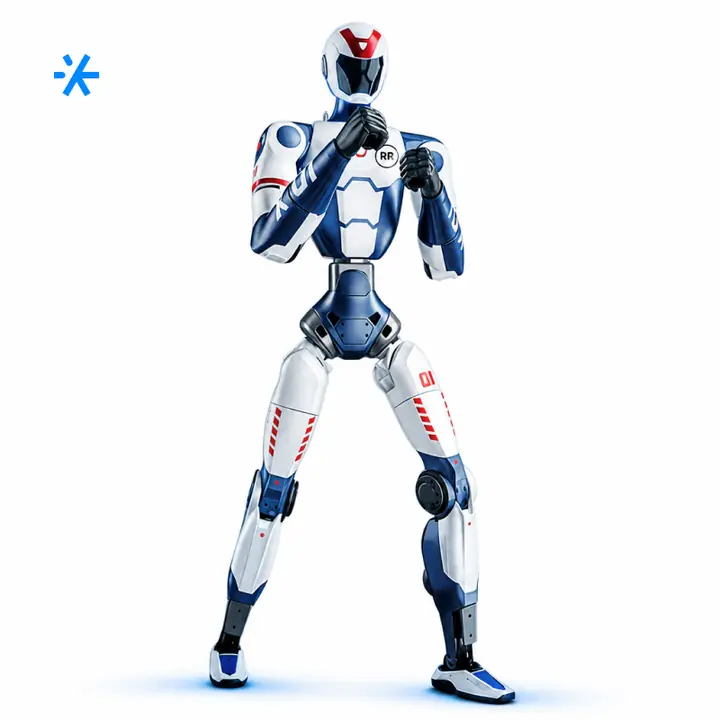
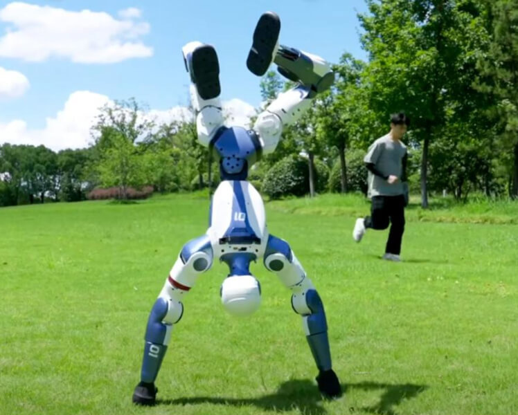
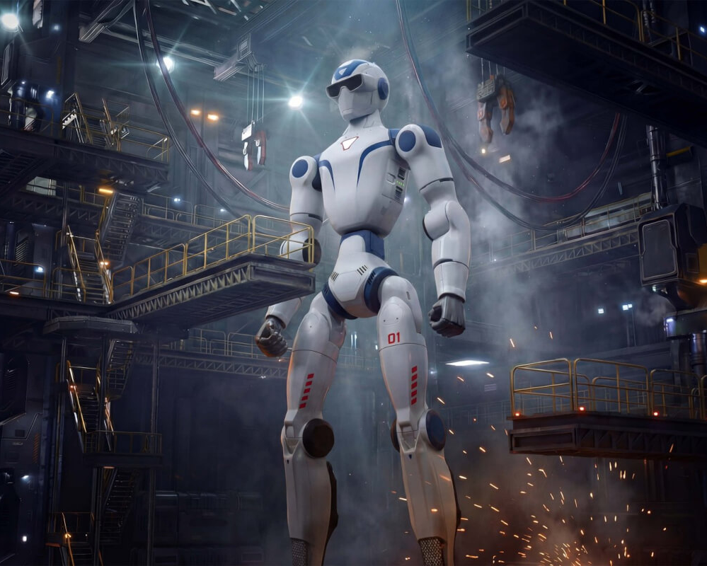
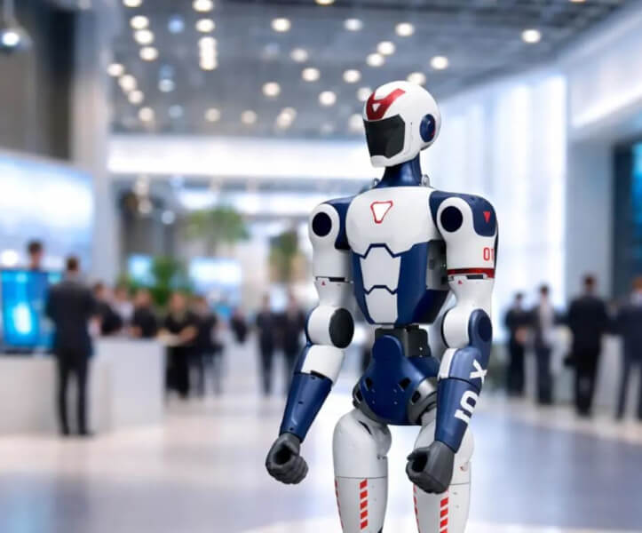
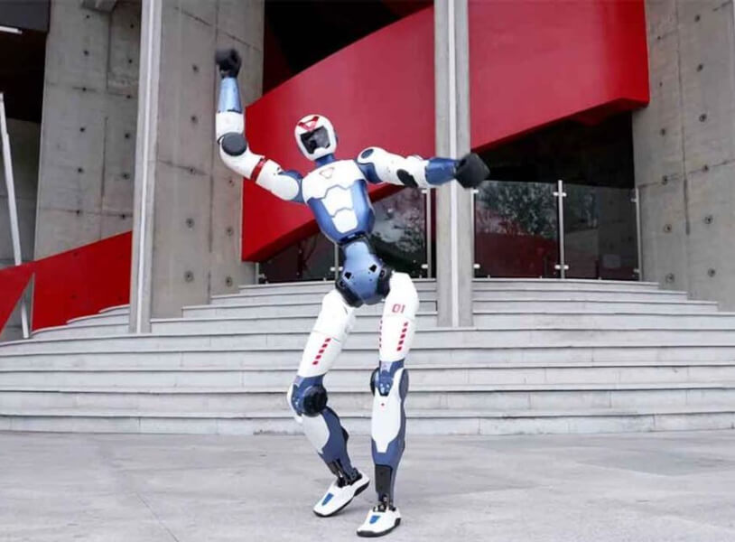
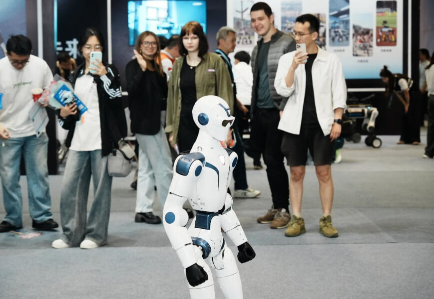
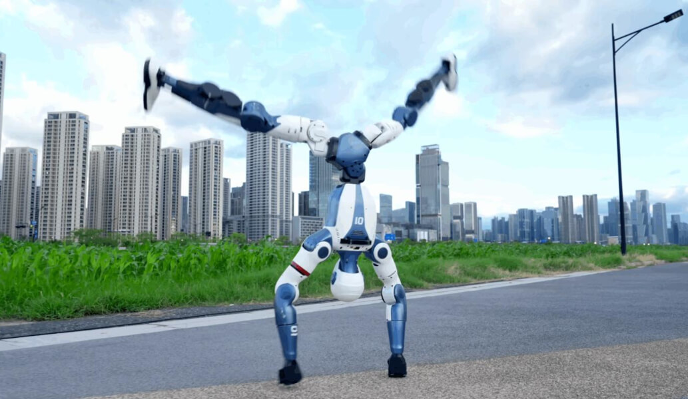

# робота-гуманоида Unitree R1

Route: `/robots/arenda-unitree-r1/`

Source-of-truth meaningful images: `10`
Upper gallery block near hero: `5`
Lower gallery block near photo section: `5`

Status: `approved_by_owner_for_production_media_use`; production media use for this card is approved by the owner review evidence below.

Approval:

- Approved by: Александр Маркин
- Approved at: `2026-08-29T00:55:09Z`
- Evidence: first five full cards reviewed directly; all remaining cards approved because they follow the same validated schema/principle.

- [x] approve for production
- [ ] replace before production
- [ ] block for production
- [x] rights/source holder confirmed

## Why earlier visual cards showed too few gallery images

The earlier visual card used the rebuilt short gallery subset. The original live page has two gallery blocks, so this card now separates the upper gallery block near the hero area and the lower gallery block near the photo section.

## Legacy horizontal hero

- role: `legacy_horizontal_hero`
- src: `/images/tild3664-6437-4561-b738-333935356561__photo.jpg`
- projectPath: `site-export/images/tild3664-6437-4561-b738-333935356561__photo.jpg`
- actualDescription: Горизонтальный hero-кадр: робот-гуманоид Unitree R1 выполняет акробатический трюк на мероприятии.
- seoAlt: Аренда робота-гуманоида Unitree R1: робот-гуманоид Unitree R1 выполняет акробатический трюк на мероприятии.
- caption: Горизонтальный hero-кадр: робот-гуманоид Unitree R1 выполняет акробатический трюк на мероприяти.
- sourceGalleryBlock: `n/a`
- rightsStatus: `approved_for_production`
- textSource: legacy-hero-generated from extracted live hero evidence; needs human text/right review

## Current generated hero

- role: `current_generated_hero`
- src: `/images/kiber-45/arenda-unitree-r1.webp`
- projectPath: `public/images/kiber-45/arenda-unitree-r1.webp`
- actualDescription: Unitree R1 бежит по улице по асфальтовой дорожке; на заднем фоне зелёная трава и небольшие деревья.
- seoAlt: Робот-гуманоид Unitree R1: бежит по улице по асфальтовой дорожке; на заднем фоне зелёная трава и небольшие деревья.
- caption: Unitree R1 бежит по асфальтовой дорожке.
- sourceGalleryBlock: `n/a`
- rightsStatus: `approved_for_production`
- textSource: data/models/robots.source-of-truth.json (previous human+agent media review, mapped from role=hero to optimized generated hero)

## Catalog card

- role: `catalog_card`
- src: `/images/tild6663-3738-4262-a338-613730653332__06.jpg`
- projectPath: `site-export/images/tild6663-3738-4262-a338-613730653332__06.jpg`
- actualDescription: Unitree R1 крупным планом по пояс, руки подняты вверх в боевой стойке, словно собирается боксировать. Робот смотрит на зрителя, на заднем фоне почти не видно кафе.
- seoAlt: Аренда человекоподобного робота Unitree R1 для HoReCa-зоны и события с гостями: крупным планом по пояс, руки подняты вверх в боевой стойке, как будто собирается боксировать.
- caption: Unitree R1 в боевой стойке крупным планом.
- sourceGalleryBlock: `upper_near_hero`
- rightsStatus: `approved_for_production`
- textSource: data/models/robots.source-of-truth.json (previous human+agent media review)

## Upper gallery block

### arenda-unitree-r1__04

- role: `source_gallery_hero_candidate`
- src: `/images/tild3235-3266-4537-b866-656131613031__02.jpg`
- projectPath: `site-export/images/tild3235-3266-4537-b866-656131613031__02.jpg`
- actualDescription: Unitree R1 бежит по улице по асфальтовой дорожке; на заднем фоне зелёная трава и небольшие деревья.
- seoAlt: Робот-гуманоид Unitree R1: бежит по улице по асфальтовой дорожке; на заднем фоне зелёная трава и небольшие деревья.
- caption: Unitree R1 бежит по асфальтовой дорожке.
- sourceGalleryBlock: `upper_near_hero`
- rightsStatus: `approved_for_production`
- textSource: data/models/robots.source-of-truth.json (previous human+agent media review)

### arenda-unitree-r1__06

- role: `gallery`
- src: `/images/tild6664-6138-4933-b832-633633326535__05.jpg`
- projectPath: `site-export/images/tild6664-6138-4933-b832-633633326535__05.jpg`
- actualDescription: Unitree R1 стоит на лужайке с зелёной травой стоит на руках и выполняет акробатический трюк; на заднем фоне зелёные деревья и человек на пробежке.
- seoAlt: Робот-человек Unitree R1, андроид Unitree R1: на лужайке с зелёной травой стоит на руках и выполняет акробатический трюк; на заднем фоне.
- caption: Unitree R1 выполняет стойку на руках на лужайке.
- sourceGalleryBlock: `upper_near_hero`
- rightsStatus: `approved_for_production`
- textSource: data/models/robots.source-of-truth.json (previous human+agent media review)

### arenda-unitree-r1__07

- role: `gallery`
- src: `/images/tild6136-3331-4366-b934-653538306539__noroot.png`
- projectPath: `site-export/images/tild6136-3331-4366-b934-653538306539__noroot.png`
- actualDescription: Эпическое изображение робота-гуманоида Unitree R1, стилизованного под огромного робота из фильма: он стоит в цеху, вокруг будто идут работы и люди его строят.
- seoAlt: Прокат андроида Unitree R1 для мероприятия: Эпическое изображение робота-гуманоида Unitree R1, стилизованного под огромного робота из.
- caption: Футуристичное изображение Unitree R1 в цеху.
- sourceGalleryBlock: `upper_near_hero`
- rightsStatus: `approved_for_production`
- textSource: data/models/robots.source-of-truth.json (previous human+agent media review)

### arenda-unitree-r1__08

- role: `gallery`
- src: `/images/tild3762-6238-4662-b332-366430336433__noroot.png`
- projectPath: `site-export/images/tild3762-6238-4662-b332-366430336433__noroot.png`
- actualDescription: Крупное изображение двух роботов-гуманоидов Unitree R1, лежащих на столе головами друг к другу; видны головы, шеи и плечи. Один робот в фирменных цветах — белый, синий и красный, второй ещё не покрашен и выглядит как в процессе производства.
- seoAlt: Прямоходящий робот Unitree R1, робот на двух ногах Unitree R1: Крупное изображение двух роботов-гуманоидов Unitree R1, лежащих на столе головами друг к другу.
- caption: Два Unitree R1 в производственном виде крупным планом.
- sourceGalleryBlock: `upper_near_hero`
- rightsStatus: `approved_for_production`
- textSource: data/models/robots.source-of-truth.json (previous human+agent media review)

## Lower gallery block

### arenda-unitree-r1__10

- role: `gallery`
- src: `/images/tild6536-3766-4034-a538-626532663162__noroot.png`
- projectPath: `site-export/images/tild6536-3766-4034-a538-626532663162__noroot.png`
- actualDescription: Unitree R1 делает акробатический трюк — стойку на руках на краю каменного утёса. Фотография крупным планом: видны небольшой участок утёса, робот, голубое небо и далёкие горы внизу.
- seoAlt: Заказать человекоподобного робота Unitree R1 на демонстрации возможностей: делает акробатический трюк — стойку на руках на краю каменного утёса. Фотография крупным.
- caption: Unitree R1 делает стойку на руках на краю утёса.
- sourceGalleryBlock: `lower_near_photo_section`
- rightsStatus: `approved_for_production`
- textSource: data/models/robots.source-of-truth.json (previous human+agent media review)

### arenda-unitree-r1__11

- role: `gallery`
- src: `/images/tild3062-3332-4361-b232-613130313861__03.jpg`
- projectPath: `site-export/images/tild3062-3332-4361-b232-613130313861__03.jpg`
- actualDescription: Крупная фотография робота Unitree R1, вероятно созданная с помощью искусственного интеллекта: робот обрезан по колено, на заднем фоне размытое корпоративное мероприятие, люди стоят и.
- seoAlt: Интерактивный гуманоид Unitree R1: Крупная фотография робота Unitree R1, вероятно созданная с помощью искусственного интеллекта.
- caption: Unitree R1 крупным планом на корпоративном фоне.
- sourceGalleryBlock: `lower_near_photo_section`
- rightsStatus: `approved_for_production`
- textSource: data/models/robots.source-of-truth.json (previous human+agent media review)

### arenda-unitree-r1__12

- role: `gallery`
- src: `/images/tild3937-3061-4237-a338-346232613765__04.jpg`
- projectPath: `site-export/images/tild3937-3061-4237-a338-346232613765__04.jpg`
- actualDescription: Робот Unitree R1 крупным планом во весь рост стоит у входа в здание; за ним лестница поднимается вверх, вход оформлен декоративными элементами, робот выглядит так, будто танцует.
- seoAlt: Арендовать андроида Unitree R1 для демонстрации возможностей: крупным планом во весь рост стоит у входа в здание; за ним лестница поднимается вверх, вход.
- caption: Unitree R1 у входа в здание в танцевальной позе.
- sourceGalleryBlock: `lower_near_photo_section`
- rightsStatus: `approved_for_production`
- textSource: data/models/robots.source-of-truth.json (previous human+agent media review)

### arenda-unitree-r1__13

- role: `gallery`
- src: `/images/tild6432-3865-4237-b665-626633613332__07.jpg`
- projectPath: `site-export/images/tild6432-3865-4237-b665-626633613332__07.jpg`
- actualDescription: Робот Unitree R1 на выставке на переднем плане, виден примерно по колено; сзади несколько человек наблюдают за роботом и фотографируют его на телефон.
- seoAlt: Человекоподобный робот Unitree R1, робот-человек Unitree R1: на выставке на переднем плане, виден примерно по колено; сзади несколько человек наблюдают за.
- caption: Unitree R1 на выставке перед посетителями.
- sourceGalleryBlock: `lower_near_photo_section`
- rightsStatus: `approved_for_production`
- textSource: data/models/robots.source-of-truth.json (previous human+agent media review)

### arenda-unitree-r1__14

- role: `gallery`
- src: `/images/tild6664-3730-4138-a238-373063623031__01.jpg`
- projectPath: `site-export/images/tild6664-3730-4138-a238-373063623031__01.jpg`
- actualDescription: Unitree R1 стоит на фоне высоких зданий делает акробатический трюк — стойку на руках, ноги разведены в стороны. Светлое небо с облаками, внизу трава и асфальтированная дорожка.
- seoAlt: Взять в прокат человекоподобного робота Unitree R1 для демонстрации возможностей: на фоне высоких зданий делает акробатический трюк — стойку на руках, ноги разведены в стороны.
- caption: Unitree R1 делает стойку на руках на городской дорожке.
- sourceGalleryBlock: `lower_near_photo_section`
- rightsStatus: `approved_for_production`
- textSource: data/models/robots.source-of-truth.json (previous human+agent media review)
